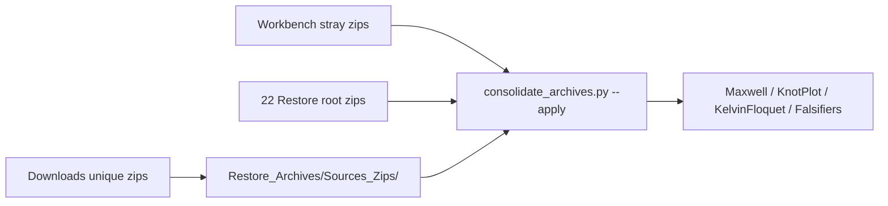

# Ontbrekende zips archiveren (Downloads + Workbench-strays)

## Wat er nu staat

[`Restore_Archives/`](c:\workspace\projects\SST-Workbench\Restore_Archives) heeft **454** zips.

### Downloads (101 bestanden)

- **26** staan al in het archief (exacte naam): alle Maxwell v0.1/v0.2 in [`Maxwell/`](c:\workspace\projects\SST-Workbench\Restore_Archives\Maxwell) (map bestaat, maar staat **niet** in `THEME_RULES` of de README), plus o.a. Threaded Hole v0.1–v0.2.0, Trefoil Lobe, Fourier-vs-Ideal, MultiTopology v0.4.1, KnotPlot MultiDynamics v0.1.0/v0.1.1-patch
- **8** Downloads-kopieën zijn SHA256-duplicaten (Chrome `(1)`/`(2)`/`(3)`, of al gearchiveerd)
- **67 unieke** zips ontbreken en moeten erin (~321 MB; de grootste is MultiTopology v0.4.5.1, 148 MB)

Downloads blijven staan; we **kopiëren**, we verplaatsen/wissen niets in Downloads.

### Restore_Archives-root (22 zips, deze ronde expliciet)

Dit is de **volledige** root-lijst (geen andere root-zips). Ze zitten al in Restore_Archives maar nog niet in een thema-map. Phase3 van consolidate verplaatst ze; SHA256-dedup verwijdert drie Chrome-`(1)`-kopieën die identiek zijn aan de unnumbered naam.

**Naar `KnotPlot/` (2):**

- `KnotPlot_3p1_MultiDynamics_Relaxation_Matrix_v0.1.0.zip` (15 KB; de grote 2,84 MB Workbench-kopie wordt `__from_repo`)
- `KnotPlot_3p1_MultiDynamics_Relaxation_Matrix_v0.1.1_patch_for_v0.1.0.zip`

**Naar `Falsifiers/` (20, na dedup 17 unieke namen):**

- Fourier-vs-Ideal v0.1.0 + `(1)` — **identieke hash** → keep unnumbered, delete `(1)`
- Fourier-vs-Ideal v0.1.1
- MultiTopology v0.4.1 + `(1)` — **identieke hash** → keep unnumbered, delete `(1)`
- Phase Feedback v0.1.0, v0.1.1, v0.1.2, v0.1.3, v0.1.4 patch
- Threaded Hole v0.1.0, v0.1.1, v0.2.0
- Trefoil Lobe v0.1.0 `(1)` — geen unnumbered in root → **hernoemen** naar `…v0.1.0.zip`
- Trefoil Lobe v0.1.1, v0.2.0
- Trefoil Lobe v0.3.0 + `(1)` — **identieke hash** → keep unnumbered, delete `(1)`
- vArrow v0.1.0, v0.2.0

`consolidate_archives.py` botst niet op `(1)` vs unnumbered (andere basename). Extra stap vóór/na phase3: die drie identieke `(1)`-files wissen en Trefoil v0.1.0 hernoemen.

### Workbench-strays (14 extra, deze ronde)

Deze liggen nog naast extracted trees. `consolidate_archives.py` phase2 **verplaatst** unieke zips en **verwijdert** identieke duplicaten (regel 1A: zips alleen onder `Restore_Archives/`).

**Al in het archief (zelfde SHA256) — Workbench-kopie wordt `delete_duplicate`:**

- [`SST_Phase_Feedback_Delay_Knot_Stability_Blind_Falsifier_v0.1.0.zip`](c:\workspace\projects\SST-Workbench\SST_Phase_Feedback_Delay_Knot_Stability_Blind_Falsifier_v0.1.0.zip)
- [`SST_Threaded_Hole_Substrate_Blind_Falsifier_v0.1.0.zip`](c:\workspace\projects\SST-Workbench\SST_Threaded_Hole_Substrate_Blind_Falsifier_v0.1.0.zip)
- [`SST_Trefoil_Lobe_Orientation_Blind_Falsifier_v0.1.0 (1).zip`](c:\workspace\projects\SST-Workbench\SST_Trefoil_Lobe_Orientation_Blind_Falsifier_v0.1.0 (1).zip)
- [`SST_vArrow_Spectral_Blind_Falsifier_v0.1.0.zip`](c:\workspace\projects\SST-Workbench\SST_vArrow_Spectral_Blind_Falsifier_v0.1.0.zip)
- [`SST_Fourier_vs_Ideal_Blind_Falsifier_v0.1.0.zip`](c:\workspace\projects\SST-Workbench\SST_Fourier_vs_Ideal_Blind_Falsifier_v0.1.0.zip) ≡ Restore `(1).zip`

**Zelfde hash als Downloads die we al kopiëren — na Sources-ingest ook `delete_duplicate`:**

- Local Thread / Material Phase EFT / Finite Core / Adaptive RPO / 7Article / 6Source, allen `v0.1.0.zip`

**Unieke inhoud, beide hashes bewaren (3 extra archiefzips):**

| Workbench-bestand | vs bestaande | Actie |
|---|---|---|
| [`KnotPlot/…Atlas_v0.3.0.zip`](c:\workspace\projects\SST-Workbench\KnotPlot\KnotPlot_3p1_Comprehensive_Dynamics_Parameter_Atlas_v0.3.0.zip) (2,29 MB) | Downloads 328 KB, andere hash | Downloads = canonieke naam; Workbench → `…v0.3.0__from_repo.zip` |
| [`KnotPlot/…Matrix_v0.1.0.zip`](c:\workspace\projects\SST-Workbench\KnotPlot\KnotPlot_3p1_MultiDynamics_Relaxation_Matrix_v0.1.0.zip) (2,84 MB) | Restore-root 15 KB, andere hash | bestaande blijft; Workbench → `…v0.1.0__from_repo.zip` |
| [`KnotPlot/…Matrix_v0.1.1.zip`](c:\workspace\projects\SST-Workbench\KnotPlot\KnotPlot_3p1_MultiDynamics_Relaxation_Matrix_v0.1.1.zip) (2,88 MB) | niet in archief (wel een kleine `v0.1.1_patch_for_v0.1.0.zip`) | MOVE als `…v0.1.1.zip` naar `KnotPlot/` |

## SHA256-beleid (Downloads)

Alleen unieke inhoud. `(N)`-suffix strippen als het de enige kopie is.

Chrome-dups die we **overslaan** (zelfde hash):

- `Einstein_SST_Emergent_Metric_Poisson_Closure_Gates_v0.1.0 (1).zip` ≡ unnumbered
- `SST_Finite_Core_…_v0.1.2 (1).zip` ≡ unnumbered
- `SST_Material_Phase_EFT_Blind_Falsifier_v0.1.0` `(3)`/`(2)`/`(1)` ≡ unnumbered
- `SST_Local_Thread_…_v0.1.0 (1).zip` ≡ unnumbered
- `SST_Phase_Feedback_…_v0.1.6 (1).zip` ≡ unnumbered
- `SST_Trefoil_Lobe_…_v0.1.0.zip` ≡ al gearchiveerde `(1).zip`

**Twee unieke hashes, beide bewaren:**

- [`SST_Local_Thread_Texture_Boost_Invariance_Blind_Falsifier_v0.2.0.zip`](c:\Users\oscar\Downloads\SST_Local_Thread_Texture_Boost_Invariance_Blind_Falsifier_v0.2.0.zip) (53 609 B)
- [`…v0.2.0 (1).zip`](c:\Users\oscar\Downloads\SST_Local_Thread_Texture_Boost_Invariance_Blind_Falsifier_v0.2.0 (1).zip) (88 368 B)

Canonieke naam voor de unnumbered file; `(1)` behouden voor de andere hash.

## Classificatie (moet eerst, anders landt het verkeerd)

Huidige [`THEME_RULES`](c:\workspace\projects\SST-Workbench\scripts\consolidate_archives.py) zouden Maxwell v0.3.x naar `Falsifiers/` sturen (geen Maxwell-regel), en `SST_Finite_Core_*_Blind_Falsifier` naar `DeriveConstants/` (`finite.?core` staat **vóór** `falsif`).

Aanpassen in `THEME_RULES` (eerste match wint):

1. **Maxwell** (nieuw, vóór Falsifiers): `Maxwell` → bestaande map `Maxwell/`
2. **KelvinFloquet** uitbreiden: `Kelvin_Joule|Kelvin_Kirchhoff` (working trees zitten al onder `SST_Kelvin_Floquet/`)
3. **Falsifiers** omhoog, vóór DeriveConstants, plus `Einstein_SST|Helmholtz_SST` (de Poisson-Gates-zips hebben geen `falsif` in de naam → anders `Misc/`)

Daarna:

- `1_Maxwell_*` v0.3.0/v0.3.1 → `Maxwell/`
- `KnotPlot_3p1_*` (Atlas, MissingParameter, MultiDynamics, Trefoil Seed) → `KnotPlot/`
- `Kelvin_Joule_*`, `Kelvin_Kirchhoff_*` → `KelvinFloquet/`
- Finite Core / Phase Feedback / Thread Texture / Material EFT / MultiTopology / 7Article / Threaded Hole / vArrow / 6Source / Adaptive RPO / Einstein / Helmholtz → `Falsifiers/`

Tests uitbreiden in [`scripts/test_consolidate_archives.py`](c:\workspace\projects\SST-Workbench\scripts\test_consolidate_archives.py). Bestaande suite: **10 passed**.

## Uitvoering

1. THEME_RULES + tests.
2. Unieke Downloads-zips **kopiëren** naar `Restore_Archives/Sources_Zips/` met canonieke namen (`(N)` strippen behalve de extra Thread-Texture v0.2.0-hash).
3. Root-dedup: delete identieke `Fourier v0.1.0 (1)`, `MultiTopology v0.4.1 (1)`, `Trefoil v0.3.0 (1)`; hernoem `Trefoil v0.1.0 (1)` → `v0.1.0.zip`.
4. Dry-run: `python scripts/consolidate_archives.py` — controleren: Maxwell→Maxwell, KnotPlot_3p1→KnotPlot, Finite_Core→Falsifiers, Kelvin_Joule→KelvinFloquet, Einstein Gates→Falsifiers; Atlas/MultiDynamics collisions → `__from_repo`; 11 Workbench-dups → `delete_duplicate`; 22 root → thema-mappen.
5. Apply: `python scripts/consolidate_archives.py --apply` (phase1 Sources, phase2 repo strays, phase3 root-sort). Downloads niet aanraken.
6. Docs: [`Restore_Archives/README.md`](c:\workspace\projects\SST-Workbench\Restore_Archives\README.md), [`INVENTORY_ARCHIVES.md`](c:\workspace\projects\SST-Workbench\INVENTORY_ARCHIVES.md), verouderde 368-telling in [`INVENTORY.md`](c:\workspace\projects\SST-Workbench\INVENTORY.md).
7. `python -m pytest scripts/test_consolidate_archives.py`.

Verwacht na apply: **~521** zips (454 − 3 identieke root-`(1)` + 67 Downloads + 3 unique KnotPlot), Restore-root leeg, geen stray `*.zip` meer in Workbench-root/`KnotPlot/`, `Sources_Zips/` verdwijnt weer.
