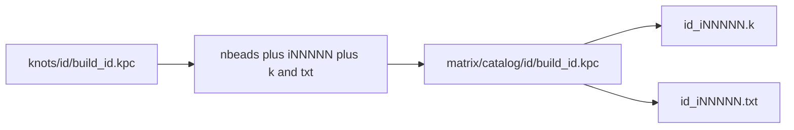

# Catalog kpc conversion to iNNNNN checkpoints

## Goal

Leave the original files in [`KnotPlot/knots`](c:/workspace/projects/SST-Workbench/KnotPlot/knots) untouched. Write **new** KnotPlot scripts under the existing matrix campaign:

[`KnotPlot/KnotPlot_3p1_MultiDynamics_Relaxation_Matrix_v0.1.0/catalog/`](c:/workspace/projects/SST-Workbench/KnotPlot/KnotPlot_3p1_MultiDynamics_Relaxation_Matrix_v0.1.0)

This is a **catalog conversion**, not a per-knot copy of the full force/charge/bend sweep matrix. Each converted script keeps its current MEB-tight dynamics and the existing `ago 1000` ladder through 15,000 iterations.

The existing 3.1 matrix scripts (`00_`–`90_`) already use `nbeads 300`, `iNNNNN`, and `save …k float` / `coords …txt`. They stay as they are.

## Sources (49 unique scripts)

Skip [`build_effort_active.kpc`](c:/workspace/projects/SST-Workbench/KnotPlot/knots/knot_0.1/build_effort_active.kpc) copies; each is a duplicate of the corresponding `build_{knot,link,torus}_*.kpc`.

- 20 knots, e.g. [`build_knot_0.1.kpc`](c:/workspace/projects/SST-Workbench/KnotPlot/knots/knot_0.1/build_knot_0.1.kpc) — `load <id>` + `refine nbeads 300`
- 15 links, e.g. [`build_link_2.2.1.kpc`](c:/workspace/projects/SST-Workbench/KnotPlot/knots/link_2.2.1/build_link_2.2.1.kpc) — `refine nbeads 600` or `900`
- 14 tori, e.g. [`build_torus_2.3.kpc`](c:/workspace/projects/SST-Workbench/KnotPlot/knots/torus_2.3/build_torus_2.3.kpc) — already `torus p q N` (300 / 600 / 900)

## Transforms (from the conversation)

Keep load/torus, force flags, `ago 1000`, and the diagnostic block (`echo` / `safe` / `dowker` / `lnknum` / `length` / `distance` / `angle` / `acn`).

1. **`refine nbeads N` → `nbeads N`** so N is an absolute count. Do **not** force every topology to 300. Links stay 600 or 900; torus `torus p q N` is already explicit.
2. **Checkpoint rename**
   - `analytic_D1` → `i00000`
   - `trial_001k` → `i01000` … `trial_015k` → `i15000`
3. **Dual save** instead of `save …txt` only:

```text
save KnotPlot_3p1_MultiDynamics_Relaxation_Matrix_v0.1.0/catalog/<id>/<id>_i00000.k float
coords KnotPlot_3p1_MultiDynamics_Relaxation_Matrix_v0.1.0/catalog/<id>/<id>_i00000.txt
```

Paths stay relative to the KnotPlot working directory (`KnotPlot/`), same convention as the current matrix scripts.

Example after conversion for the unknot:

```text
reset all
load 0.1
nbeads 300
mode cb
...
echo CHECKPOINT i00000
safe
dowker
lnknum
length
distance
angle
acn
save KnotPlot_3p1_MultiDynamics_Relaxation_Matrix_v0.1.0/catalog/knot_0.1/knot_0.1_i00000.k float
coords KnotPlot_3p1_MultiDynamics_Relaxation_Matrix_v0.1.0/catalog/knot_0.1/knot_0.1_i00000.txt

ago 1000
echo CHECKPOINT i01000
...
```



## Layout and runner

For each catalog id:

- script: `catalog/<id>/build_<id>.kpc`
- empty output dir ready for KnotPlot writes: `catalog/<id>/`

Also add:

- [`97_run_catalog.kpc`](c:/workspace/projects/SST-Workbench/KnotPlot/KnotPlot_3p1_MultiDynamics_Relaxation_Matrix_v0.1.0/97_run_catalog.kpc) — `<` includes of all 49 converted scripts, using the same `KnotPlot_3p1_MultiDynamics_Relaxation_Matrix_v0.1.0/` prefix as [`99_run_all_matrix.kpc`](c:/workspace/projects/SST-Workbench/KnotPlot/KnotPlot_3p1_MultiDynamics_Relaxation_Matrix_v0.1.0/99_run_all_matrix.kpc)
- a short `CATALOG.txt` listing ids, bead counts, and the `i00000…i15000` mapping
- a README note that `run_one.cmd catalog/knot_0.1/build_knot_0.1.kpc` works if we also allow a relative path, **or** document `run_one.cmd` usage against the new include script

Existing [`run_one.cmd`](c:/workspace/projects/SST-Workbench/KnotPlot/KnotPlot_3p1_MultiDynamics_Relaxation_Matrix_v0.1.0/run_one.cmd) currently only resolves `MATRIX_DIR\%~1`. Extend it so `run_one.cmd catalog\knot_0.1\build_knot_0.1.kpc` works.

Do **not** run KnotPlot or generate `.k`/`.txt` geometry in this task.

## Implementation

A small converter (not 49 hand edits):

- [`convert_catalog_kpc.py`](c:/workspace/projects/SST-Workbench/KnotPlot/KnotPlot_3p1_MultiDynamics_Relaxation_Matrix_v0.1.0/convert_catalog_kpc.py)
  - `checkpoint_name(old)` → `i00000` / `i01000` / …
  - `transform_kpc(text, dest_relpath)` → rewritten script
  - `iter_source_kpc(knots_dir)` → skips `build_effort_active.kpc`
  - CLI writes `catalog/` and `97_run_catalog.kpc`
- Tests colocated: `tests/test_convert_catalog_kpc.py`
  - `analytic_D1` / `trial_001k` / `trial_015k` mapping
  - `refine nbeads 300` → `nbeads 300`; `refine nbeads 600` stays 600
  - torus scripts have no `refine` line and keep `torus p q N`
  - `save …txt` becomes `save …k float` plus `coords …txt`
  - effort_active files are not selected
  - golden-snippet check against the `build_knot_0.1.kpc` header + first two checkpoints

Run those tests after generating `catalog/`. There is no existing test suite in the matrix folder today.

## Out of scope

- Overwriting `knots/*/build_*.kpc`
- Expanding each knot into F10/F11/… force-ablation or parameter sweeps
- Changing the existing 3.1 matrix diagnostic block (`centre` / `energy` / `writhe` / `rog` / `alex`)
- Zenodo mint/push
