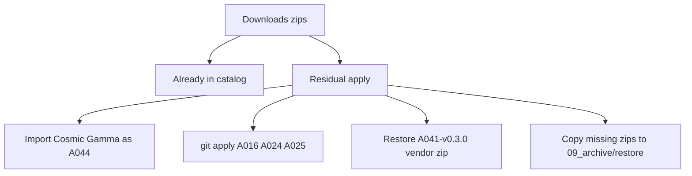

# Downloads-patches: audit + toepassen wat nog mist

## Auditresultaat (2026-09-21)

CRLF-genormaliseerde hash-vergelijking zip ↔ catalogus. Catalog-tests: `23 passed` (`test_catalog_registry`, `test_build_family_hierarchy`, `test_resolve_family`).

| Zip | Catalogusdoel | Status |
|-----|---------------|--------|
| `E010_pklsa_..._v0.3.0.zip` | [E010-v0.3.0](01_research/E_pipelines/E010_pklsa_parametric_knot_link_seed_atlas/E010-v0.3.0) | **Toegepast** (74/74 match) |
| `SST_Parametric_Trefoil_Seed_Atlas_v1.0.0.zip` | [E009-v1.0.0](01_research/E_pipelines/E009_ptsa_parametric_trefoil_seed_atlas/E009-v1.0.0) | **Toegepast** (56/56 na CRLF) |
| `SST_Trefoil_..._v0.3.1.zip` | [A038-v0.3.1](01_research/A_falsifiers/A038_trefoil_dynamic_seed_qualification/A038-v0.3.1) | **Toegepast** (74/74) |
| `Wien_Planck_..._v0.3.1.zip` | [A041-v0.3.1](01_research/A_falsifiers/A041_wien_planck_field_matter_closure/A041-v0.3.1) | **Toegepast** (156/156) |
| `Wien_Planck_..._v0.3.0.zip` | [A041-v0.3.0](01_research/A_falsifiers/A041_wien_planck_field_matter_closure/A041-v0.3.0) | **Bijna** — alleen `vendor/SST_Knot_Library_v0.2.5.zip` (~79 KB) ontbreekt |
| `SST_Quantum_Galileo_..._v0.1.0.zip` + beide QGI-patches | [A042-v0.1.0](01_research/A_falsifiers/A042_quantum_galileo_action_gauge_closure/A042-v0.1.0) | **Toegepast** — base + MSVC `ssize_t` + setup-discovery; `run_02` = MSVC-variant |
| `..._v0.1.1_BLIND_SOURCE` / `REVEAL_KEY` | [A042 `_variants/`](01_research/A_falsifiers/A042_quantum_galileo_action_gauge_closure/_variants) | **Toegepast** (CRLF; 1 lokaal afwijkende `run_02` in blind variant laten staan) |
| `SST_Paper_Driven_..._2026-09-07.zip` | diverse families | **Bijna** — P0/P1-targets + deferred A036/A039/A040 hebben al `PAPER_UPGRADE.md` / `paper_upgrade/`; **A016/A024/A025 optional-controls ontbreken** |
| Cosmic Gamma BLIND + beide outputs-zips | — | **Niet aanwezig** (0 hits in repo) |

Geen overwrite van al aanwezige packs (latere paper-upgrades / CRLF-normalisatie zouden anders beschadigd worden).

## Wat we gaan toepassen

### 1. Cosmic Gamma → A044 (enige volledige import)

- Bestemming: `01_research/A_falsifiers/A044_cosmic_gamma_transparency_dispersion_lorentz_emergence/`
- Uitpakken bron naar `A044-v0.1.0/` (zonder `.pytest_cache`)
- Outputs-zips naast de family leggen (zelfde patroon als A042), en blind/revealed inhoud onder `A044-v0.1.0/outputs/`
- Toevoegen: `FAMILY.yaml` (`catalog_id: A044`, `latest: v0.1.0`, slug/name van pack) + `A044-v0.1.0/project.json`
- Registry: `python 07_scripts/build_catalog_index.py` en `python 07_scripts/build_family_hierarchy.py` (`next_catalog_ids.A_falsifiers` wordt A045)
- Pack-tests: `pytest` in `A044-v0.1.0/tests` indien aanwezig

### 2. Optionele paper-control patches (A016 / A024 / A025)

Uit `SST_Paper_Driven_Falsifier_Upgrade_Patches_2026-09-07.zip` — alleen deze drie; overige diffs al verwerkt of deferred-marker aanwezig.

In resp. bases:
- [A016-v0.1.1](01_research/A_falsifiers/A016_helmholtz_vortex_transport/A016-v0.1.1)
- [A024-v0.3.0](01_research/A_falsifiers/A024_threaded_hole_separatrix/A024-v0.3.0)
- [A025-v0.3.0](01_research/A_falsifiers/A025_local_thread_texture_boost/A025-v0.3.0)

Werkwijze: `git apply --check` dan `git apply` (voegt `PAPER_UPGRADE.md`, `paper_upgrade/*`, `run_paper_upgrade.cmd` toe). Geen version bump / `latest` wijzigen (bundle noemt ze optional-control).

### 3. A041-v0.3.0 vendor-restant

Uit `Wien_Planck_..._v0.3.0.zip` alleen `vendor/SST_Knot_Library_v0.2.5.zip` naar `A041-v0.3.0/vendor/` (sha256 staat er al).

### 4. Archive-hygiëne

Ontbrekende zips kopiëren naar `09_archive/restore/` (Thema Falsifiers / Trefoil / root_zips) via het bestaande skip-als-naam-bestaat-model van [import_from_downloads.py](07_scripts/import_from_downloads.py) — **niet** opnieuw uitpakken over catalogusversies.

### 5. Bewijs / afronding

- Kort migratie-notitie under [10_docs/migration/](10_docs/migration/) met per-zip verdict
- Herhaal catalog-tests + A044 pack-tests + `git apply --check` dry-run bewijs dat overige paper-diffs al “already applied” / niet opnieuw nodig zijn
- Planbestand ook onder `.cursor/plans/`

## Expliciet niet doen

- Geen re-extract van E009/E010/A038/A041-v0.3.1/A042 (al aanwezig)
- Geen her-apply van paper-upgrade diffs waarvan target-versies al `paper_upgrade/` hebben
- Geen overwrite van A042 `_variants` `run_02_build_native.cmd` (unieke lokale hash, niet uit de QGI-patches)
