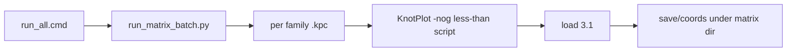

# Fix MultiDynamics `run_all` (nothing loaded)

## Diagnosis

`run_all.cmd` starts KnotPlot from the right shortcut/workdir, but the scene stays empty (`nothing loaded` / `nothing to save`) and drops to an interactive `KnotPlot>` prompt. No reliable `full_matrix_console.log` is produced.

Root cause is the **launcher**, not `load 3.1` (catalog builds already succeed in the same workdir).

## Reference that works (per your note)

Use the **ridgerunner batch packaging** from [`run_catalog_batch.cmd`](c:/workspace/projects/SST-Workbench/KnotPlot/ridgerunner/run_catalog_batch.cmd):

```bat
set "BUNDLE=%~dp0"
where python >nul 2>&1 || exit /b 1
python "%BUNDLE%run_catalog_batch.py" %*
exit /b %ERRORLEVEL%
```

Same shape as [`run_build_batch.cmd`](c:/workspace/projects/SST-Workbench/KnotPlot/ridgerunner/run_build_batch.cmd) → `run_build_batch.py`.

Note: `run_catalog_batch.cmd` itself does **not** call KnotPlot (Fourier/RR only). The **KnotPlot exe line that already works** lives in [`run_build.cmd`](c:/workspace/projects/SST-Workbench/KnotPlot/run_build.cmd):

```bat
"%KP_EXE%" -nog < "%SCRIPT%" > "!LOG_VERSIONED!" 2>&1
```

with exe/workdir resolved from `KnotPlot.lnk`, `pushd` to `KnotPlot/`, and **no** shortcut `Arguments` on the batch line.

Current matrix runners differ: they pass `%KP_ARGS%`, use `^<` escaping, feed a nested-include master over stdin, and do not use the thin cmd→python pattern.



## Chosen fix

Mirror **catalog_batch packaging** + **run_build KnotPlot launch**.

### 1. Thin CMD wrappers (like `run_catalog_batch.cmd`)

Under [`KnotPlot_3p1_MultiDynamics_Relaxation_Matrix_v0.1.0/`](c:/workspace/projects/SST-Workbench/KnotPlot/KnotPlot_3p1_MultiDynamics_Relaxation_Matrix_v0.1.0):

- [`run_all.cmd`](c:/workspace/projects/SST-Workbench/KnotPlot/KnotPlot_3p1_MultiDynamics_Relaxation_Matrix_v0.1.0/run_all.cmd) → `python run_matrix_batch.py --all`
- [`run_core.cmd`](c:/workspace/projects/SST-Workbench/KnotPlot/KnotPlot_3p1_MultiDynamics_Relaxation_Matrix_v0.1.0/run_core.cmd) → `python run_matrix_batch.py --core`
- [`run_one.cmd`](c:/workspace/projects/SST-Workbench/KnotPlot/KnotPlot_3p1_MultiDynamics_Relaxation_Matrix_v0.1.0/run_one.cmd) → `python run_matrix_batch.py --one <script.kpc>`

Keep wrappers minimal (path + python check + forward args), same style as `run_catalog_batch.cmd`.

### 2. `run_matrix_batch.py` orchestrator

New Python module next to those cmds (tests colocated under `tests/`):

- Resolve `KnotPlot.lnk` TargetPath + WorkingDirectory (same COM approach as today’s cmds / `run_build.cmd`).
- Family lists:
  - **core:** `10`, `20`, `30`, `40`, `50`, `90`
  - **all:** `00` … `90`
- For each script: `subprocess.run([kp_exe, "-nog"], stdin=open(script), stdout=log, stderr=STDOUT, cwd=kp_workdir)` — equivalent to `run_build.cmd`’s `"%KP_EXE%" -nog < script > log 2>&1`.
- Do **not** invent `-stdin` unless smoke proves `-nog` alone fails on this install; prefer the exact working `run_build` flags first.
- Per-family log: `MATRIX_DIR/<stem>_console.log`.
- Fail fast if return code ≠ 0 or log contains `nothing loaded`.
- Optional `--dry-run` (print argv only), matching catalog_batch UX.

Keep [`98_run_core_matrix.kpc`](c:/workspace/projects/SST-Workbench/KnotPlot/KnotPlot_3p1_MultiDynamics_Relaxation_Matrix_v0.1.0/98_run_core_matrix.kpc) / [`99_run_all_matrix.kpc`](c:/workspace/projects/SST-Workbench/KnotPlot/KnotPlot_3p1_MultiDynamics_Relaxation_Matrix_v0.1.0/99_run_all_matrix.kpc) for **interactive** `< …` use only.

### 3. Smoke script

Add `smoke_load_3_1.kpc` (`reset all` / `load 3.1` / `nbeads 300` / `echo SMOKE_OK` / dual save). Verify with `run_one.cmd smoke_load_3_1.kpc`.

### 4. Docs + tests

- README: batch = catalog_batch-style wrappers; KnotPlot line = run_build; interactive masters unchanged.
- Tests: family list membership; dry-run argv shape; “nothing loaded” detector helper.

## Out of scope

- Per-component link bead ratios (`2π` / `L16|L32`)
- Full multi-hour matrix run in this task (smoke + optional `00_baseline_MEB_tight.kpc`)
- Changing force/parameter content of `00_`–`90_` scripts
- Changing `run_catalog_batch` itself
