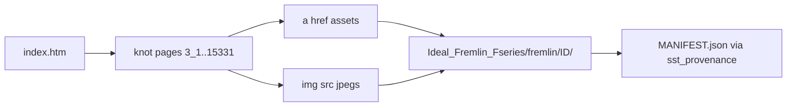

# Ideal Fremlin Fseries archive + cleanup

## Audit: wat er niet thuishoort

In [SSTcore/resources/Knots_FourierSeries](c:/workspace/projects/SSTcore/resources/Knots_FourierSeries) staan **3 mappen die niet op** [Fremlin’s index](https://david.fremlin.de/knots/) staan:

| Dir | Bewijs | Actie |
|---|---|---|
| `9_2/` | header: `Knot 9_2 (ideal) - converted…` / `Data source: Brian Gilbert` | **verwijderen** (jouw 2e ideal-knoop) |
| `10_1/` | idem Gilbert/ideal conversie + `*n.csv`/`*n.fseries` | **verwijderen** (jouw 1e ideal-knoop) |
| `1_1/` | `Simple Circle` / `generated by hand` | **ook verwijderen** (geen Fremlin; handmatige unknot) |

De 37 Fremlin-pagina’s (van `3_1` t/m `8_21`, plus `12a_1202` en `15331`) blijven. Dezelfde drie mappen zitten ook in [SST-Workbench/KnotPlot/Knots_FourierSeries](c:/workspace/projects/SST-Workbench/KnotPlot/Knots_FourierSeries) — die worden synchroon opgeschoond.

Bestaande Fremlin-kopieën hebben **geen** `.jpeg`’s; die komen pas in het nieuwe archief.

## Bestaande downloader (hergebruiken, niet `example_fetching_knots`)

De HTTP-crawler staat in [VAM/VAM_PYTHON_SIMULATOINS/dl_knots.py](c:/workspace/projects/VAM/VAM_PYTHON_SIMULATOINS/dl_knots.py) (`crawl` over `index.htm`, exts `.fseries/.short/.scad/.stl/.jpeg/.jpg/.png`).  
[SSTcore/examples/example_fetching_knots.py](c:/workspace/projects/SSTcore/examples/example_fetching_knots.py) leest alleen lokale resources — dat is niet de downloader.

Gat in `dl_knots.py`: images staan op knot-pagina’s als ``, niet altijd als `<a href>`. De nieuwe script moet **beide** scrapen.



## Nieuwe map: `SST-Workbench/Ideal_Fremlin_Fseries/`

Spiegel [Ideal_Sources](c:/workspace/projects/SST-Workbench/Ideal_Sources) (SOURCE + MANIFEST + provenance tool), met per-knot folders:

```
Ideal_Fremlin_Fseries/
  SOURCE.md                 # URL, retrieval date, attribution, licence note
  PROVENANCE.md             # kort: immutable upstream, cite Fremlin; verwijs Ideal_Sources policy
  MANIFEST.json             # sst-provenance/1 hashes
  sst_provenance.py         # kopie van Ideal_Sources (zelfde schema)
  download_fremlin_knots.py # verbeterde crawler
  tests/test_download_fremlin_knots.py
  fremlin/                  # immutable download root
    3_1/knot.3_1.{fseries,short,scad,stl,jpeg} + varianten (u,p,…)
    …
    15331/…
```

**Downloader-gedrag (concreet):**
- Start-URL: `https://david.fremlin.de/knots/index.htm` (of `/knots/`).
- Alleen knot-pagina’s in dezelfde directory (`.htm` met stems zoals `3_1`, `12a_1202`, `15331`); skip `table.htm` / niet-knot pagina’s voor asset-folders.
- Per pagina: download alle `a[href]` én `img[src]` met exts in `{.fseries,.short,.scad,.stl,.jpeg,.jpg,.png}` (inclusief thumbnails als die op de knot-pagina staan).
- Output: `fremlin/<page_stem>/<basename>` (exact upstream bytes; geen normalisatie).
- Skip bestaande files tenzij `--force`; nette User-Agent + korte delay.
- Na download: `sst_provenance.py init fremlin -o MANIFEST.json --source SOURCE.md`.

**SOURCE.md** noteert: David Fremlin, https://david.fremlin.de/knots/, retrieval date, dat dit de citable Fourier/short/scad/stl/jpeg set is, en licence status (waarschijnlijk UNRESOLVED / cite site — zelfde stijl als Ideal_Sources).

## Cleanup (SSTcore + Workbench mirror)

Verwijder directories:
- `SSTcore/resources/Knots_FourierSeries/{9_2,10_1,1_1}/`
- `SST-Workbench/KnotPlot/Knots_FourierSeries/{9_2,10_1,1_1}/`

Geen volledige replace van SSTcore’s bestaande Fremlin-bestanden in deze stap — officiële verse tree leeft in `Ideal_Fremlin_Fseries`. (Later optioneel syncen.)

## Tests

Unit-tests op fixtures (geen netwerk in CI):
- `page_stem` / URL-decode (`3%5F1.htm` → `3_1`)
- extractie van asset-URL’s uit sample HTML (anchors + imgs), zoals jouw `3_1.htm`-voorbeeld
- filter: alleen same-dir + target extensions
- dest-pad layout `fremlin/3_1/knot.3_1.fseries`

Smoke (handmatig bij uitvoering): één live download-run naar `Ideal_Fremlin_Fseries`, daarna `sst_provenance.py verify`.

## Scope / niet doen

- Geen Zenodo mint/push.
- Geen wijziging van ideal.txt / Ideal_Sources.
- Geen mass-replace van alle SSTcore `.fseries` in deze PR/stap.
