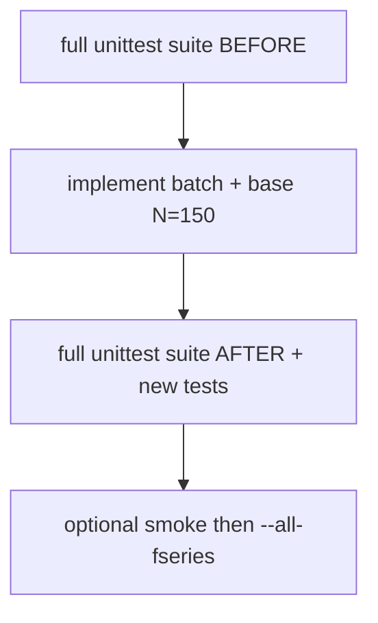

# Fseries batch runs (150 → 300 → 600 → 900 → 1200)

## Target command (phase 1)

```bat
cd C:\workspace\projects\SST-Workbench\KnotPlot\ridgerunner
run_catalog_batch.cmd --all-fseries -r150,300,600,900,1200 -t12
```

Runs **all 78** `.fseries` files under [`Knots_FourierSeries`](c:\workspace\projects\SST-Workbench\KnotPlot\Knots_FourierSeries) (canonical + variants like `3_1p`, `3_1u`, `6_3d`, …), sequentially, resume-friendly.

## Test gate (before and after)

Non-negotiable: **full unit suite green before the first edit**, and **full suite (old + new) green before calling the work done**. Do not “fix tests” if a regression appears — fix the code.

### Baseline (before any changes)

From [`KnotPlot/ridgerunner`](c:\workspace\projects\SST-Workbench\KnotPlot\ridgerunner):

```bat
python -m unittest ^
  test_gilbert_ab_to_xyz.py ^
  test_run_ideal_knot.py ^
  test_run_catalog_knot.py ^
  test_run_knotplot_txt.py ^
  test_fseries_to_xyz.py ^
  test_recover_ladder_coarse.py ^
  test_resample_closed_knot_txt.py ^
  test_count_rr_la_failures.py -v
```

Record pass/fail count. If anything fails, stop and fix baseline first (or report) — no feature work on a red suite.

### After changes

Re-run the **same command**, plus new modules:

```bat
python -m unittest ^
  test_gilbert_ab_to_xyz.py ^
  test_run_ideal_knot.py ^
  test_run_catalog_knot.py ^
  test_run_knotplot_txt.py ^
  test_fseries_to_xyz.py ^
  test_recover_ladder_coarse.py ^
  test_resample_closed_knot_txt.py ^
  test_count_rr_la_failures.py ^
  test_run_catalog_batch.py -v
```

All must pass. New coverage must include (per function / behavior added):
- `12a_1202` / `12a_1202z6` stem + flag parsing + `fseries_path_for_stem`
- discovery of all 78 fseries stems (sorted, unique)
- resolution split: base `150`, ladder `[300,600,900,1200]`
- `parse_ladder_ns_list` / helpers with variable base (300 allowed when base=150)
- batch `--dry-run` / summary shape (no RR required)
- existing Gilbert defaults still imply base 300 (no accidental default change)

Optional smoke (not a unit substitute): `--stems 3_1 -r150,300 -t12` only after suite is green.

## Context

Single-knot path already exists: [`run_catalog_knot.py`](c:\workspace\projects\SST-Workbench\KnotPlot\ridgerunner\run_catalog_knot.py) + [`fseries_to_xyz.py`](c:\workspace\projects\SST-Workbench\KnotPlot\ridgerunner\fseries_to_xyz.py) → [`run_three_stage.cmd`](c:\workspace\projects\SST-Workbench\KnotPlot\ridgerunner\run_three_stage.cmd) → [`run_resolution_ladder.cmd`](c:\workspace\projects\SST-Workbench\KnotPlot\ridgerunner\run_resolution_ladder.cmd).

Gaps:
- No batch over the full Fourier catalog.
- Pipeline hard-wired to **N=300 as base** (`n300` short aliases, `BASE_RESOLUTION = 300`, ladder only for `N > 300`).
- Stem/`--flag` regex fails for **`12a_1202`** / **`12a_1202z6`**.
- Non-2× rungs (`600→900`, `900→1200`) already work via ladder `--ns` + `spline_repair`; must keep working when base is 150.

**Chosen defaults:**
- Resolutions: **`150,300,600,900,1200`**
- Threads: **`-t12`** (multithread exe + `out/<stem>/t12/`)
- Between rungs: **continue via polish upsample** (existing ladder), not fresh fseries resample
- Scope phase 1: **all fseries** only
- On failure: continue to next stem; write batch summary



## Phase 1 approach

### 0. Baseline tests

Run the suite above; proceed only when green.

### 1. Generalize base resolution (150 as first rung)

Extend shared helpers in [`run_ideal_knot.py`](c:\workspace\projects\SST-Workbench\KnotPlot\ridgerunner\run_ideal_knot.py) / catalog pipeline:

- Seed `n{base}.txt` from fseries (`--points` = `min(resolutions)` → **150**).
- Short three_stage aliases for **any** `n{N}`: `n{N}c` / `n{N}e` / `n{N}p` / `p{N}`.
- Ladder takes variable base polish (`p150`); first targets can be **300** (today `parse_ladder_ns_list` rejects `N <= 300` — change to `N > base_polish_n`).
- Rung **900** stays a first-class `--ns` target (`coarse_steps_for_n(900)` already exists).
- Non-2× transfers use existing `--method auto` (`spline_repair` + Rop gate); 2× rungs (150→300, 300→600) use the same path for consistency.
- Gilbert / `run_ideal_knot` default base stays **300** (no behavior change for `--3:1:1`).

Concrete edits:
- [`run_three_stage.cmd`](c:\workspace\projects\SST-Workbench\KnotPlot\ridgerunner\run_three_stage.cmd): `nNNN` stem → short mode for that N.
- [`run_resolution_ladder.cmd`](c:\workspace\projects\SST-Workbench\KnotPlot\ridgerunner\run_resolution_ladder.cmd) + helpers: ladder ns relative to input polish N.
- [`run_catalog_knot.py`](c:\workspace\projects\SST-Workbench\KnotPlot\ridgerunner\run_catalog_knot.py): drive from `min(resolutions)` as base; rest as ladder. Batch default resolutions `150,300,600,900,1200`.

### 2. Fix stem parsing for `12a_1202`

Update `FS_FLAG_RE` / `fseries_path_for_stem` for mid-letter ids (`12a_1202`, `12a_1202z6`) while keeping `3_1p`, `8_10s`, `15331`.

### 3. Batch driver

Add [`run_catalog_batch.py`](c:\workspace\projects\SST-Workbench\KnotPlot\ridgerunner\run_catalog_batch.py) + [`run_catalog_batch.cmd`](c:\workspace\projects\SST-Workbench\KnotPlot\ridgerunner\run_catalog_batch.cmd):

```bat
run_catalog_batch.cmd --all-fseries -r150,300,600,900,1200 -t12
run_catalog_batch.cmd --stems 3_1,3_1p,3_1u -r150,300 -t12
run_catalog_batch.cmd --all-fseries --dry-run
```

Behavior:
- Discover stems via recursive `*.fseries`.
- Per stem: same pipeline as `run_catalog_knot` → `out/<stem>/t12/`.
- Resume checkpoints; continue on failure unless `--fail-fast`.
- Write `out/batch_fseries_summary.json` (status, Rop per N, wall time, exit code).

### 4. New unit tests + docs + after-suite

- Add [`test_run_catalog_batch.py`](c:\workspace\projects\SST-Workbench\KnotPlot\ridgerunner\test_run_catalog_batch.py) and extend [`test_fseries_to_xyz.py`](c:\workspace\projects\SST-Workbench\KnotPlot\ridgerunner\test_fseries_to_xyz.py) / [`test_run_catalog_knot.py`](c:\workspace\projects\SST-Workbench\KnotPlot\ridgerunner\test_run_catalog_knot.py) / [`test_run_ideal_knot.py`](c:\workspace\projects\SST-Workbench\KnotPlot\ridgerunner\test_run_ideal_knot.py) for changed helpers.
- README: primary batch command; note Gilbert stays 300-first; document phase-2 KnotPlot extension point.
- Re-run **full** suite (section above). Only then optional RR smoke.

## Vervolgplannen (was out-of-scope / phase 2)

Phase 1 implementeert alleen fseries batch + variable base. Alles hieronder heeft al een eigen plan onder `.cursor/plans/`:

| Vervolg | Plan | Kort |
|---------|------|------|
| KnotPlot export/relax + `--all-knotplot` | [knotplot_export_batch_followup.plan.md](knotplot_export_batch_followup.plan.md) | Ontbrekende knot/torus/link seeds; daarnazelfde ladder |
| Full 78-knot RR campagne | [fseries_full_campaign_followup.plan.md](fseries_full_campaign_followup.plan.md) | Operationele `--all-fseries -r150,300,600,900,1200 -t12` na groene tests |
| Parallel multi-knot | [batch_parallel_knots_followup.plan.md](batch_parallel_knots_followup.plan.md) | `--jobs N` worker pool |
| Catalog / VortexLab upsert | [batch_catalog_vortexlab_followup.plan.md](batch_catalog_vortexlab_followup.plan.md) | Post-polish uniform N300 + upsert |
| Gilbert ladder vanaf 150 | [gilbert_ladder_150_followup.plan.md](gilbert_ladder_150_followup.plan.md) | Ideal path opt-in `-r150,…` (default blijft 300) |
| Ridgerunner C / compile-repo | [rr_compile_repo_followup.plan.md](rr_compile_repo_followup.plan.md) | Alleen bij aangetoonde native bugs |

In phase-1 README alleen de extension-point noemen; geen implementatie van bovenstaande.

## Verification checklist

1. Baseline full suite green **before** edits.
2. After edits: full suite + `test_run_catalog_batch.py` green (no weakened assertions).
3. Dry discovery lists all 78 stems including variants and `12a_1202*`.
4. Documented primary command: `--all-fseries -r150,300,600,900,1200 -t12`.
5. Optional: smoke `3_1` at 150→300 under `out/3_1/t12/`.
