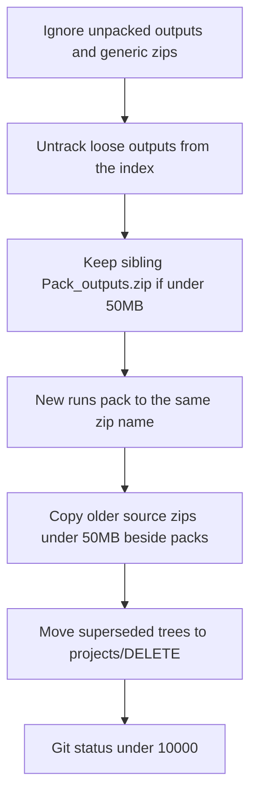

# Gitignore outputs and clean patched versions

Cursor’s **“too many active changes”** comes from tens of thousands of unpacked output files. **One small `*_outputs.zip` next to the pack replaces that tree in git**, so GitHub and `git status` stay small. Unpacked `outputs/` stay on disk, ignored.

**No real deletes.** Relocations go to [`C:\workspace\projects\DELETE`](C:\workspace\projects\DELETE). GitHub-only drops use `git rm --cached`.

---

## Locked decisions

- **Unpacked outputs stay on disk**, not in git: `outputs/`, `out/`, `campaigns/`, `*.npz`, crawler harvests.
- **`*_outputs.zip` under 50 MiB stay in the repo**, as a **sibling of the pack folder**, Trefoil name:

  `{parent}/{PackFolderName}_outputs.zip`

  Example: `KnotPlot/Trefoil_Balance_Point_Campaign_v0.2.3_outputs.zip`

  Git cannot ignore by size. Rule: `.gitignore` has `*.zip`; **`git add -f` only if size &lt; 50 MiB**. Packs at or above 50 MiB stay local-only (later SSTcore), still named `{PackFolderName}_outputs.zip`.

- **New outputs** use the same rule: pack unpacked runs to `{PackFolderName}_outputs.zip`; add to git only if &lt; 50 MiB; leave the unpacked tree ignored locally.
- **Do not** put tracked sibling `*_outputs.zip` into `Restore_Archives/` (that would duplicate). Restore_Archives remains the home for source/hotfix zips and for **copies** of large/local-only archives.
- **Older/patch source zips** (&lt; 50 MiB) are **copied** beside the family from Downloads (not output zips). Those source zips stay gitignored (`*.zip` without `-f`).
- **No disk deletions.** Move to `C:\workspace\projects\DELETE\<relative path>`.
- **GitHub HEAD:** untrack unpacked outputs and zips that are **not** sibling `*_outputs.zip` &lt; 50 MiB. No history rewrite. Currently **24** tracked `*_outputs.zip`, all under 50 MiB (many live under `Restore_Archives/` — copy beside the pack if missing, then untrack the Restore_Archives copy).
- **Do not relocate** 3-part lineage campaigns.

---

## 1. Ignore unpacked outputs; zip policy

[`.gitignore`](.gitignore):

- `*.zip` (generic; small output zips are force-added)
- `**/outputs/`, `**/outputs_*/`, `**/*_outputs/`, `**/campaigns/`, `**/logs/`
- `*.npz`
- `KnotPlot/**/out/`, `KnotPlot/qhp/`, `KnotPlot/qhp_extended/`, `KnotPlot/qhp_6p3/`
- `Katlas_Sources_v0.2.2_Outputs/`

Helper: `is_commitable_output_zip(path) -> size < 50 * 1024 * 1024 and name.endswith("_outputs.zip") and zip sits next to the pack folder` (not under `Restore_Archives/`).

---

## 1b. Untrack from GitHub (index only)

`git rm -r --cached` for unpacked output paths, `*.npz`, and `*.zip` **except** sibling `*_outputs.zip` with size &lt; 50 MiB.

Keep working tree. After commit + your push, GitHub latest tree has few zip files instead of thousands of npz/csv dumps. Old commits still have the blobs.

Do not `git rm` without `--cached`. Do not force-push.

---

## 2. Copy older/patch **source** zips beside falsifiers (&lt; 50 MiB)

From Downloads, copy lower versions and `*_PATCH*` / `*_HOTFIX*` next to the family folder. Also copy those into `Restore_Archives/`. Skip existing same SHA-256. Strip ` (1)`.

---

## 3. Pack outputs (new and missing)

If a pack has unpacked `outputs/` / `out/` / `campaigns/` and no sibling `{folder}_outputs.zip`, pack with Trefoil naming. Reuse `pack_outputs.py` when present.

Then: if the zip is &lt; 50 MiB, `git add -f`. If not, leave ignored.

Existing Trefoil zips already beside `KnotPlot/` stay tracked.

---

## 4. Relocate superseded patch source trees

Keep QHP Sweep `v0.3.2` and Trefoil `v0.2.4`. Keep Swirl `v0.2.2.8`; move extracted `v0.2.2.5`/`.6`/`.7` to DELETE after `{folder}.zip` exists. Keep `v0.1.0` … `v0.2.2`. Pack `{folder}_outputs.zip` first if that tree has outputs and the zip is &lt; 50 MiB (then it can stay tracked next to the family **before** the folder move).

---

## 5. Verify

- Unpacked outputs ignored; `git ls-files "*_outputs.zip"` only sibling zips &lt; 50 MiB
- `git ls-files` no longer lists `**/outputs/**` or `*.npz`
- Files still on disk
- `pytest` for size gate + naming
- Push only when you ask

---

## Files

- [`.gitignore`](.gitignore)
- [scripts/consolidate_archives.py](scripts/consolidate_archives.py) + tests
- Helpers + tests: `is_commitable_output_zip`, pack `{folder.name}_outputs.zip`, DELETE relocate, cached-untrack list
- [Restore_Archives/README.md](Restore_Archives/README.md)
