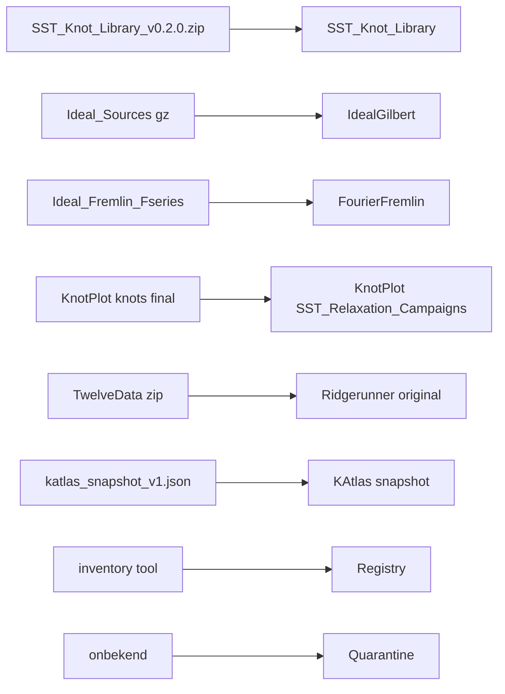

# Knot_Library provenance layout

Pak [`C:\Users\oscar\Downloads\SST_Knot_Library_v0.2.0.zip`](C:\Users\oscar\Downloads\SST_Knot_Library_v0.2.0.zip) uit en bouw de centrale knot-repository onder [`Knot_Library/`](Knot_Library/) volgens provenance (niet bestandsformaat). Bestaande mappen (`Ideal_Sources/`, `Ideal_Fremlin_Fseries/`, `KnotPlot/knots/`) blijven staan; we kopiëren bekende archives en inventariseren de rest zonder te verplaatsen.

## Doel-layout

```text
SST-Workbench/Knot_Library/
├── SST_Knot_Library/SST_Knot_Library_v0.2.0/   # zip, daarna patch naar 0.2.1
├── Sources/
│   ├── Ideal_Gilbert/
│   ├── FourierSeries_Fremlin/
│   ├── KnotPlot_Scharein/
│   ├── Ridgerunner_Cantarella_Rawdon/
│   ├── KAtlas_BarNatan/
│   └── SST_Generated/
├── Registry/
├── Derived/
└── Quarantine/
```

Mensvriendelijke mapnamen en machine-IDs blijven gescheiden. Software parsed **nooit** directorynamen:

- `Ideal_Gilbert` → `gilbert_ideal`
- `FourierSeries_Fremlin` → `fremlin_fourier`
- `KnotPlot_Scharein` → `knotplot`
- `Ridgerunner_Cantarella_Rawdon` → `ridgerunner`
- `KAtlas_BarNatan` → `katlas`
- `SST_Generated` → `sst_generated`

Gilbert en Fremlin zijn **beide Fourier**. Het onderscheid is provenance + constructiedoel (SONO/ideal vs elegante 3D-realisatie), niet het bestandsformaat.



## 1. Zip uitpakken

Uitpakken naar [`Knot_Library/SST_Knot_Library/SST_Knot_Library_v0.2.0/`](Knot_Library/SST_Knot_Library/) (zelfde versiemap-conventie als [`Knot_Geometry_Library/`](Knot_Geometry_Library/)). Daarna in **diezelfde boom** patchen en de versie naar **0.2.1** tillen (CHANGELOG: 0.2.0 = zip-baseline; 0.2.1 = native `Knot_Library`-layout). Eerst de bestaande zip-tests draaien (`run_basic.cmd` / `tests/test_smoke.py`) zodat we een groene baseline hebben.

## 2. Mappen + SOURCE.json

Per provider een `SOURCE.json` (`schema: sst-knot-library-source/1`) plus `.gitkeep` waar nog geen data is. Voorbeeldvelden:

- `provider_id`, `provider_name`, `directory`
- `class` (`original` / `extracted` / `relaxed` / `snapshot` / …)
- `construction_objective`
- `origin_paths` (Workbench-relatieve paden van de kopie-bron)
- `copied: true`, `moved: false`
- optioneel `relaxation` (stappen, solver) en `topology`

Centrale index: [`Knot_Library/Registry/providers.json`](Knot_Library/Registry/providers.json) (id → directory). Byte-identiteit van originelen blijft via bestaand [`sst_provenance.py`](Ideal_Sources/sst_provenance.py) (`MANIFEST.json`, schema `sst-provenance/1`) — geen tweede hashsysteem.

Provider-substructuur (leeg waar nog geen kopie):

- **Ideal_Gilbert:** `original/` + `extracted/`
- **FourierSeries_Fremlin:** `original/` + `extracted/`
- **KnotPlot_Scharein:** `Database_Original/`, `Initial_Seeds/`, `Relaxed/`, `Fourier_Exports/`, `VECT_Exports/`, `SST_Relaxation_Campaigns/`
- **Ridgerunner_Cantarella_Rawdon:** `Seeds/`, `N0600/`, `N1200/`, `Continued/`, `NearIdeal/`, `Final/` plus `original/` voor TwelveData
- **KAtlas_BarNatan:** `snapshot/`, `topology/`, `braid_seeds/`
- **SST_Generated:** `Analytic/ClassicTrefoil`, `Analytic/TorusKnot`, `TrackTrefoil`, `BraidClosure`, `KAtlasBraidDerived`, `S3Projection`, `ThreadBundle`, `PerturbedSeeds`
- **Quarantine:** `Unknown_Source/`, `Unknown_Format/`, `Topology_Mismatch/`, `Hash_Mismatch/`

`KAtlasBraidDerived` blijft onder SST_Generated: KAtlas-braidbron ≠ SST-3D-realisatie van die braid.

## 3. Bekende archives kopiëren (niet verplaatsen)

SHA-256 van kopie verifiëren tegen bestaande MANIFEST waar die bestaat.

- **Ideal_Gilbert/original:** kopieer de Gilbert `Ideal*.gz` / `IdealLinks*.gz` uit [`Ideal_Sources/`](Ideal_Sources/) (ongewijzigde upstream-bytes; **niet** gunzippen in `original/`). `TwelveData.zip` hoort **niet** hier.
- **Ideal_Gilbert/extracted:** per kernknoop `3_1`, `4_1`, `6_2`, `7_4` het ruwe `<AB>`-blok uit `Ideal.txt.gz` (ids `3:1:1`, `4:1:1`, `6:2:1`, `7:4:1`) als bestand, niet als geresamplede XYZ. XYZ-sampling hoort later in `Derived/`.
- **FourierSeries_Fremlin/original:** kopieer [`Ideal_Fremlin_Fseries/fremlin/`](Ideal_Fremlin_Fseries/fremlin/) byte-voor-byte (388 files). `.stl` blijft gitignored.
- **FourierSeries_Fremlin/extracted:** kopieer alleen de vier kernmappen `3_1`, `4_1`, `6_2`, `7_4`.
- **KnotPlot_Scharein/SST_Relaxation_Campaigns:** kopieer [`KnotPlot/knots/final/`](KnotPlot/knots/final/) (49 `*_final.txt` + alias/metrics). Dit zijn **geen** KnotPlot-database-originelen: alias.json wijst naar Ridgerunner-polish (`rr_*_coarse` / `eqfinal` / `polish`). Provenance per sample: `provider_id=knotplot`, `class=relaxed`, plus relaxation/solver uit de alias. `Database_Original/` blijft leeg tot inventory iets certificeert.
- **Ridgerunner_Cantarella_Rawdon/original:** kopieer `TwelveData.zip`, `TwelveSummary.zip`, `0TwelveData.csv` uit Ideal_Sources (Klotz/Anderson 12-crossing polylines via Knot Atlas). `*.zip` blijft gitignored; SOURCE.json + hashes wel committen.
- **KAtlas_BarNatan/snapshot:** kopieer `katlas_snapshot_v1.json` (+ `.sha256`) uit de zip (`sst_knotlib/data/`). De grote [`Katlas_Sources_v0.2.2_Outputs/`](Katlas_Sources_v0.2.2_Outputs/) tree niet dupliceren; alleen in inventory + `origin_paths` vermelden.
- **SST_Generated:** alleen stubs. Geen analytic seeds tussen Gilbert/Fremlin/RR zetten.

## 4. Library native op deze layout (0.2.1)

Huidige v0.2.0 is pad-agnostisch: `_source_family()` gokt op filenaam (`ideal` → `ideal_txt`, `fseries` → `knotplot_fseries`), CLI eist een `root`, docs tonen `..\..\KnotPlot\knots\final`. Dat vervangen we.

- Nieuwe module `sst_knotlib/library_root.py`: ontdek `Knot_Library/` (env `SST_KNOT_LIBRARY_ROOT`, of ouders vanaf package/CWD), laad `Registry/providers.json`.
- `GeometryAsset` / `make_knot_record` krijgen `provider_id`, `provider_name`, `class` uit SOURCE.json van de dichtstbijzijnde provider-root — **niet** uit `_source_family` path-heuristiek. Heuristiek blijft alleen fallback → `Quarantine`-classificatie, nooit `CERTIFIED`.
- `scan-dataset` default root = `Knot_Library/Sources` (expliciete `root` blijft mogelijk).
- CLI `inspect` / wrappers: voorbeelden naar `Sources/...`, niet `KnotPlot\knots\final`.
- Strict policy: records zonder `provider_id` mogen geen strict falsifier-input zijn (audit/geometry-only wel, met warning).

## 5. Migratie-inventory (geen blinde move)

Nieuw CLI-commando `inventory-sources` in de library (plus `run_inventory.cmd`):

- Scant o.a. `Ideal_Sources/`, `Ideal_Fremlin_Fseries/`, `KnotPlot/knots/`, `KnotPlot/Knots_FourierSeries/`, `Katlas_Sources_v0.2.2_Outputs/` (als aanwezig).
- Classificeert naar voorgestelde `provider_id` + `class` + doelpad.
- Schrijft [`Knot_Library/Registry/inventory_unmigrated.json`](Knot_Library/Registry/inventory_unmigrated.json).
- Verplaatst niets. Onduidijke hits → voorgesteld `Quarantine/Unknown_Source` of `Unknown_Format`.

KnotPlot-trials (`*_trial_*.txt`) → `Initial_Seeds` of `Relaxed` op basis van naam (`ago`/stappen); RR-tussenstappen (`*_rr_*`) → Ridgerunner `Continued`/`Final` als classificeerbaar, anders Quarantine.

## 6. Tests

Bestaande `tests/test_smoke.py` moet groen blijven. Nieuw (unittest, lokale fixtures, geen netwerk):

- `test_providers_json_ids` — mapping directory ↔ `provider_id`
- `test_source_json_schema` — verplicht velden; Gilbert ≠ Fremlin objective-tekst
- `test_library_root_discovery`
- `test_record_uses_provider_id_not_path_heuristic` — fseries onder `Ideal_Gilbert` blijft `gilbert_ideal`
- `test_inventory_does_not_move` + classificatie van synthetische paden (`ideal.txt`, `fremlin/3_1`, `knots/final`, naamloze xyz)
- `test_copied_core_knots_present` — `extracted/3_1` (of equivalent) bestaat voor Gilbert en Fremlin
- `test_knotplot_finals_not_database_original`

Eerst bestaande tests, daarna nieuwe; bij falen eerst de code fixen.

## 7. Git / docs

- [`/.gitignore`](.gitignore): `*.zip` / `*.stl` blijven; geen `Knot_Library/` negeren. Eventueel `Knot_Library/Sources/**/original/*.zip` laten vallen zoals nu. SOURCE.json, providers.json, extracted kernknopen, Gilbert `.gz`, Fremlin `.fseries`/`.short` wél tracken.
- Korte [`Knot_Library/README.md`](Knot_Library/README.md): layout, provider-IDs, “copy not move”, licence UNRESOLVED (zelfde policy als Ideal_Sources).
- Library README/CHANGELOG/docs: KnotPlot-final-pad vervangen; `PROVIDER_MATRIX` uitbreiden met data-providers vs exe-providers (`knotplot` exe ≠ `knotplot` geometry class).

Niet in deze stap: originelen verwijderen, falsifiers omzetten, TwelveData uitpakken, of Katlas RDF-exports dupliceren.
