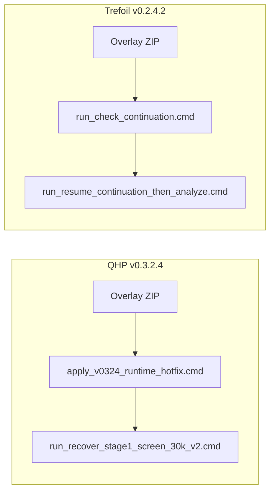

# KnotPlot hotfix overlay plan

**Author confirmation:** both hotfixes are ready and regression-tested against uploaded `stage1_screen_30k_v2.zip`. Neither is applied on this machine yet.

## Current state (local workspace)

### [KnotPlot_MultiTopology_QHP_Sweep_v0.3.2](KnotPlot/KnotPlot_MultiTopology_QHP_Sweep_v0.3.2)

| Signal | Status |
|---|---|
| Stage-1 campaign `stage1_screen_30k_v2` dynamics | **Complete** — 90/90 final `.k` + `.txt` |
| `*.metrics.csv` | **All empty** (1980 files) |
| KnotPlot logs | `unknown data field 's'`, `0 data records written` (90 runs) |
| `analysis/REPORT.md` | **Empty table** |
| Hotfix marker | `HOTFIX_v0.3.2.4_APPLIED.json` **missing** |

Root cause: unsupported `/s` safeness in KPC `data format` ([`qhp_sweep/kpc.py`](KnotPlot/KnotPlot_MultiTopology_QHP_Sweep_v0.3.2/qhp_sweep/kpc.py)). Saved `.k float` states are valid and sufficient.

### [Trefoil_Balance_Point_Campaign_v0.2.4](KnotPlot/Trefoil_Balance_Point_Campaign_v0.2.4)

| Signal | Status (local scan) |
|---|---|
| Cold-start + overlap + 200k extension | **Done** |
| Continuation 200k→400k | E01–E08 **complete** through 400k; E09–E16 **missing all continuation checkpoints** |
| Final analysis | **Not run** |
| Hotfix files | **Missing** (`check_continuation_completeness.py`, resume cmd) |

Root cause: `analyze.py` ran (or would run) before continuation outputs existed — `FileNotFoundError: XQHP__E08_i260000.txt`. **Not a scientific verdict.** Actual per-setting gaps are determined from files on disk (author notes E08 may be partial on some machines).



---

## Hotfix artifacts (author-provided, with SHA-256)

Verify before overlay:

| Artifact | SHA-256 |
|---|---|
| `KnotPlot_MultiTopology_QHP_Sweep_v0.3.2.4_METRICS_RECOVERY_HOTFIX.zip` | `104f32e569524bcc3d55406a63703402042617b9b4ddad18f3df7bfd4960a3c9` |
| `Trefoil_Balance_Point_Campaign_v0.2.4.2_INCOMPLETE_CONTINUATION_RECOVERY_HOTFIX.zip` | `f76fc3c05d870c797cc0e44e07d87eae6060825bdaf2f45017ca546fb5f35400` |

Local paths (Downloads):

- `c:\Users\oscar\Downloads\KnotPlot_MultiTopology_QHP_Sweep_v0.3.2.4_METRICS_RECOVERY_HOTFIX.zip`
- `c:\Users\oscar\Downloads\Trefoil_Balance_Point_Campaign_v0.2.4.2_INCOMPLETE_CONTINUATION_RECOVERY_HOTFIX.zip`

**Optional shortcut (QHP analysis only):** author also ships pre-recovered analysis:

- `KnotPlot_MultiTopology_QHP_Sweep_stage1_screen_30k_v2_RECOVERED_ANALYSIS.zip`
- SHA-256: `87cb862f09ec375e6da79da9ac62a87bbe68bceb17a08b8701e829da7f065f04`

Prefer running recovery locally (validates your on-disk `.k` states). Use the pre-built zip only as a cross-check or if recovery fails unexpectedly.

---

## Step 1 — Overlay hotfix ZIPs

Extract each ZIP **flat** into its project root:

| ZIP | Target |
|---|---|
| QHP v0.3.2.4 METRICS_RECOVERY | [`KnotPlot/KnotPlot_MultiTopology_QHP_Sweep_v0.3.2/`](KnotPlot/KnotPlot_MultiTopology_QHP_Sweep_v0.3.2) |
| Trefoil v0.2.4.2 CONTINUATION_RECOVERY | [`KnotPlot/Trefoil_Balance_Point_Campaign_v0.2.4/`](KnotPlot/Trefoil_Balance_Point_Campaign_v0.2.4) |

Both projects already have `.venv` — no reinstall needed.

---

## Step 2 — MultiTopology v0.3.2.4: runtime fix + metrics recovery

From [`KnotPlot/KnotPlot_MultiTopology_QHP_Sweep_v0.3.2/`](KnotPlot/KnotPlot_MultiTopology_QHP_Sweep_v0.3.2):

```bat
apply_v0324_runtime_hotfix.cmd
run_recover_stage1_screen_30k_v2.cmd
```

### 2a. Runtime fix (future campaigns)

Patches KPC generation outside `campaigns/`:

```text
data format "/I,/l,/g,/N,/s"  →  data format "/I,/l,/g,/N"
```

Writes `.pre_v0324` backups + `HOTFIX_v0.3.2.4_APPLIED.json`.

### 2b. Stage-1 recovery (existing campaign — no KnotPlot rerun)

Reads `.k float` LOCF chunks directly. For links:

$$
L = \sum_c L_c
$$

$$
R_g = \sqrt{\frac{1}{N}\sum_i \left|\mathbf{x}_i - \bar{\mathbf{x}}\right|^2}
$$

**Author regression test** (against uploaded `stage1_screen_30k_v2.zip`):

```text
runs:                    90 / 90
saved states recovered:  1980 / 1980
empty original metrics:  1980
broken-format logs:       90
```

**Direct equilibrium gates reproduced:**

```text
LINK_5p2p1__QHP_0000  PASS
LINK_6p3p3__QHP_0004  PASS
```

**Six 30k zero-track crossings reproduced:**

```text
KNOT_3p1     alpha*=0.52637660
KNOT_4p1     alpha*=0.13361478
KNOT_5p2     alpha*=0.73945088
KNOT_8p19    alpha*=0.32010503
LINK_5p2p1   alpha*=0.06361712
LINK_6p3p3   alpha*=0.86276395
```

Use these as **acceptance criteria** after local recovery.

For other campaigns:

```bat
run_recover_campaign.cmd campaign_name
```

**Design principle:** `.k` states are the **authoritative geometry source**; KnotPlot `data` CSV is at best a supplementary cross-check. Safeness is **not** reconstructed or invented.

**Note:** [`qhp_sweep/runner.py`](KnotPlot/KnotPlot_MultiTopology_QHP_Sweep_v0.3.2/qhp_sweep/runner.py) and [`qhp_sweep/analyze.py`](KnotPlot/KnotPlot_MultiTopology_QHP_Sweep_v0.3.2/qhp_sweep/analyze.py) still expect 5-column CSV for live runs. Post-hoc recovery bypasses this; future live analysis should use `recover_metrics_from_k.py` or extend runner/analyze to 4 columns.

---

## Step 3 — Trefoil v0.2.4.2: incomplete continuation recovery

From [`KnotPlot/Trefoil_Balance_Point_Campaign_v0.2.4/`](KnotPlot/Trefoil_Balance_Point_Campaign_v0.2.4):

```bat
run_check_continuation.cmd
run_resume_continuation_then_analyze.cmd
```

**Do NOT use `run_all.cmd`.**

### Pre-flight inspect

`run_check_continuation.cmd` writes `analysis/CONTINUATION_COMPLETENESS.json`. Example output shape:

```text
CONTINUATION COMPLETENESS: INCOMPLETE

E08:
  latest=240000
  missing=[260000, 280000, ..., 400000]

E09:
  latest=200000
  missing=[220000, ..., 400000]
...
```

Local machine may differ (E01–E08 complete here; E09–E16 not started). **Trust on-disk files**, not this example.

### Resume pipeline

`run_resume_continuation_then_analyze.cmd` does **only**:

```text
inspect 200k→400k status
→ SKIP fully completed E-settings
→ restart incomplete setting from frozen 200k state
→ continue remaining settings
→ completeness gate (--require-complete)
→ analyze.py
→ run_90_pack_outputs.cmd
```

**Does NOT rerun:** 0→200k cold-start, overlap calibration, extended-panel build.

**Cumulative v0.2.4.1:** rich progress logging every 15s (override: `set QHP_PROGRESS_EVERY=5`).

**Fail-closed analyze:** if outputs still incomplete, no raw `FileNotFoundError` — instead:

```text
ANALYSIS BLOCKED: continuation outputs are incomplete.

Run:
run_resume_continuation_then_analyze.cmd
```

**Scientific impact:** none. Preregistration, QHP panel, KPCs, checkpoint schema, and all gates unchanged.

**Wall time:** ~6–8 hours for remaining settings on this machine (8 full continuations E09–E16; less if E08 or others are partial).

---

## Step 4 — Verification checklist

### QHP (minutes after recovery)

- [ ] ZIP SHA-256 matches author hash
- [ ] `HOTFIX_v0.3.2.4_APPLIED.json` exists
- [ ] Recovery audit: 90/90 runs, 1980/1980 states
- [ ] `REPORT.md` populated; two direct gates PASS; six crossings match author values above

### Trefoil (after continuation completes)

- [ ] ZIP SHA-256 matches author hash
- [ ] `CONTINUATION_COMPLETENESS.json` → `"overall": "PASS"`, 16/16
- [ ] All required `out/XQHP__E*_i*.txt` present
- [ ] `analyze.py` completes cleanly (no blocked/incomplete message)
- [ ] Pack step succeeds

---

## Risk / safety notes

- Non-destructive to completed checkpoints and expensive prior stages
- QHP recovery backs up prior empty `analysis/REPORT.*` before replacement
- `apply_v0324` writes `.pre_v0324` before editing sources
- Do **not** `--force` rerun QHP Stage-1 dynamics

---

## Suggested execution order

1. Verify SHA-256, overlay **both** hotfix ZIPs (~1 min)
2. QHP: `apply_v0324` + `run_recover_stage1_screen_30k_v2` (~minutes) — immediate scientific readout
3. Trefoil: `run_check_continuation` then `run_resume_continuation_then_analyze` (hours)
