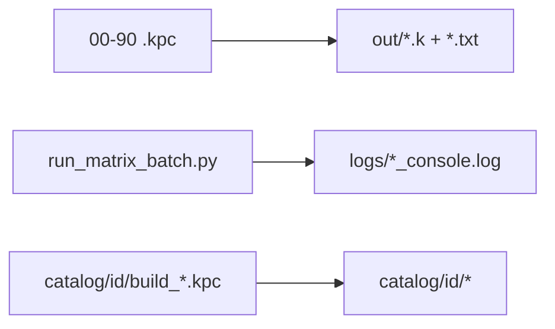

# Clean matrix outputs into `out/` and `logs/`

## Problem

Family scripts currently write into the campaign root:

```text
save KnotPlot_3p1_MultiDynamics_Relaxation_Matrix_v0.1.0/F00_MEB_tight_i00000.k float
coords KnotPlot_3p1_MultiDynamics_Relaxation_Matrix_v0.1.0/F00_MEB_tight_i00000.txt
```

So `.txt` / `.k` / `*_console.log` sit next to `.kpc` / `.cmd` / README. Catalog runs already use the correct nested path [`catalog/<id>/`](c:/workspace/projects/SST-Workbench/KnotPlot/KnotPlot_3p1_MultiDynamics_Relaxation_Matrix_v0.1.0/catalog).

## Target layout (default)

Keep scripts/docs in the campaign root. Put run products under:

```text
KnotPlot_3p1_MultiDynamics_Relaxation_Matrix_v0.1.0/
  out/          # geometry: F00_*.{k,txt}, C20_*.{k,txt}, smoke_*, …
  logs/         # 00_baseline_MEB_tight_console.log, …
  catalog/      # unchanged (already nested)
  *.kpc *.cmd   # sources only
```

New save prefix:

```text
KnotPlot_3p1_MultiDynamics_Relaxation_Matrix_v0.1.0/out/<stem>_iNNNNN.k float
coords KnotPlot_3p1_MultiDynamics_Relaxation_Matrix_v0.1.0/out/<stem>_iNNNNN.txt
```



## Steps

### 1. Retarget scripts

In all matrix family files [`00_`–`90_`](c:/workspace/projects/SST-Workbench/KnotPlot/KnotPlot_3p1_MultiDynamics_Relaxation_Matrix_v0.1.0) and [`smoke_load_3_1.kpc`](c:/workspace/projects/SST-Workbench/KnotPlot/KnotPlot_3p1_MultiDynamics_Relaxation_Matrix_v0.1.0/smoke_load_3_1.kpc): replace

`KnotPlot_3p1_MultiDynamics_Relaxation_Matrix_v0.1.0/` → `KnotPlot_3p1_MultiDynamics_Relaxation_Matrix_v0.1.0/out/`

only on `save` / `coords` lines (not comments that merely mention the folder). Do **not** change [`catalog/**`](c:/workspace/projects/SST-Workbench/KnotPlot/KnotPlot_3p1_MultiDynamics_Relaxation_Matrix_v0.1.0/catalog).

### 2. Retarget batch logs

In [`run_matrix_batch.py`](c:/workspace/projects/SST-Workbench/KnotPlot/KnotPlot_3p1_MultiDynamics_Relaxation_Matrix_v0.1.0/run_matrix_batch.py): write logs to `matrix_dir / "logs" / f"{stem}_console.log"` and `mkdir` `logs/` (and ensure `out/` exists before runs if useful). Update [`tests/test_run_matrix_batch.py`](c:/workspace/projects/SST-Workbench/KnotPlot/KnotPlot_3p1_MultiDynamics_Relaxation_Matrix_v0.1.0/tests/test_run_matrix_batch.py) dry-run expectations if they assert log paths.

### 3. Migrate existing root clutter

Move from campaign root into the new folders (create dirs first):

- Geometry: `F*.txt`, `F*.k`, `C*.txt`, `C*.k`, `A*.txt`, `A*.k`, `smoke_load_3_1.txt`, `smoke_load_3_1.k` → `out/`
- Logs: `*_console.log` → `logs/`

Leave docs/sources (`MATRIX.txt`, `CATALOG.txt`, `PATCH_NOTES_*`, `README.md`, `*.kpc`, `*.cmd`, `*.py`, `tests/`, `catalog/`).

### 4. Docs

Update [`README.md`](c:/workspace/projects/SST-Workbench/KnotPlot/KnotPlot_3p1_MultiDynamics_Relaxation_Matrix_v0.1.0/README.md) example `save`/`coords` lines to include `/out/`, and note `logs/` for batch consoles.

### 5. Verify

- Unit tests still pass
- `run_one.cmd smoke_load_3_1.kpc` writes `out/smoke_load_3_1.{k,txt}` and `logs/smoke_load_3_1_console.log`
- Campaign root has no leftover `F*` / `C*` / `smoke_load_3_1.{k,txt}` / `*_console.log`

## Out of scope

- Catalog path layout (`catalog/<id>/` stays)
- Re-running the full multi-hour matrix
- Changing force/parameter content of family scripts
