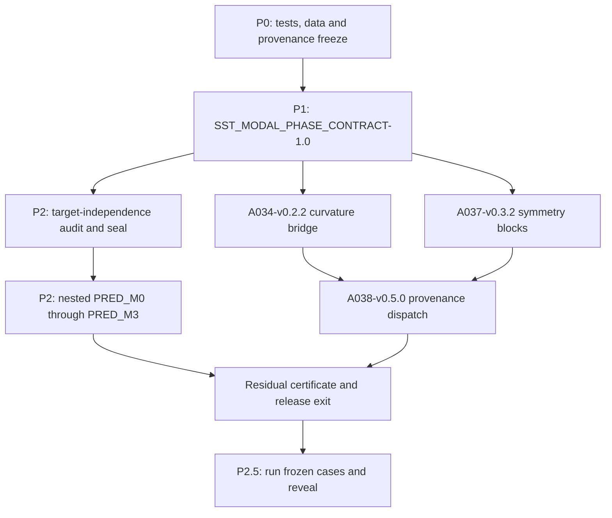

# Modal–phase minimum first release (P0–P2.5)

Source: [deep-research-report.md](c:/Users/oscar/Downloads/deep-research-report.md), the follow-up derivation, and the frozen overnight record [paper_upgrade_run_log_20260911_225901.md](10_docs/migration/paper_upgrade_run_log_20260911_225901.md).

Scope remains limited to P0–P2 plus P2.5 execution/reveal. C006 strain-slew, new A030/A035 clock or closure hypotheses, A031 RPO/Floquet, A021 self-confinement, and A024/A016 transport extensions remain deferred and must not be started in P2.5.

Primary question:

> How much phase is algebraically accounted for by advection, intrinsic modal dispersion, and closed-loop geometry—and does that frozen decomposition predict an independently measured return phase?

Verified constraints that the implementation must preserve:

- A029 uses the legacy convention \(\lambda_{\rm raw}=\sigma-i\omega\), and its current closed-loop wavenumber already embeds Bishop holonomy.
- A029’s stored \(\Phi_{\rm loop}\) is constructed from the same \(\omega\), return time, and synthetic envelope used by the proposed predictors. Matching it with PRED_M3 is an accounting identity, not an independent scientific success.
- A034’s current twofold value \(0.25364441\) is a constrained \(|\Re\lambda(J)|\) curvature proxy, not a stored physical energy Hessian.
- A037’s matrix is a protocol-derived CAMPAIGN selection rule in body-frame order, not a measured response tensor.
- A038’s overnight geometry/mesh certificates are fixtures. They must not authorize a scientific modal dispatch.



## Hard rules

- Use copy-on-write version bumps only. Never patch A034-v0.2.1, A037-v0.3.1, A038-v0.4.0, A029-v0.2.0, A030-v0.2.0, or A035-v0.3.0 in place.
- Capture the existing affected-pack and workbench test results before implementation, then rerun the same matrix at release exit.
- Keep all overnight scientific thresholds and verdicts frozen. Adapters may add integrity gates, but may not turn a parent FAIL into PASS or broaden a parent claim.
- Represent holonomy exactly once: either through \(k(\Theta_B)\) or as an explicit phase, never both.
- Never score a phase predictor against a target constructed from the same predictor inputs. A derived-target match is `ACCOUNTING_IDENTITY_CONFIRMED`, never scientific PASS.
- A residual test requires both target-phase independence and return-time independence; model-derived \(\tau_{\rm return}\) is accounting-only.
- A038 may emit `QUALIFIED_FOR_MODAL_ANALYSIS` only from genuine provider geometry/mesh CAMPAIGN provenance plus valid A034/A037 certs. Fixture or synthetic upstream certs must block.
- A038’s block does not suppress provenance-labelled retrospective accounting of frozen A029 cases; it does prevent prospective dispatch and an end-to-end promotable science claim.
- A029 pair-identity blinding and the new residual holdout/prediction lock are separate protocols; record both.
- Prefer reanalysis of sealed A029 case JSON. Permit only bounded local eigensolves needed at \(k_{\rm ref}\); do not start a new long campaign.
- Exclude `outputs/`, `.venv/`, `private_reveal_keys/`, and Windows `(1)` duplicate files when copying version trees.

## P0 — Baseline and provenance freeze (1–2 days)

1. Before edits, run and record the current A029, A034, A037, A038, and relevant `07_scripts` tests in a dated baseline record under [10_docs/migration](10_docs/migration).
2. Add:
   - [CANONICAL_ROOT.json](10_docs/migration/CANONICAL_ROOT.json), anchored by `.sst-workbench-root`, with normalized repository identity and optional Drive ID.
   - [PATCH_LEDGER.jsonl](10_docs/migration/PATCH_LEDGER.jsonl), with one append-only entry per new version and rationale.
3. For every new version add `MANIFEST_PRE.json`, `PATCH_LEDGER.jsonl`, `THRESHOLDS_FROZEN.json`, `BLIND_SPLIT.json`, and `rollback/PARENT_VERSION.json`. Use an explicit `not_applicable` record where a split or threshold is not scientific input.
4. Hash the parent source tree, parent certificate, threshold/config files, and the immutable overnight log before copying.
5. Locate the canonical A029 sealed case JSON, private reveal mapping, and any raw complex time-domain trajectory/envelope trace from the overnight run or archived v0.1.2 output package. Hash them without copying bulk outputs into Git. CSV alone is insufficient because it omits \(k\), \(L/a\), \(\Theta_B\), and dispersion coefficients.
6. Record target-phase and return-time dependency DAGs. The existing `delay.py::wavepacket_return` phase and \(\tau_{\rm return}\) both depend on \(\omega(k)\), \(v_g\), and/or the fitted synthetic dispersion envelope, so both are derived from predictor inputs.
7. If canonical case records are missing, emit `INDETERMINATE_MISSING_BASELINE_CASES`. If no admissible independent phase exists, emit `INDETERMINATE_NO_INDEPENDENT_PHASE_TARGET`; if phase exists but return time is model-derived, emit `INDETERMINATE_NONINDEPENDENT_RETURN_TIME`. In either case, complete accounting only and never substitute reported summary numbers.

## P1 — Common contract and additive upstream adapters (2–4 days)

### Common modal/phase contract

- Create [SST_MODAL_PHASE_CONTRACT-1.0.json](10_docs/registry/schemas/SST_MODAL_PHASE_CONTRACT-1.0.json) as a JSON Schema and [validate_modal_phase_contract.py](07_scripts/validate_modal_phase_contract.py) with tests in [test_validate_modal_phase_contract.py](07_scripts/test_validate_modal_phase_contract.py).
- Use a discriminated `record_type` union so `curvature_bridge`, `symmetry_blocks`, `dispersion_branch`, and `phase_observation` records require only their relevant fields while sharing identity/provenance conventions.
- Contract fields must cover:
  - schema/version identity, source/provider IDs, opaque `carrier_group_token` and `geometry_group_token`, parent hashes, code hash, and blind status;
  - raw generalized eigenvalue, its declared convention, \(\sigma\), signed physical \(\omega\), and canonical \(\mu=\sigma+i\omega\);
  - nondimensionalization and units for \(k_{\rm hat}\), \(L_{\rm hat}=L/a\), \(kL\), \(m\), \(n\), and \(\Theta_B\);
  - branch ID, adjacent \(B\)-overlap, ambiguity status, dispersion fit, \(v_g\), and \(\omega''\);
  - `holonomy_representation` in `{embedded_in_k, explicit_phase}` plus structured `return_time_representation` and `tau_return_independence`;
  - \(\Phi_{\rm loop}\), envelope phase, derived carrier phase, optional independent target phase, uncertainty, target-dependency DAG, nested predictions, wrapped residuals, and split/prediction hashes;
  - structured `target_independence` with class in `{fully_model_independent_time_domain, independent_time_domain_given_frozen_spatial_mode, derived_from_predictors, unavailable}`, temporal-frequency source, return-phase source, spatial-basis provenance/hash, and explicit booleans for predicted-\(\omega\) use, predicted-\(v_g\) use, demodulation, and bandpass centering;
  - `tau_return_independence` with class in `{raw_trajectory_phase_blind, model_conditioned, derived_from_predicted_dispersion, unavailable}`, detector/window hashes, search-window source, and the same predictor-use booleans.
- Preserve historical columns. Never rename a canonical \(\sigma+i\omega\) value to `lambda`; use `canonical_complex` or `mu`.
- Treat canonical JSON records as the hash source. Emit Parquet for analysis tables and CSV only as a compatibility export; add and pin the required Parquet dependency in A029-v0.3.0.
- Test nearly every new pure function: schema boundaries, convention transforms, hash canonicalization, angle wrapping, units, missing/extra fields, and JSON/Parquet round trips.

### A034-v0.2.2 curvature-proxy bridge

Base: [A034-v0.2.1](01_research/A_falsifiers/A034_qhp_stability_landscape/A034-v0.2.1).

- Copy to `A034-v0.2.2` and update all package/release/contract identities, not only `FAMILY.yaml` and `project.json`.
- Add `src/sst_qhp_falsifier/modal_bridge.py` and invoke it after the existing paper-upgrade CAMPAIGN certificate stage. Read the exact historical parent payload \(\{g,H_{\rm parent},C_{\rm constraint}\}\), dual record, and hashes used by [paper_upgrade_campaign_payload.py](07_scripts/paper_upgrade_campaign_payload.py); do not rebuild a second proxy in `analyze.py`.
- In the new bridge call the projected proxy

\[
K_{\rm tan}=P H_{\rm parent}P,
\]

and reserve \(H_{\rm parent}\) only for the historical input field.

- Emit `modal_bridge.json`, `tangent_curvature_proxy_basis.npz`, and an `A034-BRIDGE-1` wrapper containing:
  - sorted eigenvalues, frozen cluster tolerance, multiplicities, and cluster IDs;
  - constraint projector \(P\), one ambient cluster projector \(P_j\), the exact projected proxy \(K_{\rm tan}\), and each exact restricted operator \(K_j=P_jK_{\rm tan}P_j\);
  - `basis_is_unique: false` for the repeated pair, projector/operator hashes, and reconstruction error;
  - cluster means \(\bar\lambda_j\) as metadata only, never as the stored restricted operator;
  - `operator_semantics: abs_real_jacobian_curvature_proxy`;
  - `dynamic_stability_claim: false` and `physical_energy_hessian_claim: false`;
  - `parent_classification: ENERGETICALLY_ADMISSIBLE` with `parent_classification_semantics: historical_parent_only`;
  - explicit `certifies` and `does_not_certify` lists.
- `A034-BRIDGE-1` checks the parent `gate_input_sha256`, projector symmetry/idempotence/orthogonality, restricted-operator consistency, and the exact reconstruction

\[
\frac{\left\|K_{\rm tan}-\sum_jP_jK_{\rm tan}P_j\right\|_F}{\|K_{\rm tan}\|_F}
\le
\max(10^{-10},10\,\epsilon_{\rm measured}).
\]

- Tests must include exact and near-degenerate spectra and remain invariant under arbitrary orthogonal rotations inside a clustered subspace. Never compare or hash individual eigenvector columns, and never use \(\bar\lambda_jP_j\) as the primary reconstruction.
- Do not change `constrained_admissibility`, `soft_tol`, `ENERGETICALLY_ADMISSIBLE`, or the parent CAMPAIGN certificate.

### A037-v0.3.2 ordered symmetry blocks

Base: [A037-v0.3.1](01_research/A_falsifiers/A037_chirality_helicity_transport_polarity/A037-v0.3.1).

- Copy to `A037-v0.3.2`, update stale package/docs/contract identities, and add `sst_chiral/symmetry_blocks.py` as a pure adapter around the existing selection-matrix rule.
- Wire the adapter through `paper_upgrade/gate.py`, [paper_upgrade_campaign_payload.py](07_scripts/paper_upgrade_campaign_payload.py), [paper_upgrade_certs.py](07_scripts/paper_upgrade_certs.py), and the post-certificate stage in `run_all.cmd`.
- Emit `symmetry_blocks.json` with:
  - normalized matrix `[[1,0,0],[0,1,1],[0,1,1]]` and blocks `[[0],[1,2]]`;
  - `channel_ids`, labels `body_x/body_y/body_z`, basis order, mirror matrix \(R\), block membership, and any permutation to provider order;
  - provider-basis hash, parent `gate_input_sha256`, source `provenance_sha256`, and output hash;
  - `measured_response_claim: false`.
- The integrity gate normalizes JSON booleans/integers and requires exact agreement with the parent CAMPAIGN matrix and ordering. It must not infer blocks from a differently ordered basis or alter A037 transport thresholds.
- Add full 3-by-3, ordering/hash, permutation, malformed-matrix, and parent-provenance tests; the current 2-by-2 selftest is insufficient.

### A038-v0.5.0 provenance-aware modal dispatch

Base: [A038-v0.4.0](01_research/A_falsifiers/A038_trefoil_dynamic_seed_qualification/A038-v0.4.0).

- Copy to `A038-v0.5.0` and update `__version__`, `RELEASE.json`, package metadata, docs, tests, output naming, `project.json`, and `FAMILY.yaml` together.
- Add `src/sst_seed_falsifier/provenance_lock.py` and `modal_dispatch.py`, but extend the existing `paper_upgrade/gate.py::upstream_gate` rather than creating a parallel authorization system.
- Integrate the lock into the Python CLI/workflow/campaign entry points so direct invocation cannot bypass it. Reuse `knot_library.py`, source provenance, atlas evidence, and existing hash helpers; keep upstream numerical qualification separate from `operator_split_cert.py`.
- Require genuine promotable CAMPAIGN certs for `geometry`, `mesh`, `admissibility` (A034), and `symmetry` (A037). Reject `gate=="fixture"`, `source_run_id=="fixture-run"`, synthetic inputs, placeholder hashes, and unverified topology/provider records.
- Add `dispatch_status` under `SST-DYNAMIC-SEED-DISPATCH-2.0`:
  - `QUALIFIED_FOR_MODAL_ANALYSIS`
  - `BLOCKED_PROVENANCE`
  - `BLOCKED_A034`
  - `BLOCKED_A037`
  - `BLOCKED_NUMERICS`
- Preserve and map the existing `BLOCKED_UPSTREAM_*` codes rather than replacing them. `QUALIFIED_FOR_MODAL_ANALYSIS` certifies dispatch eligibility only, never dynamic stability.
- The current overnight upstream bundle is expected to become `BLOCKED_PROVENANCE` because geometry/mesh are fixtures. A positive logic selftest may use temporary, internally consistent test certificates only when its output is marked `SELFTEST` and non-promotable; a scientific qualification still requires genuine CAMPAIGN certs.
- A030 and A035 remain absent from `REQUIRED`.

## P2 — A029-v0.3.0 prediction-locked phase residual (4–7 days)

Base: [A029-v0.2.0](01_research/A_falsifiers/A029_finite_core_axial_toroidal_phase_delay/A029-v0.2.0), especially [analyze.py](01_research/A_falsifiers/A029_finite_core_axial_toroidal_phase_delay/A029-v0.2.0/src/sst_finite_core_falsifier/analyze.py), [eigen.py](01_research/A_falsifiers/A029_finite_core_axial_toroidal_phase_delay/A029-v0.2.0/src/sst_finite_core_falsifier/eigen.py), and `delay.py`.

### Version and target definition

- Copy to `A029-v0.3.0`; synchronize all stale v0.1.2/v0.2.0 identities and set `FAMILY.yaml` latest only after validation.
- Add `phase_contract.py`, `holonomy.py`, `residual.py`, and a thin `continuation.py` that reuses the existing `track_mode`/`vector_overlap` logic.
- Export the synthetic wavepacket envelope phase separately and define the existing derived carrier phase as

\[
\Phi_{{\rm carrier,derived},i} =
\operatorname{Arg}
\exp\!\left[
i\left(\Phi_{{\rm loop},i}-\Phi_{{\rm envelope},i}\right)
\right].
\]

- Keep \(\Phi_{\rm loop}\) unchanged for historical compatibility, but mark both it and \(\Phi_{\rm carrier,derived}\) as `derived_from_predictors`. Use them only in `PHASE_ACCOUNTING_CERTIFICATE.json`.
- A scientific residual target is admissible only when a raw time-domain trajectory provides a complex modal coefficient without using the predicted temporal frequency:

\[
\Phi_{{\rm target,ind},i} =
\operatorname{Arg}
\left[
a_m(t_{\rm return})a_m(0)^*
\right].
\]

- Classify a projection onto a preregistered eigensystem basis as `independent_time_domain_given_frozen_spatial_mode`, not fully model-independent. Freeze the spatial basis, basis hash, projection, and gauge-cancelling phase ratio before target extraction.
- The extractor must set `predicted_omega_used_in_extraction: false`: no \(e^{+i\omega_mt}\) demodulation, no bandpass centered on predicted \(\omega_m\), and no predictor-selected temporal window. Any such use downgrades the target to `derived_from_predictors`.
- A fully model-independent observable may use a spatial measurement basis fixed without the modal predictor; record that stronger class separately rather than requiring it for this release.

```yaml
target_independence:
  class: independent_time_domain_given_frozen_spatial_mode
  temporal_frequency: independent
  return_phase: measured_from_raw_trajectory
  spatial_mode_basis: model_conditioned_frozen
  predicted_omega_used_in_extraction: false
  predicted_omega_used_for_demodulation: false
  predicted_omega_used_for_bandpass: false
```

### Independent return time

- For a residual test, derive return time from a phase-blind raw-trajectory envelope statistic:

\[
\tau_{\rm return,ind} =
\underset{\tau\in W_{\rm frozen},\,\tau>\tau_{\min}}{\arg\max}
\;C_{\rm envelope}^{\rm raw}(\tau).
\]

- Freeze \(C_{\rm envelope}^{\rm raw}\), \(\tau_{\min}\), tie-breaking, coherence threshold, and \(W_{\rm frozen}\) before target reveal. The window must be protocol-fixed or training-only; it may not be centered or resized with predicted \(\omega\), \(v_g\), \(L/|v_g|\), or the synthetic dispersion wavepacket.
- Certify `tau_return_independence.class: raw_trajectory_phase_blind` only when `predicted_omega_used: false`, `predicted_group_velocity_used: false`, and `synthetic_wavepacket_used: false`.
- The current `wavepacket_return` \(\tau_{\rm return}\) and \(L_{\rm hat}/|v_g|\) remain accounting/sensitivity quantities. They cannot enter PRED_M1–PRED_M3 scientific scoring.
- If no independent return event survives the frozen coherence/ambiguity gate, emit `INDETERMINATE_NO_INDEPENDENT_RETURN_EVENT`.

```yaml
tau_return_independence:
  class: raw_trajectory_phase_blind
  search_window_source: protocol_fixed_or_training_only
  predicted_omega_used: false
  predicted_group_velocity_used: false
  synthetic_wavepacket_used: false
```

### Sign and holonomy conventions

- Preserve raw values exactly:

\[
\lambda_{\rm raw}=\sigma-i\omega,\qquad
\sigma=\Re\lambda_{\rm raw},\qquad
\omega=-\Im\lambda_{\rm raw},\qquad
\mu=\sigma+i\omega.
\]

- Use signed `omega_median` or `-lambda_imag`; never use the historical absolute-valued `omega_mode` in phase prediction.
- Freeze:

\[
k_{\rm ref}=\frac{2\pi n}{L_{\rm hat}},
\qquad
k_{\rm closed}=\frac{2\pi n-m\Theta_B}{L_{\rm hat}}.
\]

- Set `holonomy_representation: embedded_in_k` for A029-v0.3.0 and `phi_holonomy_explicit: 0`. The holonomy contribution is the nested change from \(k_{\rm ref}\) to \(k_{\rm closed}\), not an added \(m\Theta_B\) term.

### Mandatory same-branch continuation

- Directly solve the same eigenbranch at \(k_{\rm ref}\) and \(k_{\rm closed}\); do not use a polynomial interpolation as the primary M2 result.
- Record the normalized adjacent \(B\)-overlap

\[
\mathcal O_{j,j+1} =
\frac{|\langle q_j,q_{j+1}\rangle_B|}
{\|q_j\|_B\|q_{j+1}\|_B}.
\]

- Freeze the overlap threshold before target reveal. If continuation loses identity, emit `DISPERSION_BRANCH_AMBIGUOUS` and exclude that row under predeclared validity rules; never silently select a new maximum-growth branch.
- Export \(\omega''\) only when the tracked dispersion fit passes overlap, fit-residual, and window-containment gates.

### Residual blind/prediction lock

- Introduce opaque group tokens so all rows from one carrier and geometry stay together without revealing labels.
- If an independent target exists, encode deterministic leave-one-carrier-out folds in `BLIND_SPLIT.json`. The registered null for each held-out fold is the training-only circular mean:

\[
\Phi_{\rm null} =
\operatorname{Arg}\sum_{j\in{\rm train}}e^{i\Phi_{{\rm target,ind},j}}.
\]

- Before opening any independent target phase, seal:
  - `H_data`: canonical predictor-input records with target fields removed;
  - `H_target`: sealed target artifact;
  - `H_split`: grouped fold assignment;
  - `H_thresholds`: all validity/gate/statistical choices;
  - `H_return_detector`: phase-blind return detector, window, and independence declaration;
  - `H_code`: exact predictor implementation;
  - `H_prediction`: target-free PRED_M1–PRED_M3 rows in `blind_phase_predictions.parquet`.
- Compute PRED_M0 only after reveal via the already frozen leave-one-carrier-out rule, then seal `H_evaluation`. It is a comparator, not a pre-target physical prediction.
- If an independent historical target was already visible to the implementer, label the result `RETROSPECTIVE_PREDICTION_LOCKED`; only use `PROSPECTIVE_BLIND` when target secrecy can be demonstrated from hashes and access history.
- If no admissible independent phase or return time exists, skip residual scoring and classify the run as derived accounting only with the specific `INDETERMINATE_*` reason.
- Branch choice, wrapping convention, exclusions, and thresholds become immutable after `H_prediction`.

### Nested classical predictors

Use names `PRED_M*` to avoid collision with A029’s existing azimuthal `m=1/m=2` labels:

\[
\begin{aligned}
\widehat\Phi_{\rm PRED\_M0} &=
\Phi_{\rm null},\\
\widehat\Phi_{\rm PRED\_M1} &=
\operatorname{wrap}\!\left[-\omega_{\rm adv}(k_{\rm ref})\tau_{\rm return,ind}\right],\\
\widehat\Phi_{\rm PRED\_M2} &=
\operatorname{wrap}\!\left[-\left(\omega_{\rm adv}(k_{\rm ref})
+\omega_{\rm intrinsic}(k_{\rm ref})\right)\tau_{\rm return,ind}\right],\\
\widehat\Phi_{\rm PRED\_M3} &=
\operatorname{wrap}\!\left[-\left(\omega_{\rm adv}(k_{\rm closed})
+\omega_{\rm intrinsic}(k_{\rm closed})\right)\tau_{\rm return,ind}\right].
\end{aligned}
\]

Interpretation is fixed before reveal:

- PRED_M0 \(\rightarrow\) PRED_M1 measures reference-\(k\) advection.
- PRED_M1 \(\rightarrow\) PRED_M2 adds intrinsic modal frequency.
- PRED_M2 \(\rightarrow\) PRED_M3 adds closed-loop geometry/holonomy through \(k\).
- No explicit \(\Phi_{\rm hol}\) is added to PRED_M3.
- Evaluate PRED_M0–PRED_M3 as prediction models only against \(\Phi_{\rm target,ind}\) at \(\tau_{\rm return,ind}\). Against \(\Phi_{\rm carrier,derived}\), record `ACCOUNT_M*` with the historical synthetic return time; the expected ACCOUNT_M3 equality is a code/integrity check with no scientific skill score.

### Residual statistics and gate

For every model and eligible row:

\[
R_{\Phi,i} =
\operatorname{Arg}
\left[
e^{i(\Phi_{{\rm target,ind},i}-\widehat\Phi_i)}
\right]
\in(-\pi,\pi],
\]

\[
\operatorname{CRMSE}_M =
\sqrt{\frac{1}{N}\sum_iR_{\Phi,i,M}^2},
\qquad
S_M =
1-\frac{\operatorname{CRMSE}_M}{\operatorname{CRMSE}_{\rm PRED\_M0}}.
\]

- Report \(S_M\), median \(|R_\Phi|\), and paired increments for every nested step.
- Bootstrap whole `carrier_group_token` clusters, never individual rows. Run a separate geometry-cluster robustness analysis only if its preregistered minimum number of independent geometries survives validity gates.
- Freeze bootstrap seed, resample count, minimum evaluable carrier/geometry counts, and missing-row policy in `THRESHOLDS_FROZEN.json`. Too few independent groups yields `INDETERMINATE_INSUFFICIENT_CLUSTERS`.
- The primary PRED_M3 gate is evaluable only when:
  - `target_independence.class` is `fully_model_independent_time_domain` or `independent_time_domain_given_frozen_spatial_mode`;
  - target extraction used neither predicted \(\omega\) nor predictor-centered filtering/demodulation;
  - `tau_return_independence.class == raw_trajectory_phase_blind`;
  - return detection used neither predicted \(\omega\), predicted \(v_g\), nor the synthetic wavepacket.
- Once those independence gates pass, PRED_M3 passes only if all hold:

\[
S_{\rm PRED\_M3}\ge0.30,
\qquad
CI_{95\%,{\rm lower}}(S_{\rm PRED\_M3})>0,
\]

\[
\operatorname{median}|R_\Phi|
\le
\max\!\left(0.35\ {\rm rad},
2\,\operatorname{median}\sigma_\Phi\right).
\]

- The 0.35-rad floor and uncertainty source must resolve to a named, hashed parent config/artifact; do not substitute the reported overnight median if the source rows are unavailable.
- PASS means that the registered classical decomposition predicts the independently evolved held-out carrier phase at an independently detected return event. The certificate must state whether the observable remained conditioned on a frozen modal spatial basis. It does not certify a fundamental clock, causal stabilization, an RPO, or Floquet stability.
- A derived target can produce only `ACCOUNTING_IDENTITY_CONFIRMED`, `ACCOUNTING_IDENTITY_FAILED`, or `INDETERMINATE_*`; it cannot produce residual PASS.

### Outputs and tests

- Feature flag: `enable_phase_residual_v1`, default off for historical presets.
- Emit:
  - `phase_contract.parquet`
  - `dispersion_contract.parquet`
  - `return_time_contract.parquet`
  - `phase_predictor_inputs.parquet`
  - `blind_phase_predictions.parquet`
  - `phase_decomposition_summary.parquet`
  - `PHASE_ACCOUNTING_CERTIFICATE.json`
  - `PHASE_RESIDUAL_CERTIFICATE.json`
- Add focused tests for every new calculation or seal boundary: signed convention bridge, \(k_{\rm ref}/k_{\rm closed}\), holonomy anti-double-counting, envelope accounting, conditional target-independence classification, rejection of predicted-\(\omega\) demodulation/bandpass, phase-blind return detection, rejection of predicted-\(v_g\) windows, refusal to score tautological or model-derived-\(\tau\) targets, wrapped residual boundaries, nested toy dispersion, same-branch continuation and ambiguity, no carrier leakage across folds, clustered rather than row bootstrap, prediction tamper detection, schema round trip, and end-to-end PASS/FAIL/INDETERMINATE fixtures.

## Scientific interpretation fixed before reveal

- ACCOUNT_M3 matching the current A029 \(\Phi_{\rm loop}\) after envelope reconstruction confirms only the implementation identity \(\omega=\omega_{\rm adv}+\omega_{\rm intrinsic}\); it is not evidence for a clock mechanism.
- If PRED_M1 is already comparable to PRED_M3 and both beat PRED_M0, the observed carrier phase is predominantly advective.
- If PRED_M2 materially improves on PRED_M1, an intrinsic modal phase survives subtraction of advection.
- If PRED_M3 materially improves on PRED_M2, closed-loop geometry/holonomy has independent predictive value through wavenumber quantization.
- If PRED_M3 does not beat PRED_M0, advection plus intrinsic dispersion plus static closed-loop geometry do not explain the observed phase. Only then may P3 propose strain history, moving-basis geometric phase, or nonlinear mode coupling for the residual.
- If no independent phase or return time exists, this release must stop at `INDETERMINATE_NO_INDEPENDENT_PHASE_TARGET`, `INDETERMINATE_NONINDEPENDENT_RETURN_TIME`, or `INDETERMINATE_NO_INDEPENDENT_RETURN_EVENT`; obtaining both becomes the prerequisite for P3 rather than treating the algebraic residual as new physics.

## Validation and release exit

- Baseline and final results must both be recorded for:
  - A034 package tests, CLI selftest, and paper-upgrade gate selftest;
  - A037 package and paper-upgrade selftests;
  - A038 package tests, package selftest, and paper-upgrade gate selftest;
  - A029 package tests and paper-upgrade gate selftest;
  - relevant `07_scripts` contract, certificate, gate, catalog, and hierarchy tests.
- Validate A034/A037/A029 outputs against `SST_MODAL_PHASE_CONTRACT-1.0`.
- Verify parent A034-v0.2.1 and A037-v0.3.1 CAMPAIGN hashes remain unchanged and resolvable.
- A038 tests must show: missing certs block; the current overnight fixture bundle blocks provenance; structurally valid temporary certs exercise only a non-promotable `SELFTEST` success path; genuine CAMPAIGN certs are required for scientific qualification; A030/A035 presence or status has no effect.
- A029 must always emit a hashed accounting certificate. It emits a residual PASS/FAIL only when both the phase target and return event pass their independence audits; otherwise it emits the corresponding `INDETERMINATE_*` status.
- Update each canonical `FAMILY.yaml` and `project.json`; ignore `FAMILY (1).yaml` and other `(1)` duplicates.
- Regenerate [catalog_index.json](10_docs/registry/catalog_index.json) and [family_hierarchy.json](10_docs/registry/family_hierarchy.json) with `build_catalog_index.py` and `build_family_hierarchy.py`. Do not run `catalog_metadata.py --apply`, which can drop existing gate metadata.
- Add a concise migration note under [10_docs/migration](10_docs/migration) recording parent hashes, blindness class, nested-model outcome, test matrix, and rollback instructions.
- Do not commit bulk overnight `outputs/`; keep only small contracts/certificates allowed by the repository’s output-size policy.


## P2.5 — execution and reveal

P2 builds the residual machinery and may stop at accounting-only if no sealed independent target exists. P2.5 is the execution/reveal step on frozen historical A029 cases. It does not invent a new predictor, retune thresholds, or open deferred families.

- Run [A029-v0.3.0](01_research/A_falsifiers/A029_finite_core_axial_toroidal_phase_delay/A029-v0.3.0) on the frozen historical cases located in P0 (sealed case JSON and any hashed archive). Prefer reanalysis of those records; permit only the bounded \(k_{\rm ref}\) eigensolves already allowed in P2. Do not start a new long campaign.
- Always emit the hashed `PHASE_ACCOUNTING_CERTIFICATE.json` from the historical derived \(\Phi_{\rm loop}\) / synthetic return time.
- If an independent phase target **and** an independent return event exist under the P2 audits, execute the already-sealed blind residual evaluation (`H_data` … `H_prediction`, then reveal PRED_M0 / `H_evaluation`). Label the run `PROSPECTIVE_BLIND` only when target secrecy is demonstrable; otherwise `RETROSPECTIVE_PREDICTION_LOCKED`.
- Emit `PHASE_RESIDUAL_CERTIFICATE.json` with exactly one of `PASS`, `FAIL`, or the applicable `INDETERMINATE_*` status. A derived-only target still cannot become scientific PASS.
- If the frozen cases remain missing or non-independent, keep the corresponding `INDETERMINATE_*` certificate and stop. Do not substitute overnight summary numbers.
- Do not start C006, A031, or A021. P3 remains gated on an independent residual that PRED_M3 does not explain.

## Explicitly deferred

C006-v0.3.0, A030-v0.3.0, A035-v0.4.0, A031-v0.3.0, A021-v0.5.0, and A024/A016 transport extensions.
