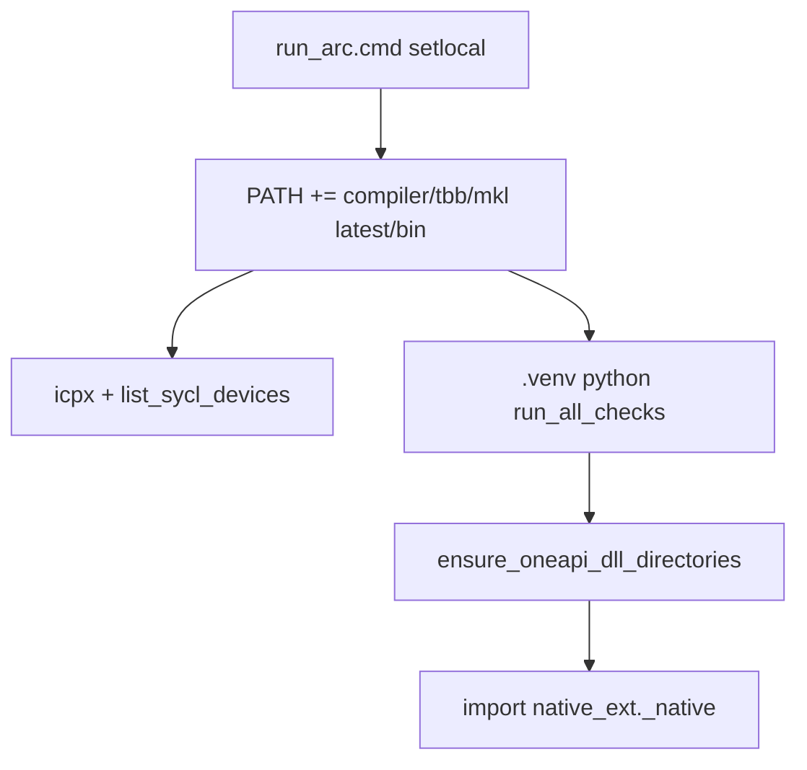

# Lokale oneAPI PATH + DLL directories (GPU-template)

Scope: alleen [`templates/SST_GPU_SYCL_DPC_audit_template`](c:\workspace\projects\SST-Workbench\templates\SST_GPU_SYCL_DPC_audit_template). De CPU-template heeft geen oneAPI nodig.

**Out of scope:** CUDA wordt **niet** als 2e backend in deze template gezet. Een NVIDIA/CUDA-pad hoort in een **aparte** toekomstige template (sibling van deze SYCL/Arc-starter), niet in de SYCL-ladder.

## Aanpak

Vervang `call ...\setvars.bat` in [`run_arc.cmd`](c:\workspace\projects\SST-Workbench\templates\SST_GPU_SYCL_DPC_audit_template\run_arc.cmd) door session-scoped PATH-prepends (alleen tijdens die `.cmd`-run via `setlocal`). Voeg in Python dezelfde bin-mappen toe via `os.add_dll_directory` vóór elke native `.pyd`-load, zodat import werkt ook zonder setvars/global PATH.

## 1. Shared oneAPI padlijst in `_config.py`

In [`native_ext/_config.py`](c:\workspace\projects\SST-Workbench\templates\SST_GPU_SYCL_DPC_audit_template\native_ext\_config.py) vaste kandidaten (x86 + Program Files):

- `...\Intel\oneAPI\compiler\latest\bin`
- `...\Intel\oneAPI\tbb\latest\bin`
- `...\Intel\oneAPI\mkl\latest\bin`

Plus helpers:

- `oneapi_bin_dirs() -> list[Path]` — alleen bestaande dirs
- `ensure_oneapi_dll_directories() -> list[str]` — op Windows `os.add_dll_directory` per bestaande dir (idempotent via module-level set); no-op elders

## 2. Aanroepen vóór native load

- [`native_ext/core.py`](c:\workspace\projects\SST-Workbench\templates\SST_GPU_SYCL_DPC_audit_template\native_ext\core.py) `_import_native()`: eerst `ensure_oneapi_dll_directories()`
- [`native_ext/build_ext_if_needed.py`](c:\workspace\projects\SST-Workbench\templates\SST_GPU_SYCL_DPC_audit_template\native_ext\build_ext_if_needed.py) `_extension_imports()`: idem vóór `exec_module`
- Fouttekst “Call setvars.bat” → wijzen op `run_arc.cmd` / lokale PATH+DLL-setup

`find_icpx()` blijft absolute compiler-paden gebruiken (al aanwezig); compile heeft daardoor geen globale PATH nodig.

## 3. `run_arc.cmd` zonder setvars

In [`run_arc.cmd`](c:\workspace\projects\SST-Workbench\templates\SST_GPU_SYCL_DPC_audit_template\run_arc.cmd):

1. Geen `setvars.bat` meer
2. Prepend PATH voor compiler/tbb/mkl onder `C:\Program Files (x86)\Intel\oneAPI\...` en fallback `C:\Program Files\Intel\oneAPI\...` als die bestaan
3. Fail met duidelijke melding als `compiler\latest\bin\icpx.exe` ontbreekt
4. Behoud Level Zero env vars + `.venv` python + default `{folder}_outputs`
5. Optioneel smoke: `"%PY%" -c "from native_ext._config import ensure_oneapi_dll_directories; ensure_oneapi_dll_directories(); import native_ext._native as n; print(n.backend_info())"` na build/probe — alleen als `_native` al bestaat, anders skip; primaire flow blijft `run_all_checks.py`

## 4. Docs + tests

In [`README.md`](c:\workspace\projects\SST-Workbench\templates\SST_GPU_SYCL_DPC_audit_template\README.md) een duidelijke **Requirements / hardware**-sectie (of uitbreiding van Dependencies):

- **Intel oneAPI** (DPC++ / `icpx`, Level Zero runtime) moet geïnstalleerd zijn — dit is geen optionele extra; de GPU-path faalt zonder toolkit
- Doelhardware: **Intel Arc GPU, specifiek Arc A770 16 GB** (Level Zero device `level_zero:0`); OpenMP/Python zijn laptop-fallbacks, niet het productiedoel
- Geen CUDA in deze README als fallback — verwijs kort dat NVIDIA/CUDA een aparte template zou zijn
- Geen permanente Windows-PATH of system-wide `setvars` nodig: `run_all.cmd` / `run_arc.cmd` prependen Intel bins alleen tijdens de run; Python gebruikt `os.add_dll_directory`

Examples (`minimal_commands.txt` / `full_commands.txt`) kort afstemmen op die wording.

Nieuwe tests in `tests/test_oneapi_dll_dirs.py`:

- `oneapi_bin_dirs()` retourneert alleen bestaande paths
- `ensure_oneapi_dll_directories()` is idempotent en crasht niet zonder oneAPI

## 5. End-to-end: template werkt via SYCL Biot-Savart op de GPU

Er hoeft **geen nieuwe** Biot-Savart-formule bij: die zit al in [`cpp/native.cpp`](c:\workspace\projects\SST-Workbench\templates\SST_GPU_SYCL_DPC_audit_template\cpp\native.cpp) (`biot_savart_sycl` + `sycl::parallel_for` over query-index M) en in [`run_example.py`](c:\workspace\projects\SST-Workbench\templates\SST_GPU_SYCL_DPC_audit_template\run_example.py) / [`run_all_checks.py`](c:\workspace\projects\SST-Workbench\templates\SST_GPU_SYCL_DPC_audit_template\run_all_checks.py) (`heavy_sycl.json` bij N=512, M=8192).

Na de PATH/DLL-wijzigingen de template **echt** valideren:

1. `python -m pytest -q` — altijd; `test_sycl_heavy_or_skip` skip’t zonder GPU, moet **passen** op Arc met `backend=sycl` en `is_gpu=true`
2. Op de Arc-machine: `run_all.cmd` (of `run_arc.cmd`) → faalt hard zonder oneAPI/GPU; bij succes schrijft `{folder}_outputs/` o.a. `smoke_sycl.json`, `heavy_sycl.json`, `audit_summary.json` met `heavy_is_gpu: true`
3. Extra smoke (documenteer in README/examples):  
   `python run_example.py --n-segments 512 --n-queries 8192 --backend sycl --summary-only`  
   Verwacht: `PASS`, `backend=sycl`, `is_gpu=True`, `last_ms` gezet

Als Arc/oneAPI in de agent-omgeving ontbreekt: pytest + Python-path blijven groen; GPU-e2e wordt dan gerund waar de A770 beschikbaar is en als fail gerapporteerd als `run_arc` daar faalt.

Vooraf/na: `python -m pytest -q` in de GPU-template; daarnaast `run_arc.cmd` / Biot-Savart SYCL smoke wanneer hardware aanwezig is.
