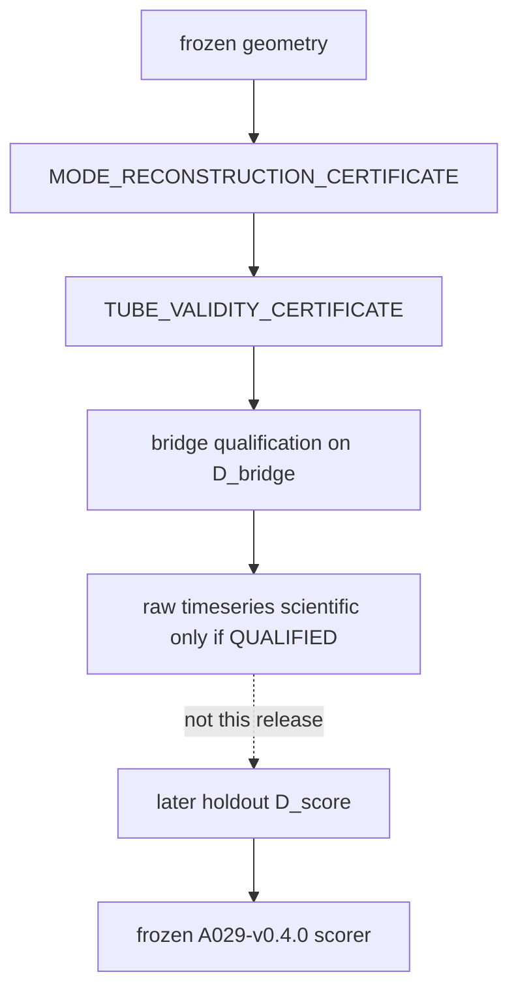
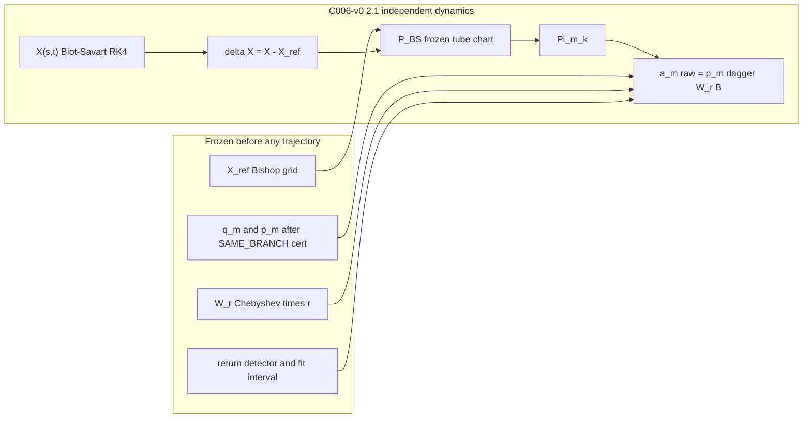

# P2.6 — Independent Time-Domain Producer Qualification (state-space bridge)

## What this release is (and is not)

This is **not** P3, not C006-v0.3.0 strain/Floquet science, not A021-v0.5.0 gates, and not a time integrator of A029’s \(B\dot\xi=A\xi\). Integrating that DAE is algebraically the same eigenproblem that predicts \(\omega_m\):

\[
\xi(t)=\exp(B^{-1}At)\xi(0).
\]

A029-v0.4.0 stays **frozen** (code and config). PRED_M0–PRED_M3 keep their current meaning (M0 = LOCO null). Holonomy stays `embedded_in_k` with \(\Phi_{\rm holonomy,explicit}=0\).

The missing object is a **provenance-clean producer whose state can be paired with a frozen A029 projector**. Inspection shows that pairing does not exist yet. The work is to **falsify one explicit bridge** \(P_{\rm BS}\), then stop.

**This C006-v0.2.1 release ends at the bridge certificate.** It does **not** feed A029-v0.4.0 M0–M3. A later holdout on a disjoint carrier set may do that; mixing qualification and scoring carriers is forbidden.

`BRIDGE_REJECTED` does **not** falsify the A029 modal clock. It only says that C006’s regularized filament state, through this one preregistered \(P_{\rm BS}\), is not a valid independent A029-field observable.

## P2.6A — Inspection result (already established)

Neither backend lives in A029’s Hilbert space.

- [A029-v0.4.0](01_research/A_falsifiers/A029_finite_core_axial_toroidal_phase_delay/A029-v0.4.0): generalized eigenproblem only; **no stepper**. Mode \(q\in\mathbb{C}^{4N}=(u_r,u_\theta,u_s,p)\) on Chebyshev \(r\) ([eigen.py](01_research/A_falsifiers/A029_finite_core_axial_toroidal_phase_delay/A029-v0.4.0/src/sst_finite_core_falsifier/eigen.py) L16–44). Cases **strip** `vector`.
- [C006-v0.2.0](01_research/C_dynamics/C006_kelvin_floquet_workbench/C006-v0.2.0): RK4 regularized Biot–Savart filament; **no** \(\omega_{\rm pred},v_g,L/|v_g|\) in the RHS. State \(X\in\mathbb{R}^{N\times 3}\). Writes C006 helical \(a_m(t)\), not raw \(X(t)\). **Incompatible** without \(P\).
- [A021-v0.4.0](01_research/A_falsifiers/A021_trefoil_lobe_self_confinement/A021-v0.4.0): RK2 finite-core Biot–Savart; same centerline type. **Incompatible** without \(P\). Inspect-only; **not** copied.

C006 already has an off-filament query, which is why it is the **only** backend for this attempt:

```52:54:01_research/C_dynamics/C006_kelvin_floquet_workbench/C006-v0.2.0/cpp/native.cpp
Arr induced_velocity(const Arr& targets, const Arr& filament, double gamma, double eps) {
    require_nx3(targets, "targets");
    require_nx3(filament, "filament");
```

Python fallback is identical ([fallback.py](01_research/C_dynamics/C006_kelvin_floquet_workbench/C006-v0.2.0/sst_kelvin_workbench/fallback.py) L30–44).

C006 helical `ring_modal_amplitudes` ([kelvin.py](01_research/C_dynamics/C006_kelvin_floquet_workbench/C006-v0.2.0/sst_kelvin_workbench/kelvin.py) L199–214) is a **centerline** projector. It must never be relabelled as \(\langle q_m^{\rm A029},\delta X\rangle\).

## P2.6B — Compatibility verdict

Drop-in inner product is undefined. Two scientifically clean options remain: an explicit \(P\), or a producer that already emits \((u_r,u_\theta,u_s,p)\). This patch attempts **exactly one** \(P\). If that \(P\) cannot be certified without fitting or ad-hoc interpolation, the outcome is `BRIDGE_REJECTED` (or an `INDETERMINATE_*`). **No second \(P\)** in this release. The later same-state finite-core Euler producer is out of scope.

## Allowed scientific outcomes

- `BRIDGE_QUALIFIED` — \(P_{\rm BS}\) is qualified to emit observables (not a phase PASS)
- `BRIDGE_REJECTED` — this filament\(\to\)core-field bridge fails
- `INDETERMINATE_MODE_RECONSTRUCTION` — rebuilt \((q_m,p_m)\) is not the same frozen branch
- `INDETERMINATE_TUBE_CHART_INVALID` — Bishop tube is not injective / locally valid
- `INDETERMINATE_INSUFFICIENT_STATE` — \(|m|\ne 1\), time map, or other under-determined state
- `INDETERMINATE_NO_VALID_PRODUCER` — umbrella stop when no scientific series may be written

## Provenance chain (hard order)



\[
\text{frozen geometry}
\rightarrow
\text{mode reconstruction cert}
\rightarrow
\text{tube validity cert}
\rightarrow
\text{bridge qualification}
\rightarrow
\text{raw timeseries}.
\]

Only later, and only on \(D_{\rm score}\) with \(D_{\rm bridge}\cap D_{\rm score}=\varnothing\):

\[
\text{raw timeseries}
\rightarrow
\text{frozen A029-v0.4.0 scorer}.
\]

## P2.6C — Single producer backend

**Choose C006.** One candidate map, preregistered, not fitted to \(\omega_m\) or \(\Phi\):

\[
P_{\rm BS}:\ \delta X(s,t)\ \longrightarrow\ \delta\mathbf u(r,\theta,s,t)
\]

via C006’s existing regularized Biot–Savart kernel, evaluated on a **frozen** Bishop tube chart.

### Scientific modal coefficient (essential)

A029’s operator is a generalized, not necessarily normal, eigenproblem \(A q_m=\lambda_m B q_m\). The **primary** observable uses the **left** eigenmode \(p_m\),

\[
p_m^\dagger A=\lambda_m p_m^\dagger B,
\]

normalized so

\[
p_m^\dagger W_r B q_m=1,
\]

and the cylindrical / Chebyshev measure \(W_r\):

\[
a_m^{\rm raw}(t)=p_m^\dagger W_r B\,\Pi_{m,k}\,P_{\rm BS}[\delta X(t)].
\]

The existing right-vector overlap \(q_m^\dagger B\) / Euclidean \(q^\dagger q\) may remain a **diagnostic only**. It is not the scientific amplitude.

\(B\) is identity on the three velocity blocks and zero on pressure ([eigen.py](01_research/A_falsifiers/A029_finite_core_axial_toroidal_phase_delay/A029-v0.4.0/src/sst_finite_core_falsifier/eigen.py) L19–23), so \(P\) **need not reconstruct pressure**. Pressure is not a free parameter to fit. Left/right solves run in C006-v0.2.1 against A029-v0.4.0’s frozen `build_generalized` (import read-only; do not patch A029).



## Candidate \(P\) (frozen recipe, no fit)

Implement in copy-on-write [C006-v0.2.1](01_research/C_dynamics/C006_kelvin_floquet_workbench/) as `sst_kelvin_workbench/bridge.py`. Hyperparameters are declared once in `THRESHOLDS_FROZEN.json` / the bridge contract. **Do not optimize them against \(\omega_m\) or phase.**

1. **Reference curve** \(X_{\rm ref}(s)\) from \(D_{\rm bridge}\) only (see data split below).
2. **Bishop frame** \((t,n,b)\) on \(X_{\rm ref}\); tangential gauge removed (same policy as C006 `remove_tangential_gauge`).
3. **Tube-validity gate first** (section below). On failure, stop. **Never shrink \(r_{\max}\) afterwards.**
4. **Tube grid**: A029 Chebyshev \(r\) (\(N\), \(r_{\max}\) from the frozen case tags), discrete \(\theta\), discrete \(s\). Core scale \(a\) from the NPZ `core_fraction` (ring: `eps_over_R * R` with the **already frozen** C006 default `0.05`).
5. **Field**: \(\delta\mathbf u = u_{\rm BS}[X(t)]-u_{\rm BS}[X_{\rm ref}]\) at those targets via `induced_velocity`.
6. **Chart**: rotate to \((u_r,u_\theta,u_s)\).
7. **Fourier \(\Pi_{m,k}\)**: use frozen geometry quantum numbers \((m,n,\Theta_B,L)\). Projector wavenumber is geometric \(k_{\rm closed}=(2\pi n-m\Theta_B)/L_{\hat{}}\), **not** a frequency. Consuming \(\Theta_B\) is geometry, not a predictor.
8. **Inner product**: \(p_m^\dagger W_r B\) on velocity blocks. No pressure fit.
9. **Time map** (dimensional consistency, not an \(\omega\) fit): preregister one conversion from C006 \(\tau=\Gamma t/(4\pi R^2)\) to A029 core time using \((\Gamma,a,R)\) and A029’s edge-normalized \(V(r=1)=1\). If that map is not unique without using \(\omega_m\), emit `INDETERMINATE_INSUFFICIENT_STATE` — do not calibrate on predicted frequency.

**Forbidden in \(P\), the stepper, the detector, and the unwrap:** \(\omega_{\rm pred}\), \(v_g\), \(L/|v_g|\), \(\Phi_{\rm pred}\), \(e^{\lambda t}\), `expm(B^{-1}A)`, and any least-squares fit of \(\varepsilon\), \(a\), or profile to A029 spectra.

Hard producer clause, hashed into the certificate:

```text
prediction_inputs_consumed = []
```

## Preregistration amendment 1–2 — Biorthogonal projector and cylindrical measure

Compute \(p_m\) as the left generalized eigenvector of the **same** frozen \((A,B)\) that produced \(q_m\). Normalize \(p_m^\dagger W_r B q_m=1\). If the biorthogonality residual exceeds a preregistered floor (near-degeneracy / defective pair), emit `INDETERMINATE_MODE_RECONSTRUCTION` — do not fall back to \(q_m^\dagger\).

\(W_r\) is **not** the identity. It is the preregistered Chebyshev–Gauss–Lobatto quadrature times the cylindrical Jacobian \(r\):

\[
\langle p,u\rangle_h=p^\dagger W_r B u
\approx
\int_0^{r_{\max}} p^\dagger(r)\,B\,u(r)\,r\,dr.
\]

A029 already uses a radial weight `wt=re` in energy diagnostics ([eigen.py](01_research/A_falsifiers/A029_finite_core_axial_toroidal_phase_delay/A029-v0.4.0/src/sst_finite_core_falsifier/eigen.py) L39–42); the scientific projector must use an explicit, hashed \(W_r\), not an undocumented Euclidean dot.

**Numerical-convergence gate (preregistered):** repeat the inner product / biorthogonality residual at the frozen A029 radial ladder (e.g. \(N_r\in\{28,36,44\}\)) **without** changing \(r_{\max}\) or any other hyperparameter. If \(p^\dagger W_r B q\) or a fixed diagnostic field overlap moves by more than the frozen tolerance when only \(N_r\) changes, fail the measure (`INDETERMINATE_INSUFFICIENT_STATE` or `BRIDGE_REJECTED` per the frozen rule). Do not retune weights after seeing trajectories.

## Preregistration amendment 3 — Mode reconstruction certificate

Historical A029 cases **delete** `vector`. Re-solving from NPZ tags can pick another branch (ordering, near-degeneracy, conjugate pair). **Before any C006 trajectory exists**, emit `MODE_RECONSTRUCTION_CERTIFICATE`.

Compare the rebuilt right mode to the frozen A029 case on at least

\[
\lambda,\ \sigma,\ \omega,\ \omega_{\rm intrinsic},
\]

plus `core_localization`, `axial_energy_fraction`, `residual`, `hybrid_score`, and any other branch-selection observables already used by `select_hybrid_mode` / `track_mode` ([eigen.py](01_research/A_falsifiers/A029_finite_core_axial_toroidal_phase_delay/A029-v0.4.0/src/sst_finite_core_falsifier/eigen.py) L47–60). Also persist hashes of \(q_m\) and \(p_m\) as `[Re, Im]` stacks.

- Match within frozen tolerances \(\Rightarrow\) `RECONSTRUCTED_SAME_BRANCH`. Only then seal \((q_m,p_m)\).
- Otherwise \(\Rightarrow\) `INDETERMINATE_MODE_RECONSTRUCTION` and **stop**.

Do **not** pick a different mode because it “works better” for the bridge or for phase.

## Preregistration amendment 4 — Tube-validity gate (before \(P_{\rm BS}\))

A Bishop tube around a trefoil is unique only inside the local reach / thickness. **Before field sampling**, check physical outer radius \(r_{\rm phys,max}=a\,r_{\max}\) against curvature and nonlocal self-distance:

\[
a\,r_{\max}\,\kappa_{\max}<c_\kappa,
\qquad
2 a r_{\max}<c_d\,d_{\min,\mathrm{nonlocal}}.
\]

Freeze \(c_\kappa\) and \(c_d\) in `THRESHOLDS_FROZEN.json` before looking at qualification fields. Suggested starting protocol values (must be written before the run, not tuned after): \(c_\kappa=0.30\) (same slender spirit as A029 `max_core_curvature`) and \(c_d=1.0\).

On failure: `INDETERMINATE_TUBE_CHART_INVALID`. **Do not reduce \(r_{\max}\) after the fact.** That is goalpost movement.

## Preregistration amendment 5 — Disjoint qualification and scoring sets

Even if \(P\) is never fit to \(\omega\) or phase, qualification uses A029 \(q_m/p_m\), boundary compatibility, subspace overlap, core scale, and \((m,k)\). The same carrier is then **not** a clean confirmatory phase target.

\[
D_{\rm bridge}\cap D_{\rm score}=\varnothing.
\]

**This release:**

- \(D_{\rm bridge}=\{\text{C006 unit ring},\ \text{one preregistered A029 qualification carrier}\}\)
- Freeze that carrier id as `bridge_qualification_carrier_id` (prefer one CLOSED `TORUS_T2_3` / trefoil-class NPZ token from A029-v0.2.0 basic). All other basic tokens are holdout.
- \(D_{\rm score}\) is **not used**. C006-v0.2.1 **ends at** `BRIDGE_QUALIFIED` / `BRIDGE_REJECTED` / `INDETERMINATE_*`.
- Do **not** point A029-v0.4.0 `independent-residual` at \(D_{\rm bridge}\) records.
- No bridge hyperparameter may change between a future holdout and this qualification.

A later patch may score \(D_{\rm score}\) (other frozen A029 carriers) with the sealed \(P\) and sealed \((q_m,p_m)\). That is not part of C006-v0.2.1.

## Qualification tests on \(D_{\rm bridge}\) only

New schema: [`10_docs/registry/schemas/SST_STATE_SPACE_BRIDGE-1.0.json`](10_docs/registry/schemas/SST_STATE_SPACE_BRIDGE-1.0.json) plus [`07_scripts/validate_state_space_bridge.py`](07_scripts/validate_state_space_bridge.py), plus reconstruction / tube cert records and tests.

Preregistered tests (thresholds frozen before looking at trajectories):

- \(P(0)=0\); small-amplitude linearity
- tangential reparameterization invariance
- Bishop-phase covariance for \(|m|=1\)
- **same** hyperparameters on the ring **and** the single qualification carrier (no carrier-specific knobs)
- discrete divergence diagnostic on \(\delta\mathbf u\)
- subspace overlap: fraction of \(\|P\delta X\|\) compatible with A029 axis/\(r_{\max}\) velocity BCs \(\ge\eta_{\min}\). A029 modes vanish at \(r_{\max}\); raw BS fields do not. If overlap is below floor, **reject** — do not shrink the domain
- \(W_r\) radial-ladder convergence gate
- biorthogonality residual \(|p_m^\dagger W_r B q_m-1|\)
- \(|m|\ne 1\) \(\Rightarrow\) `INDETERMINATE_INSUFFICIENT_STATE`
- `prediction_inputs_consumed = []` and a hash of the frozen contract

`scientific: true` on [`SST_RAW_MODAL_TIMESERIES-1.0`](10_docs/registry/schemas/SST_RAW_MODAL_TIMESERIES-1.0.json) is allowed **only if** the bridge cert is `BRIDGE_QUALIFIED` **and** reconstruction is `RECONSTRUCTED_SAME_BRANCH` **and** the tube cert passed. Extra fields (`prediction_inputs_consumed`, `bridge_cert_sha256`, `mode_recon_sha256`, `tube_cert_sha256`, `state_space_mapping`, left-eigenvector hash) are additive; do not break the existing A029-v0.4.0 validator.

Any scientific series written on \(D_{\rm bridge}\) is **qualification provenance**, not a confirmatory M0–M3 target.

## P2.6D–G — Instrumentation-only C006-v0.2.1

Copy-on-write C006-v0.2.0 → `C006-v0.2.1` (exclude `outputs/`, `.venv/`, `(1)` duplicates; reuse the exclusions in [`07_scripts/copy_modal_phase_versions.py`](07_scripts/copy_modal_phase_versions.py)). Patch/minor only: no K0–K14 science, no Floquet unlock, no paper-upgrade retune.

Fix the stale `0.1.1` identity strings in the new tree (`__init__.py`, `pyproject.toml`, `MANIFEST.json`) to `0.2.1`.

Add:

- `sst_kelvin_workbench/mode_recon.py` — left/right solve, \(W_r\), reconstruction cert
- `sst_kelvin_workbench/tube_validity.py` — curvature / nonlocal reach gate
- `sst_kelvin_workbench/bridge.py` — \(P_{\rm BS}\), \(\Pi\), \(p_m^\dagger W_r B\), qualification
- `sst_kelvin_workbench/raw_capture.py` — persist \(X(t)\), \(\delta X(t)\), fixed-grid \(t\), projector metadata; emit timeseries **only after** QUALIFIED + SAME_BRANCH + valid tube
- `sst_kelvin_workbench/return_detector.py` — freeze **before** any scientific trajectory is inspected:
  - \(E(t)=\|\Pi_{\rm env}\delta X(t)\|\)
  - \(C_E(\tau)\) normalized autocorrelation
  - \(\tau_{\rm return,ind}=\) first **qualified local** max in \([\tau_{\min},\tau_{\max}]\) with \(C_{\min}\), local-max rule, interpolation — **not** global argmax
  - also \(\phi_{\rm target}(t)=\mathrm{unwrap}\,\arg a_m(t)\) with preregistered amplitude floor; \(\hat\omega_{\rm TD}\) on a preregistered fit interval (interval **not** chosen from \(\omega_{\rm pred}\); unwrap **not** guided by \(\omega_{\rm pred}\))
- `run_bridge_qualify.py` / `.cmd` — Python fallback is enough (`--force-python`); do not require `cl.exe`
- tests for each new function: \(P(0)=0\), linearity, gauge, \(W_r\) vs Euclidean difference, left vs right projector, reconstruction mismatch stop, tube-fail does not shrink \(r_{\max}\), prediction-input leak, schema, “scientific forbidden unless QUALIFIED”, “D_bridge records are not scored”

Keep C006 helical \(a_m\) dumps out of the scientific path.

## P2.6H — Do not score tonight

- **If `BRIDGE_QUALIFIED`:** optional qualification-provenance timeseries on \(D_{\rm bridge}\) only. **Do not** run A029-v0.4.0 `independent-residual` on those records. Do **not** retune PRED gates.
- **If `BRIDGE_REJECTED` or any `INDETERMINATE_*`:** do **not** emit scientific series. A029-v0.4.0 remains `INDETERMINATE_NO_RAW_MODAL_TIMESERIES`. **Do not iterate \(P\).**

Producer-side \(\hat\omega_{\rm TD}\) and the stricter \(\tau_{\rm return}\) may be stored as extras. Wiring \(\Delta S_{31}\) bootstrap and \(\dot\phi\) vs \(\omega_{\rm pred}\) into A029 scoring waits for a later holdout + optional A029-v0.4.1 **after** a QUALIFIED producer and a disjoint \(D_{\rm score}\).

## P2.6I — What opens only after this cert

- `BRIDGE_QUALIFIED` — later holdout on \(D_{\rm score}\) may feed frozen A029-v0.4.0. P3 still closed until that scoring exists and M3 fails to beat M0/M1.
- `BRIDGE_REJECTED` — **same-state** finite-core time-domain producer in \((u_r,u_\theta,u_s,p)(r,\theta,s,t)\). Not \(e^{\lambda t}q_m\), not `expm(B^{-1}A)`. Not “A029 clock falsified.”
- `INDETERMINATE_*` — fix provenance / geometry / branch; do not invent a second \(P\).

## Workbench / catalog hygiene

- Update [C006 FAMILY.yaml](01_research/C_dynamics/C006_kelvin_floquet_workbench/FAMILY.yaml) `latest: v0.2.1`.
- Regen catalog with `build_catalog_index.py` and `build_family_hierarchy.py`. Do **not** run `catalog_metadata.py --apply`.
- Migration note: `10_docs/migration/producer_bridge_p26_20260913.md`.
- Also keep a copy of this plan at [`.cursor/plans/p26_bridge_qualification_9dcfbe2f.plan.md`](.cursor/plans/p26_bridge_qualification_9dcfbe2f.plan.md).
- Do **not** bump A038. Do **not** commit bulk `outputs/`.
- Leave pre-existing A043 / missing-FAMILY catalog failures alone.
- Before implementation: rerun the already-green A029-v0.4.0 and timeseries schema tests. After: those plus new C006-v0.2.1 / bridge validator tests.

## Explicit non-goals

- C006-v0.3.0, A031, A021-v0.4.1 / v0.5.0, A030, A035, A024, A016
- A029-v0.4.1 scoring retune
- M0–M3 scoring of \(D_{\rm bridge}\)
- A second bridge after REJECTED
- Ad-hoc interpolation of \(q_m(r)\) onto \(\delta X(s)\)
- Using \(q_m^\dagger\) (without \(p_m\) and \(W_r\)) as the scientific amplitude
- Shrinking \(r_{\max}\) after a tube-validity fail
- Choosing a new eigenbranch because reconstruction missed the frozen one
- Using C006 helical \(a_m\) or A021 TBK `mode_projection` as the A029 target
