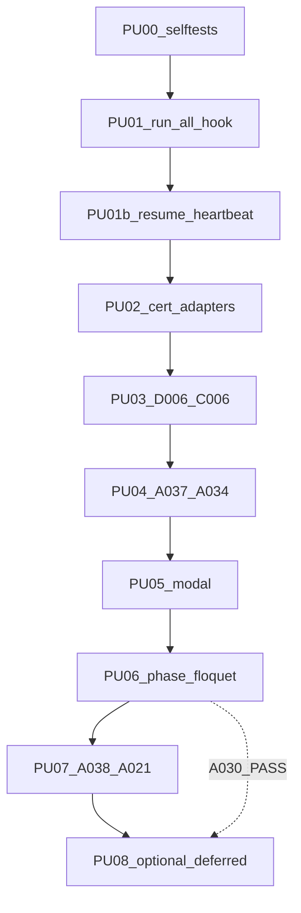
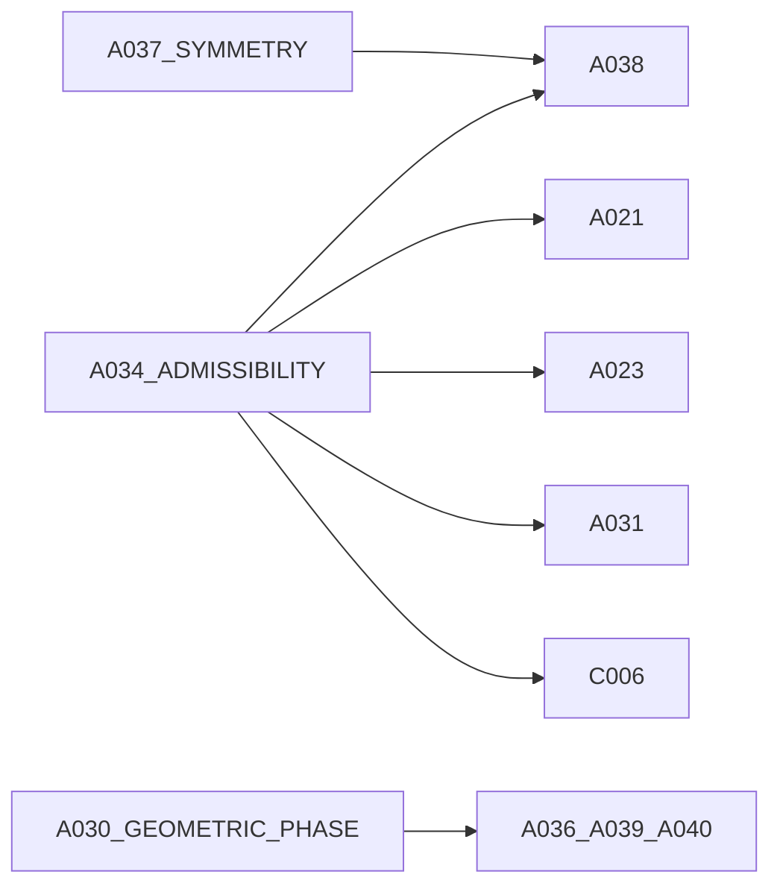

# PAPER UPGRADE EPIC — selftest → integrate → campaign

Status: `IN PROGRESS` · Version: 0.3 · Baseline: 2026-09-08

Index: [README.md](README.md) · Report: [TOTAL_REPORT_2026-09-08.md](TOTAL_REPORT_2026-09-08.md)

## Todos

- [x] PU00 selftests 18/18 PASS
- [x] PU01 run_all selftest hooks wired
- [x] PU01b resume + heartbeat on all 18 patched families
- [x] PU02 certificate adapters + tests
- [x] PU03 D006 + C006 scientific infra
- [x] PU04 A037 + A034 first basic campaigns
- [x] PU02b certificate semantics (no synthetic promotion)
- [ ] PU04b A037 numerics ladder
- [ ] PU04c A037 Paper-2505 gate
- [ ] PU04d A034 dual branch (keep dynamic FAIL)
- [ ] PU05 A029 + A035 + A008 modal chain *(blocked until promotable certs)*
- [ ] PU06 A030 + A023 + A031 phase/Floquet
- [ ] PU07 A038 + A021 orchestrator/consumer
- [ ] PU08 optional controls and/or deferred guards decision recorded

## 1. Problem

The 2026-09 paper-upgrade patches are **additive**: each family gained
`paper_upgrade/gate.py`, `contract.json`, `PAPER_UPGRADE.md`, and
`run_paper_upgrade.cmd`, but **no** `run_all.cmd` calls those gates yet.

`run_paper_upgrade.cmd` only runs:

```bat
python paper_upgrade\gate.py --selftest
```

New observables (`selection_matrix`, constrained Hessian / no-go, geometric phase,
Floquet mirror parity, upstream certificate consumption) live only in the gate modules.
A green legacy `run_all.cmd` therefore does **not** certify the new target versions
(A037 v0.3.0, A034 v0.2.0, A038 v0.4.0, …).

Repo-wide selftest regression already exists:
[`07_scripts/test_paper_upgrade_gates.py`](../../07_scripts/test_paper_upgrade_gates.py)
(18 paths).

## 2. Goal

1. Prove all 18 patches install and selftest on this machine (100% PASS).
2. Wire paper-upgrade into the primary run chain (selftest early; certificates from
   real scientific output; consumers before expensive stages).
3. Make **every patched falsifier resume-able** with **heartbeat logging** before long
   campaigns (stable OUT, stage markers, `heartbeat.log`).
4. Re-run scientific campaigns in dependency order with stop/go discipline.
5. Keep optional controls optional; keep A036/A039/A040 deferred until A030 certifies
   geometric phase.

## 3. Phase graph



| Sub-plan | Role |
|----------|------|
| [PU00](PU00_selftests.plan.md) | Cheap validation of all 18 gates |
| [PU01](PU01_run_all_selftest_hook.plan.md) | `call run_paper_upgrade.cmd` in every `run_all.cmd` |
| [PU01b](PU01b_resume_and_heartbeat.plan.md) | Stage resume + heartbeat for all 18 families |
| [PU02](PU02_certificate_adapters.plan.md) | Emit/consume certificate JSON from campaign outputs |
| [PU03](PU03_infra_d006_c006.plan.md) | D006 numerics + C006 Floquet infra |
| [PU04](PU04_primary_gates_a037_a034.plan.md) | Symmetry-selection + admissibility certificates |
| [PU05](PU05_modal_a029_a035_a008.plan.md) | Modal / soft-mode / chiral channel chain |
| [PU06](PU06_phase_floquet_a030_a023_a031.plan.md) | Geometric phase + RPO/Floquet |
| [PU07](PU07_orchestrator_a038_a021.plan.md) | A038 orchestrator + A021 consumer |
| [PU08](PU08_optional_and_deferred.plan.md) | Optional covariance controls; deferred phase-clock guards |

## 4. Certificate dependency graph



Schemas:

- A037 → `SST-SYMMETRY-SELECTION-1.0`
- A034 → `SST-ADMISSIBILITY-1.0`
- A030 → `SST-GEOMETRIC-PHASE-1.0`
- C006 / A023 / A031 → `SST-FLOQUET-PARITY-1.0`

Canonical on-disk location (after PU02):

`outputs/<tier>/paper_upgrade/certificate.json`

(same resumable OUT tree as [PU01b](PU01b_resume_and_heartbeat.plan.md): `run_state.json`, `heartbeat.log`, `stages/`).

Env overrides for consumers: `SST_A034_CERT`, `SST_A037_CERT`, `SST_A030_CERT`.

## 5. Hard stop/go

\[
\boxed{
\texttt{promotion\_allowed}
=
(\texttt{scientific}=\texttt{true})
\land
(\texttt{certificate\_kind}=\texttt{CAMPAIGN})
\land
(\texttt{status}\in\{\texttt{PASS},\texttt{QUALIFIED}\})
}
\]

Only then may expensive downstream candidate promotion proceed.

Corrected first-campaign labels (do **not** collapse to “paper FAIL”):

\[
\boxed{
\begin{aligned}
A037 &: \texttt{INVALID\_NUMERICS / NOT\_YET\_TESTED\_2505}\\
A034 &: \texttt{OLD\_QHP\_DYNAMIC\_GATE\_FAIL / NOT\_YET\_TESTED\_1806}
\end{aligned}}
\]

- Invalid numerics ⇒ observable not scientifically assessable (not hypothesis FAIL).
- Old QHP dynamic FAIL is real negative science for the **legacy** restoring gate; Paper-1806 still untested.
- Synthetic / SELFTEST certificates must never authorize A038/A021 (`promotion_allowed=false`).
- Infra FAIL (D006 or C006) **does** stop the epic chain until fixed.
- Next: [PRODUCTION_CERTIFICATION.plan.md](PRODUCTION_CERTIFICATION.plan.md) (PC00→A037 v0.3.1→A034 v0.2.1→A038 v0.4.1).

## 6. Families in scope (18)

| Group | IDs |
|-------|-----|
| Infra | D006-v0.4.0, C006-v0.2.0 |
| Primary | A037-v0.3.0, A034-v0.2.0 |
| Modal | A029-v0.2.0, A035-v0.3.0, A008-v0.2.0 |
| Phase / Floquet | A030-v0.2.0, A023-v0.5.0, A031-v0.2.0 |
| Orchestrator | A038-v0.4.0, A021-v0.4.0 |
| Optional | A024 / A025 / A016 (`_variants/optional-paper-control`) |
| Deferred guards | A036-v0.1.1, A039-v0.1.1, A040-v0.1.0 |

## 7. Explicitly out of scope

No paper-driven rerun: A011, A012, A013, A014, A015, A017, A018, A020, A032, A041, A042.

## 8. Execution discipline

- One family at a time (exception: A035 ∥ A008 after A034 PASS).
- Log per run: exit code, certificate status, `outputs/` path, zip paths, **and**
  `heartbeat.log` / `run_state.json` (after PU01b).
- Prefer `basic` / `quick` configs; escalate only on request after basic PASS.
- Campaigns use **stable OUT + resume** by default (`/resume` or `SST_RESUME=1`);
  use `/fresh` only for throwaway reruns.
- Blind/reveal archive policy unchanged (`must_not_override_existing_blind_reveal_policy`).

## 8b. Resume + heartbeat (cross-cutting)

See [PU01b](PU01b_resume_and_heartbeat.plan.md). Summary:

- `outputs/<tier>/run_state.json` + `stages/<id>.done` + append-only `heartbeat.log`
- Heartbeat events: `START` | `ALIVE` (default every 60s) | `SKIP` | `DONE` | `FAIL`
- Shared stage wrapper under `07_scripts/`; all 18 patched families wired before PU03

## 9. Done criteria (epic)

- All PU00–PU07 marked `DONE` (or `SKIPPED` with written reason for optional pieces inside PU07 if atlas missing — must be recorded).
- PU01b `DONE`: mid-chain resume smoke + heartbeat present on patched families.
- PU08 either ran optional campaigns with logged rationale, or recorded `SKIPPED` / deferred-block status.
- Summary log exists under this folder or `10_docs/` pointing to certificate paths for A034, A037, A030 (if produced).
