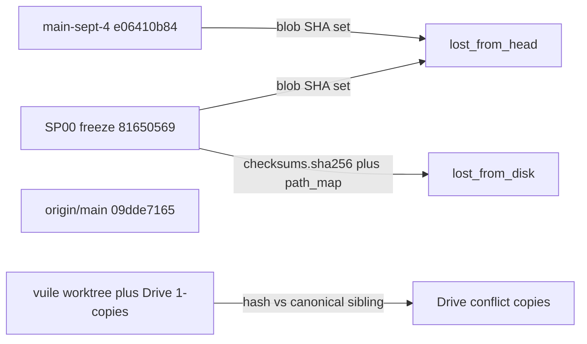

# Pre-refactor content-verlies audit

Geen tweede clone. Jouw keuze: lokale branch [`main-sept-4`](c:/workspace/projects/SST-Workbench) (`e06410b84`, 50.957 tracked files). Extra clone zou dezelfde git-objecten dupliceren en **geen** untracked Drive-bestanden terugzetten.

## Wat we vergelijken

| Punt | SHA | Rol |
|------|-----|-----|
| `main-sept-4` | `e06410b84` | Jouw pre-refactor snapshot (4 sept, vóór de SP-plannen) |
| SP00 freeze | `81650569` | Officiële baseline: 51.122 tracked files, plus [checksums.sha256](10_docs/migration/checksums.sha256) en [file_manifest.csv](10_docs/migration/file_manifest.csv) |
| `origin/main` | `09dde7165` | Post-SP11 catalog tree (69.299 tracked files) |
| Worktree | dirty | Untracked Drive-`(1)` bestanden (nu ~63), ignored outputs |

Tussen `main-sept-4` en freeze zitten alleen Wien-Planck v0.4.0, twee reveal-key trees, en PyYAML. Die 165 extra files zijn **geen** verlies.

De oude commit `0c0214bd1` (“Mega refactor”) is VortexLab-tijdperk en is **niet** deze vergelijking. De “enorme refactor” is SP00–SP11.

## Wat “ontbreekt” betekent

Alleen **echte content-verlies**: een blob (of ignored file uit de freeze-manifest) die nergens in HEAD of op schijf meer voorkomt, ook niet onder een nieuwe naam.

Niet als verlies:

- `git mv` via [path_map.csv](10_docs/migration/path_map.csv) (73 roots → `01_research` … `10_docs`)
- Drive-duplicaten die al hash-matchten en uit `DELETE/` gingen ([delete_retirement.md](10_docs/migration/delete_retirement.md): Katlas/PTSA `(1)`-mappen)
- Rebuildbare `.pyd`/`.obj` die bewust weggingen
- Unpacked `**/outputs/` die al vóór de SP-reeks `git rm --cached` kregen (commit `3a8894c6a`); die zaten niet in `main-sept-4` als tracked content

Bestaande dataset-check ([07_scripts/dataset_integrity.py](07_scripts/dataset_integrity.py)) dekt alleen `03_data/A_knots/`. Deze audit is repo-breed.

## Google Drive-hypothese

Bewijs dat Drive in deze tree heeft gezeten:

- Untracked `*(1)*` bestanden (klassieke Drive Desktop conflict copies)
- SP-commits “Retire Google Drive duplicate … to DELETE/”
- [rclone_oneway_upload_to_gdrive.cmd](07_scripts/rclone_oneway_upload_to_gdrive.cmd): lokaal is source of truth; `--delete-excluded` kan wél extra’s **op Drive** wissen, niet lokaal
- Policy in dat script: deze repo **niet** in Drive Desktop Mirror zetten

Als Drive Desktop toch gemirror’d heeft, kan het ignored/untracked files (outputs, zips, `.stl`) van schijf hebben gehaald. Die zitten niet in git; alleen freeze-checksums + Downloads/rclone kunnen dat aantonen.

## Implementatie

Nieuw script [07_scripts/audit_pre_refactor_content_loss.py](07_scripts/audit_pre_refactor_content_loss.py) (geen checkout van 50k files):

1. **Git blob-set (tracked)**  
   `git rev-list --objects --no-object-names <old>` vs `origin/main`. Blobs in old, niet in HEAD → `lost_from_head`. Per lost blob: oude paden, grootte, of path_map een destination had die nu leeg is.

2. **Disk (tracked + ignored uit freeze)**  
   Lees `checksums.sha256` + `file_manifest.csv`. Map oude paden via path_map (hergebruik `remap_old_to_new` uit [dataset_integrity.py](07_scripts/dataset_integrity.py)). Status: `present_hash_ok` / `present_hash_drift` / `missing_on_disk` / `found_elsewhere_by_hash`.

3. **Drive `(1)`-classificatie, daarna opruimen** (zie volgende sectie).

4. **Optioneel rclone**  
   Als `rclone` een remote `gdrive:SST-Workbench` heeft: `lsf` van remote vs lokale freeze-paden. Alleen rapporteren, niets downloaden.

Allowlist (expliciet in het rapport, niet stilzwijgend droppen): `DELETE/`-retirement, rebuildbare binaries, gitignored output-trees waarvan de sibling `*_outputs.zip` nog bestaat.

## Google Drive-troep opruimen

Eerst classifiëren, daarna toepassen. Geen `git rm` van historische namen.

**Doelwit:** alleen **untracked** (en ignored) paden waarvan de naam Drive Desktop-stijl is: spatie + `(N)` vóór de extensie of als mapnaam, bijv. `run_all (1).cmd`, `.gitignore (1)`, `SST_Blind_MultiLibrary_Falsifier_Template_v0.1.0 (1)/`.

**Niet aanraken (~76 tracked hits):**

- `Infographic(1).png` … zonder spatie (echte presentatie-assets)
- `SST_emergent_SR_foundational_audit_(1).md` (underscore, al in git)
- `5_1 (2).png` en andere tracked archive/media namen
- alles wat `git ls-files` al kent

Nu ~63 untracked Drive-copies plus de hele untracked templatemap `(1)/`.

| Classificatie | Actie |
|---------------|--------|
| SHA-256 gelijk aan canonical sibling zonder ` (N)` | wissen |
| Hash nergens anders in de tree (of geen sibling) | `git mv`-achtige filesystem move naar [`09_archive/drive_conflicts/<origineel/relatief/pad>`](09_archive/drive_conflicts/) |
| Hele map `foo (1)/` | zelfde regel per file; lege restmap weg |

Nieuw helper [07_scripts/cleanup_drive_conflict_copies.py](07_scripts/cleanup_drive_conflict_copies.py): `--dry-run` default, `--apply` na de scan. Ledger: `10_docs/migration/drive_conflict_cleanup_20260913.jsonl` (`deleted_duplicate` / `quarantined_unique` + hashes). Quarantine blijft untracked tot jij zegt dat het gecommit mag.

Tests: hash-gelijke copy verdwijnt; unieke copy landt onder `drive_conflicts/` en blijft leesbaar; tracked `foo (1).txt` wordt overgeslagen.

Geen restore van pre-refactor content in deze ronde, behalve dat unieke Drive-copies daardoor niet meer tussen packs staan.

Uitvoer:

- [10_docs/migration/pre_refactor_content_audit_20260913.md](10_docs/migration/pre_refactor_content_audit_20260913.md) — samenvatting in gewone taal
- `10_docs/migration/pre_refactor_content_audit_20260913.json` — machine counts
- `10_docs/migration/pre_refactor_lost_blobs.csv` — alleen echte verliesrijen

Tests in [07_scripts/test_audit_pre_refactor_content_loss.py](07_scripts/test_audit_pre_refactor_content_loss.py): temp-repo met rename (geen verlies), echte delete (verlies), `(1)`-duplicate vs unique copy. Daarna bestaande `test_dataset_integrity` / `test_manifest_integrity` meedraaien.

Geen restore in deze ronde. Als de audit unique lost content vindt, volgt een apart herstelplan (git checkout van blob, of rclone/Downloads).

## Wat we al weten (niet opnieuw “ontdekken”)

- Tracked file-count **steeg** 50.957 → 69.299; wholesale git-verlies is onwaarschijnlijk.
- `DELETE/` is leeg en verwijderd na hash-audit; duplicaten waren Drive-copies.
- Freeze-artefacten `file_manifest.csv` (16 MB) en `checksums.sha256` (9.5 MB) staan nog op schijf.
- Huidige worktree is vuil (modal-phase untracked packs + Drive `(1)` copies); de git-vergelijking gebruikt `origin/main`, niet die dirty files als “HEAD content”.
