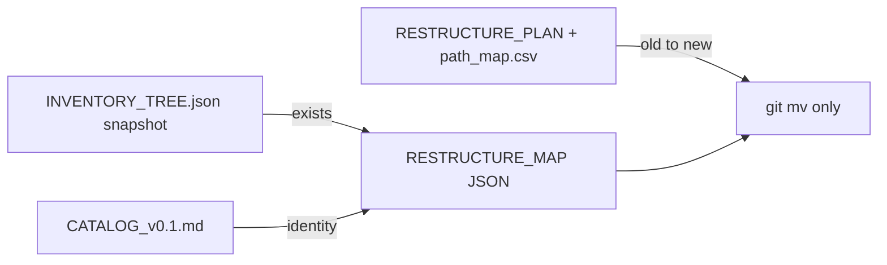

# Catalogus 01–03 bevriezen + git-mv-only migratie

## Harde regel (nieuw, overrulet eerdere SP11-deletes)

**Alles verplaatsen met `git mv`. Niets verwijderen.**

- Elke relocatie in `path_map.csv` heeft `action` ∈ `{git_mv, split_git_mv, ensure_dir, junction}` — **nooit** `delete` / `rm`.
- Tracked content: uitsluitend `git mv` (directories of files). Ignored residue reist mee met de directory rename (SP00 Q1).
- Wat eerder “delete stub” was (`to_be_processed/`, lege `experiments/`-stubs, oude inventory-README’s) wordt **`git mv` naar `DELETE/<original/relative/path>/...`**, niet gewist.
- SP11 wijzigt van “decommission + delete” naar: junctions verwijderen *als lege redirect-schillen* mag alleen als de target al via `git mv` bestaat; **geen content-delete**. Liever junctions laten tot expliciet later besluit — default in dit plan: SP11 archiveert restanten, wist geen research/data.
- Blind/reveal keys: `git mv` naar `keys/` of `DELETE/<original/relative/path>/D_private_reveal/` — nooit mergen, nooit wissen.

Dit geldt voor de hele migration-reeks (SP04–SP11), niet alleen 01–03.

## Antwoord op INVENTORY

**Nee — geen nieuwe `INVENTORY_TREE.json`.** Dat is de filesystem-snapshot. Wel CATALOG + PLAN + `path_map.csv` + JSON-map herschrijven naar jouw tabellen.

## Cataloguswijzigingen (jouw tabel)

**A001–A042** — behouden; versietellingen bijwerken.

**B → 5:** Planck packs samen (B002); horn root samen (B003); route_b (B004); contra_swirl (B005). ssdl → **D004**.

**C → 6:** ChiE C003, ideal C002, fermat C005, Kelvin Floquet C006. Geen IDs voor 3d_collider / uq.

**D → 9:** schrodinger_gate, fs_attachment, verification_suites, ssdl, hopf, minimal, sutcliffe, knotplot missingparameter, knotplot atlas.

**E → 9:** hernummerd; QHP generator E007; PTSA E009.

**F → 2:** coil_digital_twin, route_i PoC (+ F003 CoilLab / F004 taxonomy als residuals via git mv).

**02_libraries:** `A_knot_libraries/{A001,A002}`, `B_finite_core/B001`.

**03_data:** geen dataset-IDs; provenance-mappen `01_ideal` … `05_twist_knots`, `B_external/SPARC`, `C_media`, `D_generated/...`, lege `E_reference/`.

## Residuals — ook `git mv`, geen limbo-delete

| Bron | Bestemming via `git mv` |
|------|-------------------------|
| `SST_CoilLab_research` | `01_research/F_exploratory/F003_coil_lab/` |
| `routeI_heat_guard_*` | onder **F002** als variant-subdir |
| `sst_taxonomy_starter_*` | `01_research/F_exploratory/F004_taxonomy_starter/` |
| `experiments/sycl` | `04_tools/.../sycl_probes/` |
| `sst_3d_collider_robust`, `sst_trefoil_bs` | mee met **C002** tree |
| `GUI/additional for Vlab` | SP06 `git mv` naar research/apps |
| `to_be_processed/`, stub dirs | `DELETE/<original/relative/path>/relocation_stubs/` |
| Planck v3 / Horn children | onder B002 / B003 |

## Uitvoerstappen (documenten eerst; moves later in SP04+)

1. Herschrijf CATALOG 01/02/03 + residuals met bestemmingen, geen “delete”.
2. Herschrijf RESTRUCTURE_PLAN + path_map.csv: alleen `git_mv`/`split`; stubs → archive.
3. Regenereer JSON-map; `safety_rules`: `git_mv_only`, `no_delete`.
4. Update SP04–SP11 + EPIC: content-delete geschrapt; SP11 = junctions/archive only.
5. Verify: research counts; zero `delete` in path_map/operations.
6. Fysieke `git mv` volgt in SP04+ na deze freeze — niet in de document-stap zelf.
