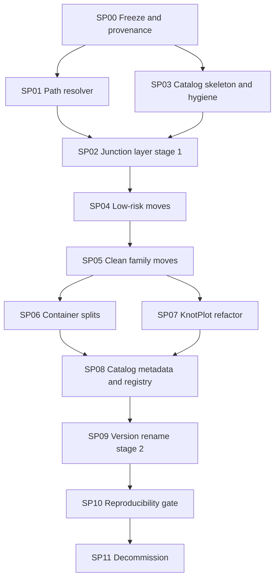

# RESTRUCTURE EPIC — SST-Workbench catalog migration

Status: `IN PROGRESS` · Version: 0.1 · Baseline: 2026-09-03

## Todos

Progress tracker — checkboxes include completed work so status is obvious at a glance.

- [x] Catalog model + 10 domains documented
- [x] Invariants written (incl. git_mv-only + DELETE/<relpath> soft-retire)
- [x] Phase graph SP00–SP11 defined
- [x] A001–A042 chronology frozen; 01/02/03 catalog tables aligned
- [x] SP00 freeze & provenance completed (`10_docs/migration/FREEZE.md`)
- [x] SP01 path resolver implemented & verified
- [x] SP02 junction layer live for moved roots
- [x] SP03 catalog skeleton + hygiene on disk
- [x] SP04–SP07 physical `git mv` waves complete
- [ ] SP08–SP09 metadata + version rename
- [ ] SP10 reproducibility gate passed
- [ ] SP11 soft-retire stubs to `DELETE/` + junction decommission

**Next:** SP09 version-directory rename. SP08 catalog metadata is done.

## 1. Problem

The directory structure has become a second information system alongside the code. Research packs,
tools, datasets, outputs, GUIs, archives and vendored third-party code are all peers in the root.
Five structural faults follow from that.

**A. Family and version are not consistently separated.** `SST_Threaded_Hole_Substrate_Blind_Falsifier_v0.1.0/`
is a root carrying a version suffix that then contains five Threaded Hole versions *and* five
versions of an entirely different family, `SST_Local_Thread_Texture_Boost_Invariance_Blind_Falsifier`.
The same fault, larger: `SST_Trefoil_Lobe_Orientation_Blind_Falsifier/` holds nine
`MultiTopology_Knot_Link_TBK_RPO` packs and one `Adaptive_Period_Aware_RPO` pack around only two
genuine Lobe versions. With 5,905 tracked files it is the single largest offender in the repo.

**B. Version identifiers carry four different meanings.** Of 275 version entries, 134 use plain
`vX.Y.Z`, 11 use four numeric parts (`v0.1.2.4`), and 130 use something else entirely: `v16B0`,
`v0_6`, `v10_complete_restored`, `v0.4.8_Adaptive_Spectral_DD32_compact`, or a full project name as
the version key. A field named `latest` therefore cannot be interpreted: it may mean newest
software release, newest variant, newest experiment, or newest package in a thematic group.

**C. Source, dataset and generated result have equal filesystem status.** `KnotPlot/` is ~12.4 GB,
of which `knots/` is ~7.8 GB of input geometry and `ridgerunner/` ~4.0 GB, mostly campaign output.
A falsifier contains a ~280 MB `.venv`. Three distinct kinds of thing are indistinguishable by
location.

**D. Archives are already solved.** `Restore_Archives/` holds 607 zips in 29 themed buckets and is
conceptually correct. It gets relocated, not redesigned.

**E. The inventory is itself partly legacy.** `INVENTORY.md` still says `Snapshot date: 2026-08-04`
while quoting 2026-09-03 tree statistics. Relocation stubs (`to_be_processed/`, parts of
`experiments/`) point at content that moved long ago.

## 2. The catalog model

Every path level carries exactly one meaning, and the full path is the identity:

```text
01_research / A_falsifiers / A006_contact_billiard_hydrodynamic / <version>/
     |              |               |                                 |
     |              |               |                                 +-- release
     |              |               +-- permanent research family, never a version
     |              +-- type within the domain
     +-- domain
```

Letters are unique only within their domain, so `01_research/A_falsifiers/A001_...` and
`02_libraries/A_knot_geometry/A001_...` coexist. The full path disambiguates.

### Ten domains

```text
SST-Workbench/
├── 01_research/     A_falsifiers B_closures C_dynamics D_benchmarks E_pipelines F_exploratory
├── 02_libraries/    A_knot_geometry B_knot_data C_finite_core D_numerics
├── 03_data/         A_knots B_external C_reference D_generated
├── 04_tools/        A_geometry B_crawlers C_fabrication D_proof
├── 05_apps/         flat, catalog IDs
├── 06_templates/    flat, descriptive names
├── 07_scripts/      flat, descriptive names
├── 08_third_party/  flat, descriptive names
├── 09_archive/      flat, descriptive names
└── 10_docs/         inventory/ architecture/ migration/
```

The letter layer exists only in the four family-bearing domains (`01`–`04`). `05_apps` is flat but
keeps catalog IDs because apps are long-lived identities worth citing (`05_apps/A001_vortexlab/`);
there the `A` is a fixed placeholder so the ID format stays uniform. Domains `06`–`10` hold
infrastructure, not families, and get no IDs.

The top layer classifies by **function**, never by research subject. That is the whole point: a new
hypothesis is not a new software version, and a research topic is not a directory type.

### Family layout

```text
01_research/A_falsifiers/A042_quantum_galileo_action_gauge_closure/
├── FAMILY.yaml          # catalog_id, official name, kind, status, latest, legacy_paths
├── README.md
├── CHANGELOG.md
├── references/
├── <version>/           # long name in stage 1, A042-v0.1.0 after SP09
└── <version>/
```

`FAMILY.yaml` is where non-version-bound metadata lives:

```yaml
catalog_id: A042
domain: 01_research
letter: A_falsifiers
name: SST Quantum Galileo Action Gauge Closure Falsifier
kind: falsifier
status: active
latest: v0.1.1
legacy_paths:
  - SST_Quantum_Galileo_Action_Gauge_Closure/
```

And `project.json` inside each version keeps the version identifiable when copied loose:

```json
{ "catalog_id": "A042", "name": "SST Quantum Galileo Action Gauge Closure Falsifier", "version": "v0.1.1" }
```

### ID allocation

IDs are allocated chronologically within each domain-letter, using the earliest `created`
timestamp among the family's own version directories (not the root directory, which is often
younger because of earlier reorganisations). New families take the next free number. **IDs are
permanent and never reused**, including for families that are later archived.

## 3. Invariants

These hold across every phase. A step that violates one is wrong by definition.

1. **`family` ≠ `version` ≠ `configuration` ≠ `result`.** Four levels, four meanings.
2. **Old paths keep working** until SP11. Junctions, not promises.
3. **No content deletion, ever.** Former delete candidates are `git mv`'d to `DELETE/<original/relative/path>`. SP11 only runs after SP10 passes and performs soft-retire + junction cleanup — never `rm` of research trees.
4. **Long official names never disappear.** They move from the directory name into `FAMILY.yaml`,
   `project.json` and the output artifact names.
5. **The output convention is preserved.** A run from
   `01_research/A_falsifiers/A042_.../A042-v0.1.1/` still produces
   `SST_Quantum_Galileo_Action_Gauge_Closure_Falsifier_v0.1.1-outputs/`, and its blind and revealed
   variants, with zips at the agreed higher level. The name is sourced from `project.json`, not
   from the directory.
6. **Outputs are runtime artifacts**, gitignored, and registered explicitly when scientifically
   relevant. The source tree must not become the experiment database.
7. **Blind and revealed artifacts are never merged.**
8. **Reproducibility beats tidiness.**

## 4. Findings that shape the sequencing

These came out of measuring the repo, and each one moved something in the plan.

**~2,064 files hardcode a path that a move breaks.** 457 use `..\..`-style traversals; the rest
name a top-level folder directly. `..\..\KnotPlot\knots\final` is the default dataset for 40+
packs. This is why the junction layer is a prerequisite rather than a convenience, and why the
resolver (SP01) precedes every move.

**The catalog shortens paths, and that is not cosmetic.** The longest tracked relative path is 231
characters; with the root prefix that is 267, already past the Windows `MAX_PATH` of 260, and
`core.longpaths` is unset. 543 tracked paths exceed 220 characters. Short version directories more
than pay for the added family layer — the worst offender's 129-character prefix becomes about 74.

**Numeric-prefixed directories can never be Python packages.** `import 01_research...` is
syntactically impossible. Packs that do `sys.path.insert(0, workbench_root)` and then import a
sibling by top-level name break in a way no junction repairs. SP00 enumerates them; known starting
points are `SST_minimal_falsification_harness` and
`SST_ideal_trefoil_biot_research/sst_trefoil_bs/ideal_source.py`, both using `parents[2]`.

**`SST_WORKBENCH_ROOT` already exists** but is hardcoded absolute in seven `config/paths.cmd`
files, alongside eight competing conventions. `Knot_Library/SST_Knot_Library/SST_Knot_Library_v0.2.0/sst_knotlib/library_root.py`
already implements env-override plus upward discovery. SP01 generalizes that rather than inventing
a ninth convention.

**`falsifier_registry.yaml` resolves packs by `pack_glob`** across 46 entries. Every glob breaks on
move. The registry must gain `catalog_id` before the first family move or the master falsifier
inventory silently empties.

**Two blockers absent from the original analysis.** `core.longpaths` is unset while the target tree
is deeper in levels (though shorter in characters), and git tracks `gui/` in lowercase while the
filesystem has `GUI/` — a case collision that corrupts a naive `git mv`.

**Three mixed containers beyond the three already identified.** Besides Maxwell, Swirl Clock and
Threaded Hole: `SST_Trefoil_Lobe_Orientation_Blind_Falsifier/` (three families), `SST_Hopf_Benchmark/`
(Packet plus cpp_pybind), and `SST_QHP_Stability_Landscape/` (a sweep *generator* mixed with the
falsifier it feeds). Fourteen containers need splitting in total.

## 5. Two-stage rename

Moving a family and renaming its version directories are deliberately separated.

**Stage 1 (SP04–SP07)** moves families into their catalog location with version directory names
untouched. One junction per vacated root, roughly 73, keeps every old path alive.

**Stage 2 (SP09)** renames version directories to `A042-v0.1.1`. A root junction now points at a
directory where the old version names no longer exist, so this stage needs its own two-level
scaffold: a real directory at the old root holding one junction per old version name, roughly 272
more.

Doing both at once would require the full ~345-junction scaffold up front with no intermediate
verifiable state. Split, each stage is independently reversible.

This also settles the tension with the rule "do not rewrite old names". Old names are not erased.
They survive as junctions through SP11, and permanently in `path_map.csv`, `FAMILY.yaml` and
`project.json`.

## 6. Phase graph



## 7. Priorities

| Priority | Action | Effect | Risk | Sub-plan |
|----------|--------|--------|------|----------|
| P0 | Dataset/path resolver | very high | low | SP01 |
| P0 | Migration manifest + hashes | very high | low | SP00 |
| P0 | Compatibility junction layer | very high | low | SP02 |
| P1 | Catalog skeleton | high | low | SP03 |
| P1 | Exclude `.venv`, caches, build output | high | low | SP03 |
| P1 | Eliminate top-level version suffixes | high | medium | SP04, SP05 |
| P2 | Split KnotPlot tool/data/campaign | very high | high | SP07 |
| P2 | Split Maxwell, Swirl Clock, Threaded Hole, Trefoil Lobe | high | medium | SP06 |
| P3 | Normalize naming and versioning | medium | medium | SP08, SP09 |
| P3 | Numerical reproducibility gate | very high | medium | SP10 |
| P3 | Deduplicate old outputs and archives | very high (disk) | high | SP11 |
| P4 | Remove stubs and junctions | low | low | SP11 |

## 8. Explicit non-goals

Things this migration deliberately does **not** do:

- Merge the 275 version folders into one `src/`.
- Delete old versions on the grounds that git keeps them anyway.
- Move all outputs into a single global `outputs/`.
- Merge blind and revealed artifacts.
- Mass-rename long project names without a migration manifest.
- Move `KnotPlot/knots/final` before the resolver exists.
- Re-extract the archives in `Restore_Archives/`.
- Rewrite historical version identifiers. Only new versions follow the new convention; old
  identifiers are recorded, not corrected.
- Touch `.tmp.driveupload/` (~5.65 GB) as part of the research migration. It is Google Drive
  staging, handled separately in SP11.

## 9. End state

The goal is not "73 directories become fewer directories". It is:

```text
SST-Workbench = research + libraries + data + tools + apps + third-party + archive
```

and within it:

```text
family -> version -> configuration/run -> result
```

with a catalog code that identifies a research family permanently, independently of the software
version it happens to be on.
