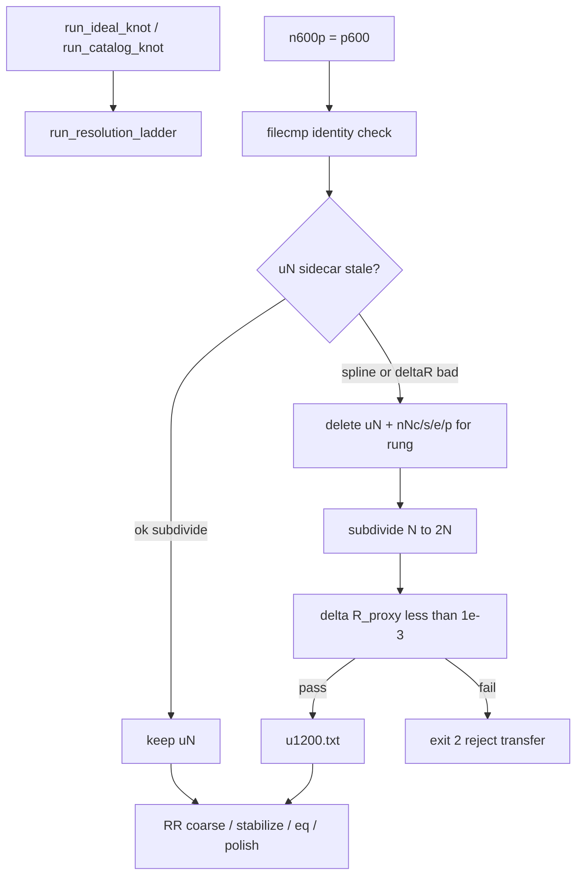

# Rop-preserving N600→N1200 transfer

## Diagnosis (bevestigd)

Jouw log klopt met de code:

- [`run_resolution_ladder.cmd`](c:\workspace\projects\SST-Workbench\KnotPlot\ridgerunner\run_resolution_ladder.cmd) kopieert `n600p.txt` → `p600.txt` (`copy /Y`); daarna resample `p600` → `u1200` met `--method auto`.
- [`resolve_method`](c:\workspace\projects\SST-Workbench\KnotPlot\resample_closed_knot_txt.py) kiest bij upsample **spline**.
- Spline verlaat de piecewise-linear curve → thickness 0.49998 → 0.484575 → Rop ~32.75 → ~33.77 vóór enige N1200-optimalisatie.
- Huidige gates (edge-ratio / length 0.5% / minrad 0.90) vangen dit niet; **geen** Rop/thickness-gate.
- Uniform schalen naar Thi=0.501 laat Rop invariant.

`p600` vs `n600p` is waarschijnlijk **niet** de oorzaak (ladder refresht de alias), maar we voegen een expliciete identity-check toe zodat stale aliases hard falen.

Bestaande tests (baseline): `test_resample_closed_knot_txt.py` + `test_gilbert_ab_to_xyz.py` → **14 passed**.

## Gekozen aanpak

Ladder-rungs zijn overal **exact 2×** (300→600→1200→2400→4800). Daarom:

**Primary fix:** nieuwe upsample-methode `subdivide` = één midpoint per edge (N→2N). Dat behoudt exact dezelfde PL-steun, dus L, self-distance en Rop_proxy blijven gelijk (tot numerieke noise). Geen research-grade contact-solver nodig voor deze ladder.

**Gate:** harde `|R_out/R_in − 1| < 1e-3` via bestaande [`thickness_proxies`](c:\workspace\projects\SST-Workbench\KnotPlot\ridgerunner\select_knotplot_seed.py) (`D_proxy`, `length_over_diameter_proxy`) — dicht genoeg bij jouw δ_Rop om de huidige ~3% spline-collapse te killen.

**Drivers:** [`run_ideal_knot.cmd`](c:\workspace\projects\SST-Workbench\KnotPlot\ridgerunner\run_ideal_knot.cmd) / [`run_catalog_knot.cmd`](c:\workspace\projects\SST-Workbench\KnotPlot\ridgerunner\run_catalog_knot.cmd) zijn dunne wrappers; echte resume-logica zit in de `.py` + ladder. Die moeten stale spline-`u{N}` / polish van slechte transfers niet stil overslaan.

**Ideal-path aanvulling:** optioneel Gilbert opnieuw samplen op target-N (vergelijking/ablation), niet als vervanging van de ladder-polish-keten.



## Wijzigingen

### 1. [`resample_closed_knot_txt.py`](c:\workspace\projects\SST-Workbench\KnotPlot\resample_closed_knot_txt.py)

- Voeg `resample_closed_subdivide(comp, n_out)` toe:
  - Alleen ondersteund wanneer `n_out == 2 * len(comp)` (ladder-case); anders duidelijke `ValueError`.
  - Per edge: behoud vertex i, insert midpoint naar i+1.
- `auto` bij upsample → **`subdivide`** (niet meer spline). Downsample/same-N blijft linear. Spline blijft beschikbaar via `--method spline`.
- In `evaluate_gates` / `main`:
  - Importeer/hergebruik `thickness_proxies` (of een dunne gedeelde helper om circular imports te vermijden — bij voorkeur kleine `thickness_proxy` extract of import vanuit `select_knotplot_seed`).
  - Gate `ROP_REL_MAX = 1e-3`: hard error in strict upsample als `|R_out/R_in - 1| >= 1e-3` of als proxies ontbreken.
  - Schrijf `D_proxy`/`R_proxy` in/out + `relative_rop_change` + `method_per_component` naar `.resample.json` (al deels aanwezig; uitbreiden).
- CLI `choices`: `auto|linear|spline|subdivide`.
- Exporteer helper `transfer_sidecar_is_stale(path) -> bool` (of apart klein module-functie) die `*.resample.json` keurt: stale als method spline op upsample, of `relative_rop_change` ontbreekt/≥1e-3, of validation_errors niet-leeg.

### 2. [`run_resolution_ladder.cmd`](c:\workspace\projects\SST-Workbench\KnotPlot\ridgerunner\run_resolution_ladder.cmd)

- Na `copy n600p → p600` (en analoog p300/p1200/…): identity-check; fail als verschillend.
- Voor skip van `%U%` / hele rung `%C3%`: als sidecar stale → **niet skippen**; verwijder stale `u{N}.txt` (+ json) en bij stale+bestaande polish ook `n{N}{c,s,e,p}*` voor die rung zodat RR opnieuw loopt. Zonder `--force` dus toch herstel van bekende slechte spline-transfers.
- Resample-comment: “PL-preserving subdivide”.
- `--force` blijft volledige herbouw forceren.

### 3. Drivers: ideal + catalog

Beide `.cmd`-files zijn wrappers (`python … %*`). Aanpassen waar nodig:

| Bestand | Rol |
|---------|-----|
| [`run_ideal_knot.cmd`](c:\workspace\projects\SST-Workbench\KnotPlot\ridgerunner\run_ideal_knot.cmd) | Header: ladder gebruikt subdivide; stale spline-`u{N}` wordt herbouwd; `--force` herbouwt alles |
| [`run_catalog_knot.cmd`](c:\workspace\projects\SST-Workbench\KnotPlot\ridgerunner\run_catalog_knot.cmd) | Zelfde header-notitie (catalog deelt ladder) |
| [`run_ideal_knot.py`](c:\workspace\projects\SST-Workbench\KnotPlot\ridgerunner\run_ideal_knot.py) | Voor “skip entire ladder omdat polish bestaat”: als enige gevraagde rung een stale `u{N}.resample.json` heeft (of ontbrekende/oké sidecar bij bestaande `u{N}` van vóór deze fix), **niet** skippen — ladder opnieuw aanroepen zodat §2 kan herstellen |
| [`run_catalog_knot.py`](c:\workspace\projects\SST-Workbench\KnotPlot\ridgerunner\run_catalog_knot.py) | Zelfde via gedeelde `run_rr_pipeline` (importeert al ladder-helpers uit `run_ideal_knot`) — pas **één** gedeelde helper aan, bv. `ladder_needs_rerun(...)` naast `should_skip_existing` |

Concreet in shared Python:

```python
def ladder_rung_transfer_stale(outdir_or_polish_parent, n: int) -> bool:
    # True if u{n}.txt exists and sidecar missing/stale (spline / δ_R ≥ 1e-3)
```

`all_done` wordt dan: polish bestaat **en** transfer niet stale. Zo hoeven T2.3/g1k/t12-achtige camps niet handmatig `--force` over alles als alleen de N1200-transfer stuk was — wel opnieuw N1200-rung, niet per se N600.

Documenteer in module-docstrings / cmd rem-blocks:
- Default ladder blijft polish-transfer met subdivide.
- Parallel experiment: `run_ideal_knot.cmd --3:1:1 --resolutions 1200 --points 1200` (Gilbert@N1200 zonder ladder).

### 4. Tests ([`test_resample_closed_knot_txt.py`](c:\workspace\projects\SST-Workbench\KnotPlot\ridgerunner\test_resample_closed_knot_txt.py) + driver unit smoke indien aanwezig)

- `test_auto_chooses_subdivide_on_upsample`.
- `test_subdivide_doubles_preserves_length_and_r_proxy`: `|ΔR/R| < 1e-3`.
- `test_gate_rejects_high_delta_rop`.
- `test_transfer_sidecar_is_stale` voor spline / hoge δ_R / goede subdivide.
- Indien zinvol: kleine test op `ladder_needs_rerun` / `ladder_rung_transfer_stale` in `test_run_ideal_knot.py`.
- Bestaande spline/minrad-tests laten staan.

### 5. Docs

Korte noot in [`KnotPlot/ridgerunner/README.md`](c:\workspace\projects\SST-Workbench\KnotPlot\ridgerunner\README.md): ladder upsample = subdivide; δ_R_proxy &lt; 1e-3; stale spline-sidecars triggeren herbouw via ideal/catalog/ladder zonder volledige campagne-`--force` op eerdere rungs.

## Verificatie

1. Unit tests opnieuw (resample + gilbert + ideal helpers).
2. Smoke op bestaande polish:  
   `python resample_closed_knot_txt.py .../n600p.txt --points 1200 --method auto -o .../u1200_new.txt`  
   Verwacht: R_proxy-delta ≪ 1e-3; RR start-Rop ≈ N600 polish-Rop (~32.75), niet ~33.77.
3. Resume-smoke: bestaande map met oude spline-`u1200.resample.json` + `n1200p.txt` → `run_catalog_knot` / `run_ideal_knot` zonder `--force` moet N1200-rung opnieuw plannen (niet “skip entire ladder”).
4. Geen wijzigingen in ridgerunner C-core tenzij smoke aantoont dat RR-autoscale zelf nog iets breekt (niet verwacht).

## Niet in scope

- Volledige octrope-thickness in de resampler (R_proxy volstaat voor de gate).
- Generieke contact-aware smooth reconstruction voor willekeurige N≠2N.
- Herschrijven van de hele ideal-campagne naar alleen Gilbert@N1200.
- Wijzigingen aan `run_build.cmd -rr`.
