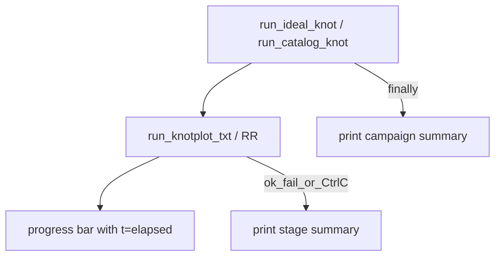

# Run live timer + end-of-run stats summary

## Scope

Both layers:

1. **Per stage** — [`run_knotplot_txt.py`](c:\workspace\projects\SST-Workbench\KnotPlot\ridgerunner\run_knotplot_txt.py) (used by `ridgerunner.cmd`, three_stage, ladder)
2. **Campaign** — [`run_ideal_knot.py`](c:\workspace\projects\SST-Workbench\KnotPlot\ridgerunner\run_ideal_knot.py) + [`run_catalog_knot.py`](c:\workspace\projects\SST-Workbench\KnotPlot\ridgerunner\run_catalog_knot.py)

No C-core / `ridgerunner.exe` changes.

## Live timer (during run)

In non-verbose mode the progress bar already redraws each RR step via `\r`. Extend it with **elapsed wall clock** from stage start:

Example:

```text
[##########------------------------------] 2500/10000  25%  Rop:32.75  Str:900  t=12m34s
```

Concrete changes in [`run_knotplot_txt.py`](c:\workspace\projects\SST-Workbench\KnotPlot\ridgerunner\run_knotplot_txt.py):

- `format_duration(seconds) -> str` (compact: `45s`, `12m34s`, `1h02m03s`)
- `format_progress_bar(..., elapsed_s: float | None = None)` appends `t={format_duration}` when set
- `run_ridgerunner_live`: `t0 = time.perf_counter()` at start; on each progress line pass `elapsed_s = time.perf_counter() - t0`
- **Verbose mode**: no progress bar — print a one-line elapsed heartbeat every N seconds (default 30s) or every 100 steps so time is still visible without flooding; debounce with last-heartbeat timestamp

Campaign drivers do not need a second live clock while a stage is running (stage bar already shows it). Campaign total time only in the final summary.

## End summary

**Stage** (after each RR wrapper run, and on Ctrl+C mid-stage):

- status: `ok` / `failed` / `interrupted`
- wall clock (same `format_duration` + raw seconds)
- RR walltime from `logfiles/walltime.dat` last value when present (add to metrics JSON)
- last Rop / Thi / residual / Str / MRstruts / steps
- paths: output TXT + metrics JSON when written

**Campaign** (ideal/catalog, always in `finally`):

- status: `ok` / `failed` / `interrupted`
- total wall clock
- outdir + seed
- per completed polish: N + Rop (or L_diam) from `*.metrics.json` when present



## Implementation

### 1. `run_knotplot_txt.py`

- Helpers: `format_duration`, `print_stage_summary`
- Live elapsed on bar + verbose heartbeat
- `build_metrics`: add `walltime`, `elapsed_s`
- Ctrl+C: kill RR child in `run_ridgerunner_live`; stage summary in `main` `finally`

### 2. Campaign wrappers

- `t0` at start; `try/except KeyboardInterrupt/finally`
- Merge existing Summary with time + status
- Exit `130` on interrupt, `1` on failure, `0` on success

### 3. Tests

- `format_duration` cases
- `format_progress_bar` includes `t=` when `elapsed_s` set
- Interrupt kills child (mock/`sleep` subprocess)
- Campaign summary helper smoke if extracted

### 4. Docs

README: live `t=` on progress bar; end/Ctrl+C summary with wall time + last Rop/Thi/residual.

## Out of scope

- Changing RR C logging format
- GUI/curses summary
- Separate campaign summary file
