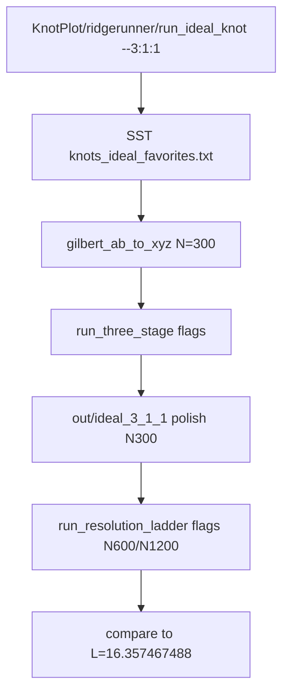

# Ideal knot runs in SST-Workbench (not compile repo)

## Correction

Home for **scripts + results** is [SST-Workbench/KnotPlot/ridgerunner](c:\workspace\projects\SST-Workbench\KnotPlot\ridgerunner).

[c:\workspace\projects\ridgerunner](c:\workspace\projects\ridgerunner) is **compile/install only**. No ideal-favorites clone, no Gilbert drivers, no `out/` RR campaigns there.

The Gilbert work from the **previous plan** (already present under the compile repo) **moves with this plan** — it is not discarded:

| Was in compile repo | Moves to SST-Workbench |
|---------------------|------------------------|
| `data/ideal_favorites.txt` + `data/README.md` | Prefer workbench root [`knots_ideal_favorites.txt`](c:\workspace\projects\SST-Workbench\knots_ideal_favorites.txt) as source of truth; optional thin note in KnotPlot/ridgerunner README (no need to duplicate the full DB unless useful) |
| `tools/gilbert_ab_to_xyz.py` | [`KnotPlot/ridgerunner/gilbert_ab_to_xyz.py`](c:\workspace\projects\SST-Workbench\KnotPlot\ridgerunner\gilbert_ab_to_xyz.py) |
| `tools/test_gilbert_ab_to_xyz.py` | [`KnotPlot/ridgerunner/test_gilbert_ab_to_xyz.py`](c:\workspace\projects\SST-Workbench\KnotPlot\ridgerunner\test_gilbert_ab_to_xyz.py) |
| `scripts/windows/run_gilbert_three_stage.cmd` | Re-home as N=300-only helper **or** fold into `run_ideal_knot.py --resolutions 300` (same flags/target compare) |
| Target `L_3_1 = 16.357467488` + compare helpers | Kept inside `gilbert_ab_to_xyz.py` / `run_ideal_knot.py` |
| `out/gilbert_3_1_1/` campaign artifacts | **Not** copied into compile repo; new runs write to `KnotPlot/ridgerunner/out/ideal_3_1_1/` (old compile-repo `out/` deleted) |
| Gilbert section in `BUILD-WINDOWS.md` | Removed from compile repo; docs live in KnotPlot/ridgerunner `README.md` |

So: previous-plan **source files and behavior go into SST**; compile-repo copies are deleted after the move.

## Goal

```bat
cd SST-Workbench\KnotPlot\ridgerunner
run_ideal_knot.cmd --3:1:1
```

1. Read AB `Id="3:1:1"` from SST ideal favorites ([`knots_ideal_favorites.txt`](c:\workspace\projects\SST-Workbench\knots_ideal_favorites.txt) at workbench root; bundle may keep a local copy or path default to `..\..\knots_ideal_favorites.txt`)
2. Sample → XYZ at **N=300**
3. Three-stage via existing [`ridgerunner.cmd`](c:\workspace\projects\SST-Workbench\KnotPlot\ridgerunner\ridgerunner.cmd) / [`run_knotplot_txt.py`](c:\workspace\projects\SST-Workbench\KnotPlot\ridgerunner\run_knotplot_txt.py) (same flags as [`run_three_stage.cmd`](c:\workspace\projects\SST-Workbench\KnotPlot\ridgerunner\run_three_stage.cmd))
4. From N=300 polish: resolution ladder **N=600** and **N=1200** using existing [`resample_closed_knot_txt.py`](c:\workspace\projects\SST-Workbench\KnotPlot\resample_closed_knot_txt.py) + same flags as [`run_resolution_ladder.cmd`](c:\workspace\projects\SST-Workbench\KnotPlot\ridgerunner\run_resolution_ladder.cmd)
5. Report `L_diam` vs target **`16.357467488`** for each polish



## Seed vs target

| Role | Value | Convention |
|------|------:|------------|
| Gilbert seed | `L = 16.371637` | diameter `D=1` |
| Acceptance target | `L_3_1 = 16.357467488` | diameter `D=1` |
| RR radius units | `Rop ≈ 32.714934976` | `2 × L_3_1` |

## Non-negotiable

- **Do not** put campaign outputs or ideal tooling in the compile repo
- **Do not** change KnotPlot `run_build.cmd` / seed selection / catalog upsert behavior (existing `-rr` path stays production)
- **Do** additively extend [KnotPlot/ridgerunner](c:\workspace\projects\SST-Workbench\KnotPlot\ridgerunner)
- Reuse existing SST helpers: `ridgerunner.cmd`, `run_three_stage.cmd` / same flags, `run_resolution_ladder.cmd` / same flags, parent `resample_closed_knot_txt.py` — no port into compile repo

## CLI (chosen)

Python driver + thin `.cmd` in the KnotPlot ridgerunner bundle:

```bat
run_ideal_knot.cmd --3:1:1
run_ideal_knot.cmd --id 3:1:1
python run_ideal_knot.py --3:1:1
```

Options: `--ideal PATH`, `--outdir PATH` (default `KnotPlot/ridgerunner/out/ideal_3_1_1` or `KnotPlot/knots/ideal_3_1_1` — **chosen default:** [`KnotPlot/ridgerunner/out/ideal_<safe_id>/`](c:\workspace\projects\SST-Workbench\KnotPlot\ridgerunner\out)), `--resolutions 300,600,1200`.

## Stage flags

**N=300** (identical to `run_three_stage.cmd`):

- coarse / eqfinal / polish with residuals `0.05` / `0.01` / `0.01`

**N=600 / N=1200** (identical to `run_resolution_ladder.cmd`):

- resample from N=300 polish; coarser step budgets; `--StopResidual=0.005` on eqfinal/polish

Implementation may shell existing `.cmd` files (`run_three_stage.cmd`, `run_resolution_ladder.cmd`) after sampling, or call `ridgerunner.cmd` with the same flags; prefer shelling the existing cmds to avoid drift.

## Deliverables

### A. Cleanup compile repo

Delete from [ridgerunner](c:\workspace\projects\ridgerunner):

- `data/ideal_favorites.txt`, `data/README.md`
- `tools/gilbert_ab_to_xyz.py`, `tools/test_gilbert_ab_to_xyz.py`
- `scripts/windows/run_gilbert_three_stage.cmd`
- `out/gilbert_3_1_1/` (generated)
- Revert Gilbert append section from `BUILD-WINDOWS.md` if that file should stay compile-focused (or remove the Gilbert section only)

Do not touch compile wrappers (`scripts/windows/ridgerunner.cmd`, core C).

### B. SST-Workbench KnotPlot/ridgerunner

| Add | Path |
|-----|------|
| Sampler | [`gilbert_ab_to_xyz.py`](c:\workspace\projects\SST-Workbench\KnotPlot\ridgerunner\gilbert_ab_to_xyz.py) |
| Tests | [`test_gilbert_ab_to_xyz.py`](c:\workspace\projects\SST-Workbench\KnotPlot\ridgerunner\test_gilbert_ab_to_xyz.py) |
| Driver | [`run_ideal_knot.py`](c:\workspace\projects\SST-Workbench\KnotPlot\ridgerunner\run_ideal_knot.py) |
| Wrapper | [`run_ideal_knot.cmd`](c:\workspace\projects\SST-Workbench\KnotPlot\ridgerunner\run_ideal_knot.cmd) |
| Docs | append to [`README.md`](c:\workspace\projects\SST-Workbench\KnotPlot\ridgerunner\README.md) |

Ideal data: default `--ideal` → `..\..\knots_ideal_favorites.txt` (workbench root). Optional thin local copy under `ridgerunner/data/` only if path convenience is needed; prefer single source of truth at workbench root.

Optional thin `run_gilbert_three_stage.cmd` in the bundle as N=300-only alias that calls `run_ideal_knot.py --resolutions 300`; primary entrypoint is `run_ideal_knot`.

### C. Results location

All TXT / VECT / `.rr/` / metrics under:

`SST-Workbench/KnotPlot/ridgerunner/out/ideal_3_1_1/`

Never under `c:\workspace\projects\ridgerunner\out\`.

## Verification

1. Compile repo has no Gilbert/ideal campaign files after cleanup
2. `python test_gilbert_ab_to_xyz.py` in KnotPlot/ridgerunner
3. `run_ideal_knot.cmd --3:1:1 --resolutions 300` smoke, then full 300/600/1200 when practical
4. `run_build.cmd knot_3.1` without `-rr` still works (no regression to KnotPlot-only path); do not rewrite `run_build.cmd`

## Out of scope

- Changing catalog / VortexLab upsert to consume Gilbert polish automatically
- Editing ridgerunner C sources for this feature
