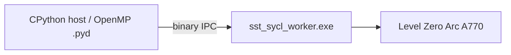

# Lessen uit `run_sycl_worker_smoke.cmd` → GPU-template

Bron: [`SST_MultiTopology_Knot_Link_TBK_RPO_Falsifier_v0.4.5/run_sycl_worker_smoke.cmd`](c:\workspace\projects\SST-Workbench\SST_Trefoil_Lobe_Orientation_Blind_Falsifier\SST_MultiTopology_Knot_Link_TBK_RPO_Falsifier_v0.4.5\run_sycl_worker_smoke.cmd) + [`docs/SYCL_WORKER_ARCHITECTURE.md`](c:\workspace\projects\SST-Workbench\SST_Trefoil_Lobe_Orientation_Blind_Falsifier\SST_MultiTopology_Knot_Link_TBK_RPO_Falsifier_v0.4.5\docs\SYCL_WORKER_ARCHITECTURE.md).

## Wat daar cruciaal is (en de template nog mist)

| Les | Werkende smoke | Huidige GPU-template |
|-----|----------------|----------------------|
| **Geen SYCL device-code in CPython `.pyd`** | Persistent `sst_sycl_worker.exe` + stdin/stdout IPC | SYCL-kernels in `_native.pyd` (fragiel; op Py3.14/oneAPI 2026: `0xC0000005` bij import) |
| **Device selector** | `ONEAPI_DEVICE_SELECTOR=level_zero:gpu` | `level_zero:0` |
| **Cache** | `SYCL_CACHE_PERSISTENT=0` | niet gezet |
| **FP32-gate** | `SST_SYCL_ALLOW_FP32=1` + probe `aspect::fp64`; anders hard fail | stilzwijgend float op device |
| **Build-flag** | `icpx -fsycl -fsycl-device-code-split=per_kernel` | `-fsycl` zonder split |
| **Smoke** | `-X faulthandler` + FP32-vs-host-FP64 relative L2 `< 5e-4` | in-process `run_all_checks` |



## Aanpak (concrete default)

Port de **worker-architectuur** naar [`templates/SST_GPU_SYCL_DPC_audit_template`](c:\workspace\projects\SST-Workbench\templates\SST_GPU_SYCL_DPC_audit_template) als de SYCL-GPU-path; houd `_native.pyd` host/OpenMP-only (zoals v0.4.5).

### 1. Worker binaries + Python bridge

- Kopieer/adapteer uit v0.4.5:
  - [`cpp/sycl_worker.cpp`](c:\workspace\projects\SST-Workbench\SST_Trefoil_Lobe_Orientation_Blind_Falsifier\SST_MultiTopology_Knot_Link_TBK_RPO_Falsifier_v0.4.5\cpp\sycl_worker.cpp) → template `cpp/sycl_worker.cpp`
  - [`native_ext/sycl_worker.py`](c:\workspace\projects\SST-Workbench\SST_Trefoil_Lobe_Orientation_Blind_Falsifier\SST_MultiTopology_Knot_Link_TBK_RPO_Falsifier_v0.4.5\native_ext\sycl_worker.py) → template `native_ext/sycl_worker.py`
  - `tools/build_sycl_worker.py` + `tools/sycl_worker_smoke.py` (met `sys.path`-fix)
- Strip SYCL device-kernels uit template [`cpp/native.cpp`](c:\workspace\projects\SST-Workbench\templates\SST_GPU_SYCL_DPC_audit_template\cpp\native.cpp) / build: geen `-DSST_HAVE_SYCL` in de `.pyd`; OpenMP/host blijft.

### 2. Wire `core.resolve_backend` / `run`

- `backend=sycl` → `sycl_worker.biot_savart` (niet in-process SYCL)
- Respecteer `SST_SYCL_ALLOW_FP32`; zonder FP64 en zonder flag → duidelijke RuntimeError
- Label backend `sycl-worker-fp32` / `sycl-worker-fp64` in probes/summary

### 3. `run_arc.cmd` / smoke alignen op werkende script

```bat
call "%ONEAPI_SETVARS%" >nul
set "ONEAPI_DEVICE_SELECTOR=level_zero:gpu"
set "SYCL_CACHE_PERSISTENT=0"
set "SST_SYCL_ALLOW_FP32=1"
```

- Behoud session `setlocal` (geen permanente PATH)
- Voeg `run_sycl_worker_smoke.cmd` toe (spiegel van v0.4.5)
- `run_all.cmd` → install + worker-smoke + `run_all_checks.py --backend sycl`

### 4. Docs + tests

- README: link naar worker-architectuur; Arc = screening FP32 tenzij native FP64; CUDA blijft out-of-scope
- Tests: worker build/probe skip zonder oneAPI; met Arc: smoke parity `rel < 5e-4`; `oneapi_bin_dirs` / `add_dll_directory` blijven voor host `.pyd`

### 5. Validatie

- `python -m pytest -q`
- `run_sycl_worker_smoke.cmd` op A770 → PASS + finite + rel L2
- `run_arc.cmd` / full checks → `heavy_is_gpu` / worker backend labels in `{folder}_outputs/`
