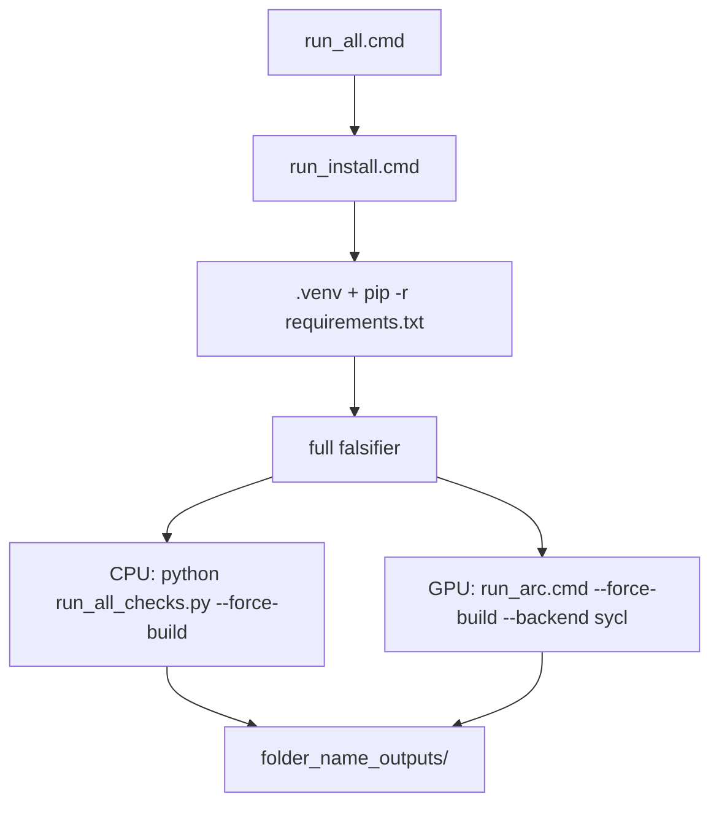

# Template outputmap + run_all.cmd

Beide starters in [templates/SST_cpp_pybind_audit_template](c:\workspace\projects\SST-Workbench\templates\SST_cpp_pybind_audit_template) en [templates/SST_GPU_SYCL_DPC_audit_template](c:\workspace\projects\SST-Workbench\templates\SST_GPU_SYCL_DPC_audit_template) krijgen dezelfde conventie. De mapnaam volgt de **huidige** package-folder, dus na copy/rename naar `Foo_v0.1.0` landt alles in `Foo_v0.1.0/Foo_v0.1.0_outputs/` (nu: `SST_cpp_pybind_audit_template/SST_cpp_pybind_audit_template_outputs/` en analogon voor GPU). Template-folders zelf worden **niet** hernoemd.

## Outputpad

In beide [`native_ext/_config.py`](c:\workspace\projects\SST-Workbench\templates\SST_cpp_pybind_audit_template\native_ext\_config.py):

```python
def package_root() -> Path:
    return Path(__file__).resolve().parent.parent

def default_output_dir() -> Path:
    root = package_root()
    return root / f"{root.name}_outputs"
```

Defaults die nu `audit_out` / `example_sweep.json` in CWD schrijven, wijzen hierheen:

- [`run_all_checks.py`](c:\workspace\projects\SST-Workbench\templates\SST_cpp_pybind_audit_template\run_all_checks.py) `--out-dir` en `core.run_all_checks()`
- [`run_sweep.py`](c:\workspace\projects\SST-Workbench\templates\SST_cpp_pybind_audit_template\run_sweep.py) `--out-json` / `--out-csv` → `{out}/sweep.json` en `{out}/sweep.csv`
- `run_example.py --out` blijft optioneel; als gezet zonder map, mag het relatief in `{out}` vallen — geen extra file bij een kale smoke-print

GPU: [`run_arc.cmd`](c:\workspace\projects\SST-Workbench\templates\SST_GPU_SYCL_DPC_audit_template\run_arc.cmd) geeft `--out-dir` mee als de caller het niet al zet.

`.gitignore`: `*_outputs/` (GPU houdt `audit_out*/` erbij). CPU-template krijgt een `.gitignore` in dezelfde stijl als GPU (`build/`, `__pycache__`, `*.pyd`, `*_outputs/`).

## Windows launchers



Nieuwe bestanden in **beide** templates:

- `run_install.cmd` — `cd` naar scriptmap; maak `.venv` (`py -3` daarna `python`); `pip install --upgrade pip setuptools wheel`; `pip install -r requirements.txt`
- `run_all.cmd` — `call run_install.cmd`, daarna full battery met `.venv\Scripts\python.exe`; extra args via `%*`

CPU `run_all.cmd` stappen: install → `python -m native_ext.build_ext_if_needed --force` (geen `--strict`, fallback blijft geldig) → `python run_all_checks.py --force-build` (default out-dir).

GPU `run_all.cmd` stappen: install → `call run_arc.cmd %*` (GPU-first, blijft falen zonder Arc/oneAPI). `run_arc.cmd` gebruikt `.venv\Scripts\python.exe` als die bestaat, anders `python` op PATH, zodat install en Arc-run dezelfde interpreter delen.

## Docs + tests

README’s, [`examples/minimal_commands.txt`](c:\workspace\projects\SST-Workbench\templates\SST_cpp_pybind_audit_template\examples\minimal_commands.txt) en [`examples/full_commands.txt`](c:\workspace\projects\SST-Workbench\templates\SST_cpp_pybind_audit_template\examples\full_commands.txt) (beide templates): quick start wordt `run_all.cmd`; default output is `{folder}_outputs`, niet `audit_out`.

Tests (user rule: test per nieuwe functie):

- CPU: nieuwe [`tests/test_output_dir.py`](c:\workspace\projects\SST-Workbench\templates\SST_cpp_pybind_audit_template\tests\test_output_dir.py) + `pytest.ini`; `pytest` in [`requirements.txt`](c:\workspace\projects\SST-Workbench\templates\SST_cpp_pybind_audit_template\requirements.txt)
- GPU: zelfde test in bestaande [`tests/`](c:\workspace\projects\SST-Workbench\templates\SST_GPU_SYCL_DPC_audit_template\tests)

Assert: `default_output_dir()` is child van package root en heet `{root.name}_outputs`.

Voor implementatie: bestaande GPU-pytest in de template-map. Na afloop: CPU `pytest -q` + GPU `pytest -q` (native/SYCL-skips blijven zoals nu).
