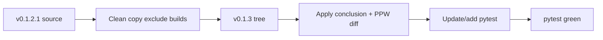

# Kelvin falsification v0.1.3 pack

Baseline: `pytest` in [`SST_chiral_kelvin_falsification_v0.1.2.1`](c:/workspace/projects/SST-Workbench/SST_Chiral-Kelvin-Mode/SST_chiral_kelvin_falsification_v0.1.2.1) — **10 passed**. Target does not exist yet.

## 1. Clean duplicate

Create:

`SST-Workbench/SST_Chiral-Kelvin-Mode/SST_chiral_kelvin_falsification_v0.1.3`

Copy from `..._v0.1.2.1`, excluding:

- `build/`
- `.pytest_cache/`
- `**/__pycache__/`
- compiled native `*.pyd` / `*.so` (e.g. `chiral_kelvin/_native.*.pyd`)
- generated audit trees/zips (`audit_out/`, `audit_out_v0121/`, `audit_out_v0121.zip`)

Keep source: `chiral_kelvin/` (Python), `cpp/`, `tests/`, runners, `README.md`, `CHANGELOG.md`.

Leave the original `v0.1.2.1` folder untouched.

## 2. Apply the provided v0.1.3 diff in the new folder

Patch targets (content as given; adapt only where the baseline string is `0.1.2.1` instead of `0.1.2`):

| File | Change |
|------|--------|
| [`chiral_kelvin/__init__.py`](c:/workspace/projects/SST-Workbench/SST_Chiral-Kelvin-Mode/SST_chiral_kelvin_falsification_v0.1.2.1/chiral_kelvin/__init__.py) | Import/export conclusions API; `__version__ = "0.1.3"` |
| `chiral_kelvin/conclusions.py` | **New** machine-readable ledger + `build/write_conclusions_summary` |
| [`chiral_kelvin/convergence_v012.py`](c:/workspace/projects/SST-Workbench/SST_Chiral-Kelvin-Mode/SST_chiral_kelvin_falsification_v0.1.2.1/chiral_kelvin/convergence_v012.py) | Nyquist-safe `max_m`; `mode_ppw` / `wavelength_resolution_status`; attach `ppw`/`wavelength_status` on modes, clusters, matches; require RESOLVED wavelength for `physical_allowed`; policy + rule text |
| [`run_resolution_ladder.py`](c:/workspace/projects/SST-Workbench/SST_Chiral-Kelvin-Mode/SST_chiral_kelvin_falsification_v0.1.2.1/run_resolution_ladder.py) | Add `resolved` preset `(256, 320, 384)`; CLI text → v0.1.3 |
| [`run_all_checks.py`](c:/workspace/projects/SST-Workbench/SST_Chiral-Kelvin-Mode/SST_chiral_kelvin_falsification_v0.1.2.1/run_all_checks.py) | Same preset; write `audit_summary_v0.1.3.json` + `conclusions_summary.json` |
| [`run_all.cmd`](c:/workspace/projects/SST-Workbench/SST_Chiral-Kelvin-Mode/SST_chiral_kelvin_falsification_v0.1.2.1/run_all.cmd) | Banner → v0.1.3 |
| [`CHANGELOG.md`](c:/workspace/projects/SST-Workbench/SST_Chiral-Kelvin-Mode/SST_chiral_kelvin_falsification_v0.1.2.1/CHANGELOG.md) | Prepend v0.1.3 section above existing v0.1.2.1 history |
| `CONCLUSIONS.md` | **New** scientific ledger (as provided) |

Hunks already match the current `convergence_v012.py` structure (`min(24, ...)`, `physical_allowed`, cluster/`match` dicts, final `policy`/`rule`).

## 3. Test updates required for the new pack

Existing asserts will break after the version bump:

- `test_package_version` → `"0.1.3"`
- `test_run_resolution_ladder_help` → expect `v0.1.3` and that `resolved` appears in help

Add focused unit tests (new functions in the diff):

- `mode_ppw` / `wavelength_resolution_status` (m=0 → `inf`/`NOT_APPLICABLE`; PPW thresholds 12 / 8)
- default `arclength_fourier_fingerprint` length uses full Nyquist (`n//2-1`), not a hard 24 cap (e.g. N≥64)
- `build_conclusions_summary` / `write_conclusions_summary` (status counts, JSON write, release `"0.1.3"`)

## 4. Verify

From the new `v0.1.3` directory: `python -m pytest tests -q`.

Save this plan under [`SST-Workbench/.cursor/plans/`](c:/workspace/projects/SST-Workbench/.cursor/plans/).

