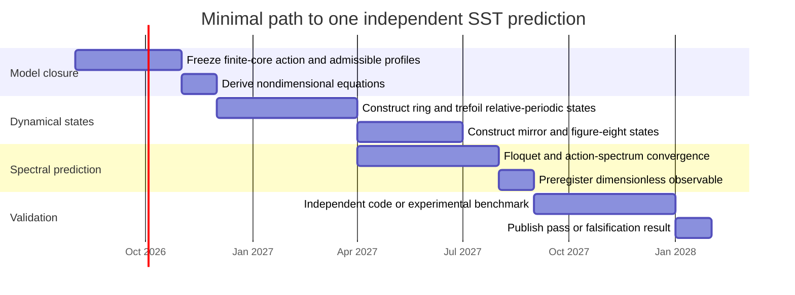

# Can Swirl-String Theory Compute Anything Not Already Encoded in Its Calibration Constants?

## Executive assessment

The strict answer is:

\[
\boxed{
\text{SST currently performs nontrivial calculations, but it has not yet produced a validated}
\atop
\text{physical prediction independent of its calibration inputs.}
}
\]

Two questions must be separated.

| Question | Answer |
|---|---|
| Can SST calculate numbers that are not obtained by a trivial one-line substitution of \(\alpha,m_e,G,\ldots\)? | **Yes.** Examples include knot-action ratios, regularized Biot–Savart residuals, conditional fixed points, and several internal no-go results. |
| Has SST predicted a measured physical observable without directly or indirectly using that observable’s calibration constants? | **Not yet.** |
| Are any current results promising candidates for an independent prediction? | **Yes, but they are conditional or presently fail comparison with observation.** |
| What is SST’s strongest scientific output at present? | Its increasingly explicit **falsification and dependency audit**, not a confirmed new constant. |

The distinction is important. A numerical computation may be mathematically independent of \(\alpha\) after cancellations, yet still fail to be a physical prediction because it depends on an unfixed core profile, geometry, closure relation, lattice action, or matching coefficient. Conversely, a formula may look geometrical while its dimensional normalization already contains the measured electron mass.

The audit supports four central conclusions:

\[
\boxed{
\begin{aligned}
&\text{Most constant identities are Rosetta-style rewrites of known physics.}\\
&\text{The mass program remains calibrated or underdetermined.}\\
&\text{The Route-I action program contains genuine non-algebraic calculations,}\\
&\quad\text{but its physical selector remains profile-dependent.}\\
&\text{No current calculation independently yields }\alpha,\ m_e,\ G,\ c,\text{ or the atomic spectrum.}
\end{aligned}
}
\]

The current CANON itself is unusually candid about this status. It defines the primitive calibration set as

\[
\mathcal P_{\rm cal}
=
\left\{
\rho_f,\,
v_{\circlearrowleft},\,
\omega_c
\right\},
\]

with

\[
v_{\circlearrowleft}=\frac{\alpha c}{2},
\qquad
\omega_c=\frac{m_ec^2}{\hbar},
\]

and states explicitly that these are pinned by CODATA quantities rather than derived from resolved SST fluid dynamics. It also records that \(\rho_f=7.0\times10^{-7}\,\mathrm{kg\,m^{-3}}\) presently lacks a canon-level derivation and an explicit independent calibration observable. ([SST CANON v0.8.28](sandbox:/mnt/data/SST_CANON-v0.8.28.tex))

That provenance matters because CODATA values are not independent symbolic primitives supplied by nature one by one; they are a self-consistent least-squares adjustment of a network of theoretical and experimental data. Reusing several correlated CODATA-derived quantities can therefore make algebraic consistency checks appear more independent than they are. citeturn11search0turn11search1turn8search10

The overall verdict is therefore:

\[
\boxed{
\begin{array}{ll}
\textbf{Independent mathematical calculations:} & \text{yes},\\[1mm]
\textbf{Independent negative/falsification results:} & \text{yes},\\[1mm]
\textbf{Independent validated dimensional prediction:} & \text{no},\\[1mm]
\textbf{Independent candidate dimensionless prediction:} & \text{yes, but not yet successful}.
\end{array}
}
\]

## Audit framework and dependency architecture

A result should count as an **independent SST prediction** only if it passes all of the following tests:

| Test | Requirement |
|---|---|
| Target exclusion | The measured target does not occur anywhere in the transitive dependency chain. |
| Calibration exclusion | No equivalent representation of the target is used, such as \(r_e\) when attempting to derive \(\alpha\), or \(L_p\) when attempting to derive \(G\). |
| Closure uniqueness | Core profile, boundary conditions, topology, regularization and matching rules are fixed before comparison with data. |
| Identifiability | The number of independently constrained observables exceeds or equals the number of adjustable parameters. |
| Dynamic existence | The proposed state is an actual solution, periodic orbit, relative equilibrium or statistically defined ensemble of the governing SST equations. |
| Dimensional normalization | The absolute scale is derived rather than imported through \(m_e,\hbar,c,G\), or an equivalent measured combination. |
| Out-of-sample test | The observable used to test the result was not used to choose the model branch or its coefficients. |
| Robustness | The result is stable under resolution, regulator, profile and admissible geometry changes. |

This report uses the following classification:

\[
\boxed{
\begin{array}{ll}
\textbf{Rosetta:}&
\text{an algebraic rewrite of known relations;}\\
\textbf{Calibrated:}&
\text{a calculation with genuine model content but measured constants or fitted closures;}\\
\textbf{Independent derivation:}&
\text{an output fixed by stated SST axioms without target reuse.}
\end{array}
}
\]

“Independent derivation” does not automatically mean “correct prediction.” A parameter-free calculation that disagrees with experiment remains independent, but falsified.

The central dependency graph in the current CANON is:

```mermaid
graph TD
    ALPHA[Measured fine-structure constant alpha]
    ME[Measured electron mass]
    HBAR[Planck constant]
    C[Measured speed c]
    G[Measured Newton constant]
    RHOF[Background density rho_f]

    V[Swirl speed v = alpha c / 2]
    OMEGA[Compton frequency = m_e c^2 / hbar]
    RC[Horn radius r_c = v / omega]
    RE[Classical electron radius = 2 r_c]
    GAMMA[Core circulation Gamma_0 = 2 pi r_c v]
    RHOH[Horn-envelope density]
    FMAX[Maximum swirl force]
    COULOMB[Coulomb coupling]
    A0[Bohr radius]
    RY[Rydberg scale]

    LP[Planck length]
    TP[Planck time]
    AG[Gravitational coupling alpha_g]
    FGR[Maximum gravitational force]
    GREWRITES[Rewritten formulas for G]

    GEOM[Knot geometry and ropelength]
    PROFILE[Core profile and radius ratio chi]
    CLOSURE[Neck/lattice closure]
    ACTION[Action ladder and beta_Q]
    CT[Propagation speed c_T]

    ALPHA --> V
    C --> V
    ME --> OMEGA
    C --> OMEGA
    HBAR --> OMEGA
    V --> RC
    OMEGA --> RC
    RC --> RE
    V --> GAMMA
    RC --> GAMMA
    V --> RHOH
    RC --> RHOH
    ME --> RHOH
    C --> RHOH
    V --> FMAX
    RC --> FMAX
    HBAR --> FMAX
    FMAX --> COULOMB
    RC --> COULOMB
    COULOMB --> A0
    ME --> A0
    V --> RY
    RC --> RY
    C --> RY

    G --> LP
    G --> TP
    G --> AG
    G --> FGR
    LP --> GREWRITES
    TP --> GREWRITES
    AG --> GREWRITES
    FGR --> GREWRITES

    GEOM --> ACTION
    PROFILE --> ACTION
    CLOSURE --> ACTION
    RHOH --> ACTION
    V --> ACTION
    ACTION --> CT
    V --> CT
```

The graph shows why eliminating a symbol from the final equation is insufficient. For example, a formula for \(G\) that contains \(L_p\) has not eliminated gravitational input because

\[
L_p^2=\frac{\hbar G}{c^3}.
\]

Likewise, replacing \(\alpha\) with \(r_e\) does not derive \(\alpha\) if

\[
r_e=\frac{\alpha\hbar}{m_ec}.
\]

The current CANON recognizes this logic in its explicit labels for calibrated identities, calibrated-chain guards and non-prediction clauses. ([SST CANON v0.8.28](sandbox:/mnt/data/SST_CANON-v0.8.28.tex))

## Formula and claim inventory

### Constant and scale relations

Using the constants in the supplied script, the main identity checks are:

| Quantity | SST expression | Numerical agreement | Classification |
|---|---:|---:|---|
| Swirl speed | \(v_{\circlearrowleft}=\alpha c/2\) | Ratio to tabulated value \(0.9999999990\) | **Rosetta** |
| Horn radius | \(r_c=\alpha\hbar/(2m_ec)\) | Ratio \(1.0000000062\) | **Rosetta** |
| Classical electron radius | \(r_e=2r_c\) | Built into calibration | **Rosetta** |
| Compton frequency | \(\omega_c=m_ec^2/\hbar\) | Definition | **Rosetta** |
| Core circulation | \(\Gamma_0=2\pi r_cv_{\circlearrowleft}\) | Derived inside calibrated chain | **Calibrated** |
| Maximum swirl force | \(F_{\rm swirl}^{\max}=v_{\circlearrowleft}\hbar/(2r_c^2)\) | Ratio \(0.9999999049\) | **Rosetta** |
| Coulomb coupling | \(4F_{\rm swirl}^{\max}r_c^2=e^2/(4\pi\varepsilon_0)\) | Follows from previous identities | **Rosetta** |
| Bohr radius | \(a_0=c^2r_c/(2v_{\circlearrowleft}^2)\) | Follows from \(v_{\circlearrowleft}=\alpha c/2\) and \(r_c=r_e/2\) | **Rosetta** |
| Rydberg constant | \(R_\infty=v_{\circlearrowleft}^3/(\pi r_cc^3)\) | Ratio \(0.9999999901\) | **Rosetta** |
| Electron mass | \(m_e=2F_{\rm swirl}^{\max}r_c/c^2\) | Exact inverse calibration | **Rosetta** |
| \(G\) from \(L_p,t_p,\alpha_g,F_{\rm gr}^{\max}\) | Several forms | Algebraically exact | **Rosetta/circular** |

These relations are all implemented in the supplied script. fileciteturn0file0

The underlying schoolbook chain is especially clear if one defines the Bohr speed

\[
v_B=\alpha c=2v_{\circlearrowleft}.
\]

Then

\[
m_ev_Ba_0=\hbar,
\qquad
\lambda_{\rm dB}=2\pi a_0,
\]

and

\[
\frac{m_ev_B^2}{a_0}
=
\frac{e^2}{4\pi\varepsilon_0a_0^2}.
\]

Thus the SST expressions for \(a_0\), \(R_\infty\), the Coulomb scale and the Bohr speed reproduce the familiar Bohr–Coulomb structure under a change of variables. The Bohr model historically introduced quantized stationary states and related their energies and transition frequencies; the modern hydrogen spectrum additionally includes relativistic, QED, recoil and nuclear-size contributions. citeturn11search7turn11search11turn11search16

This is useful as a conceptual translation layer, but it is not yet a derivation of atomic physics from SST.

### Claim-level classification

| SST result or claim | Minimal transitive inputs | Independent content | Classification and verdict |
|---|---|---|---|
| \(v_{\circlearrowleft}=\alpha c/2\) | \(\alpha,c\) | None | **Rosetta.** The target speed is defined from known constants. |
| \(r_c=r_e/2\) | \(\alpha,m_e,\hbar,c\) | None | **Rosetta.** The CANON explicitly forbids treating it as a hydrodynamic derivation. |
| \(\Gamma_0=2\pi r_cv_{\circlearrowleft}\) | \(\alpha,m_e,\hbar,c\) | Integer-circulation postulate | **Calibrated.** The postulate is new; its scale is not independently derived. |
| \(F_{\rm swirl}^{\max}\) identities | \(v_{\circlearrowleft},r_c,\hbar\), hence \(\alpha,m_e,c,\hbar\) | None | **Rosetta.** |
| Bohr/Rydberg identities | \(\alpha,m_e,\hbar,c\) | None | **Rosetta.** |
| Gravitational rewrites | \(G\) through \(L_p,t_p,\alpha_g,F_{\rm gr}^{\max}\) | None | **Rosetta/circular.** |
| Master mass functional | \(\rho_f,r_c\), topological kernel, clock factor | Product structure | **Calibrated synthesis.** Correct dimensions do not fix the kernel. |
| “Pure geometric” mass \(M_0\) | \(m_e\), ropelength | Geometry-dependent ratio | **Calibrated.** It collapses to \(M_0=(m_e/4)\mathcal L\). |
| Hyperbolic-volume proton/neutron model | \(m_e,\alpha,\varphi\), selected knot volumes and layer index | Predicted mass ratio | **Calibrated with independent residue.** The independent ratio fails by \(3.66\%\). |
| Total knot-action ladder | Calibrated density, \(r_c,v_{\circlearrowleft}\), Rankine profile, knot geometry | Dimensionless action ratios | **Calibrated model computation.** Nontrivial, but not universal. |
| Mirror-trefoil action equality | Same inputs plus parity-even action | Chirality parity check | **Independent internal check.** Passed within the model. |
| Local action density \(\simeq1/4\) | Horn-density closure, Rankine profile, \(a_{\rm core}=r_c\) | None after reduction | **Calibrated structural identity.** |
| Local \(\beta_Q=4.591716\) | Core ratio, horn density, Rankine neck closure, lattice interpretation | Nonlinear fixed point | **Calibrated/conditional.** Not inserted numerically, but not uniquely physical. |
| \(c_T=0.0670c\) | \(\beta_Q,v_{\circlearrowleft}\), hence \(\alpha\) | Consequence of fixed point | **Calibrated prediction attempt.** Fails monometricity. |
| Area capacity | \(a_\star(\beta_Q)\), binary-cell assumption | Nonlinear scale | **Calibrated prediction attempt.** Misses gravitational scale by over \(10^{41}\). |
| Static-knot Biot–Savart residuals | Geometry, regularization, numerical method | Genuine dimensionless dynamics diagnostic | **Independent model calculation.** Ring passes; trefoil and figure-eight fail the chosen gate. |
| Atomic \(n\)-ladder | \(\Gamma_0\), Coulomb-like potential, assumed \(\Gamma_n=n\Gamma\) | None unless envelope quantization is independently derived | **Calibrated/conditional.** Literal core model falsified. |
| Finite-cell \(\alpha^{-1}_{\rm lead}\) | Trefoil ropelength, mode count, geometric prefactor | \(\alpha\)-free number \(137.15471\) | **Independent derivation candidate.** Misses by \(866\) ppm and is underidentified. |

The CANON’s mass section confirms that its master mass expression is a synthesis formula rather than a theorem from first-principles filament dynamics. Its explicit kernel contains ropelength, braid and genus terms with coefficients that remain calibrated unless separately derived. ([SST CANON v0.8.28](sandbox:/mnt/data/SST_CANON-v0.8.28.tex))

Likewise, the “pure geometric” branch is explicitly reduced in the CANON to

\[
\boxed{
M_0(K)=\frac{m_e}{4}\mathcal L_{\rm tot}(K).
}
\]

The geometry changes the dimensionless multiple, but the absolute mass scale is the measured electron mass. For the trefoil ropelength used in the CANON,

\[
M_0(3_1)\simeq4.0929\,m_e,
\]

so this branch neither predicts \(m_e\) nor reproduces it without a further kernel. ([SST CANON v0.8.28](sandbox:/mnt/data/SST_CANON-v0.8.28.tex))

Ropelength itself is a legitimate and nontrivial object of geometric knot theory. Existence and regularity results are known for minimizers, while practical values for specific knots are generally numerical upper bounds obtained through constrained optimization rather than exact topological constants. citeturn9search12turn10academia31turn10search5

## Independent derivation attempts

### Knot-mass spectrum

The older topological mass script uses

\[
M_p
=
\rho_{\rm core}
\left(2V_{5_2}+V_{6_1}\right)
4\pi^2r_c^3
\varphi^{-16},
\]

\[
M_n
=
\rho_{\rm core}
\left(V_{5_2}+2V_{6_1}\right)
4\pi^2r_c^3
\varphi^{-16}.
\]

With the horn-density closure,

\[
\rho_{\rm horn}
=
\frac{m_ec^2}{2\pi v_{\circlearrowleft}^2r_c^3},
\qquad
v_{\circlearrowleft}=\frac{\alpha c}{2},
\]

the dimensional prefactor reduces to

\[
\rho_{\rm horn}4\pi^2r_c^3
=
\frac{8\pi}{\alpha^2}m_e.
\]

Therefore

\[
\boxed{
M_{p,n}
=
m_e
\frac{8\pi}{\alpha^2}
\varphi^{-16}
V_{p,n}.
}
\]

The absolute masses are consequently encoded in the calibrated electron mass and fine-structure constant. The hyperbolic volumes and golden-layer factor only provide dimensionless multipliers. The implementation and constants are contained in the supplied script. fileciteturn0file0

There is, however, an independently testable residue: the neutron-to-proton ratio, because the common scale and \(\varphi^{-16}\) cancel:

\[
\frac{M_n}{M_p}
=
\frac{V_{5_2}+2V_{6_1}}
{2V_{5_2}+V_{6_1}}.
\]

Using the script’s values,

\[
V_{5_2}=2.82812,
\qquad
V_{6_1}=3.16396,
\]

gives

\[
\left(\frac{M_n}{M_p}\right)_{\rm SST}
=
1.03807623.
\]

The measured ratio from the same input table is

\[
\left(\frac{M_n}{M_p}\right)_{\rm obs}
=
1.00137842.
\]

Thus

\[
\boxed{
\frac{(M_n/M_p)_{\rm SST}}
{(M_n/M_p)_{\rm obs}}-1
=
3.6647\%.
}
\]

The independent part of this model is therefore falsified at the few-percent level. Calibrating one common layer factor to the proton cannot repair the neutron ratio. At least one additional isospin-dependent coefficient, topology assignment or interaction correction is required; after adding one such adjustable parameter, the two masses cease to constitute a genuine two-point prediction.

This is a valuable result because it isolates where the model fails: not merely in dimensional normalization, but in its parameter-free dimensionless ratio.

### Emergent Newton constant

Every listed expression for \(G\) in the script contains at least one of

\[
L_p,\qquad
t_p,\qquad
\alpha_g,\qquad
F_{\rm gr}^{\max}.
\]

But these satisfy

\[
L_p^2=\frac{\hbar G}{c^3},
\qquad
t_p^2=\frac{\hbar G}{c^5},
\]

\[
\alpha_g=\frac{Gm_e^2}{\hbar c},
\qquad
F_{\rm gr}^{\max}=\frac{c^4}{4G}.
\]

Substitution therefore returns \(G=G\). This is a dimensional or algebraic consistency check, not an emergence calculation. The formulas are implemented explicitly in the supplied script. fileciteturn0file0

A useful dimensional no-go statement can be made. From only

\[
m_e,\quad\hbar,\quad c,
\]

the most general gravitational constant scale is

\[
G_{\rm candidate}
=
\frac{\hbar c}{m_e^2}\,g_\star,
\]

where \(g_\star\) is dimensionless. Matching observation requires

\[
g_\star
=
\frac{Gm_e^2}{\hbar c}
=
\alpha_g
\simeq1.75\times10^{-45}.
\]

Thus deriving \(G\) is mathematically equivalent to deriving the tiny dimensionless gravitational coupling \(\alpha_g\). Merely moving \(G\) into a Planck length or maximum-force symbol does not solve the problem.

Route I attempts a more substantive route through local horizon thermodynamics. Jacobson’s construction relates the Einstein equation to an entropy–area density, energy flux and Unruh temperature; in that framework, Newton’s constant is fixed by the coefficient of horizon entropy per unit area. citeturn8search0turn8search13

The v0.1.0 SST selector gives

\[
\eta_{\rm cap}
=
2.0700543\times10^{27}\ {\rm m^{-2}},
\]

whereas the Bekenstein–Hawking dimensionless entropy-area coefficient is

\[
\eta_{\rm BH}
=
\frac{c^3}{4G\hbar}
=
9.57018\times10^{68}\ {\rm m^{-2}}.
\]

Under the same dimensionless entropy convention,

\[
\boxed{
\frac{\eta_{\rm BH}}{\eta_{\rm cap}}
\simeq4.62\times10^{41}.
}
\]

The gap is approximately \(41.7\) orders of magnitude. Moreover, the SST capacity itself depends on the conditional adjacency length \(a_\star\). Thus Route I currently does not derive \(G\); it identifies the missing physical requirement more clearly: SST needs an independently derived microscopic boundary-state density of the correct magnitude. ([Route-I v0.1.0 result summary](sandbox:/mnt/data/SST_Route_I_relative_entropy_PoC_v0.1.0/RESULT_SUMMARY_v0.1.0.md))

The thermodynamic route is not invalidated by this failure. Relative entropy, modular-energy and local-horizon methods provide legitimate structural bridges, but the absolute area coefficient remains the decisive normalization. Jacobson’s result itself assumes the entropy-area proportionality rather than deriving its microscopic coefficient from a classical fluid substrate. citeturn8search0turn8search1

### Local action unit, \(\beta_Q\), and \(c_T\)

The v0.1.0 Rankine-core model defines

\[
I_K
=
\frac{1}{2}\rho_{\rm horn}\pi a_{\rm core}^3
v_{\circlearrowleft}L_K.
\]

Write

\[
\chi=\frac{a_{\rm core}}{r_c}.
\]

Using the canonical horn-density closure,

\[
\rho_{\rm horn}
=
\frac{m_ec^2}
{2\pi v_{\circlearrowleft}^2r_c^3},
\]

and

\[
r_c=\frac{\hbar v_{\circlearrowleft}}{m_ec^2},
\]

one obtains

\[
\rho_{\rm horn}
=
\frac{\hbar}
{2\pi v_{\circlearrowleft}r_c^4}.
\]

Therefore

\[
\frac{I_K/\hbar}{L_K/r_c}
=
\frac{\rho_{\rm horn}\pi a_{\rm core}^3
v_{\circlearrowleft}r_c}{2\hbar}
=
\boxed{\frac{\chi^3}{4}}.
\]

At the baseline choice \(\chi=1\),

\[
\frac{I_K/\hbar}{L_K/r_c}
=
\frac14.
\]

This shows that the reported “universal local action density” is not an independently discovered numerical constant. It is an exact consequence of four assumptions:

\[
\boxed{
\text{Rankine solid-body profile}
+
\rho_{\rm tube}=\rho_{\rm horn}
+
v_{\rm surface}=v_{\circlearrowleft}
+
a_{\rm core}=r_c.
}
\]

The non-universality of total knot action is nevertheless genuine inside this model because the total action grows with knot length. The trefoil, mirror trefoil and figure-eight values are not simple reinsertions of \(\alpha\); they are geometry-dependent model outputs. ([Route-I v0.1.0 solver](sandbox:/mnt/data/SST_Route_I_relative_entropy_PoC_v0.1.0/sst_route1_resolved_knot_action_v0.1.0.py), [audit report](sandbox:/mnt/data/SST_Route_I_relative_entropy_PoC_v0.1.0/output_v0.1.0/audit_report.json))

The same solver uses a Lambert-\(W\) neck closure and the local match

\[
\hbar\beta_Q=j_\phi a_\star,
\qquad
j_\phi=
\frac12\rho_{\rm tube}\pi
v_{\circlearrowleft}a_{\rm core}^3.
\]

Under the baseline equal-density closures, the entire fixed point can be reduced analytically to

\[
\boxed{
\beta_Q(\chi)
=
\frac{\chi^3}{2}
\exp\left[
\frac{\pi^2\chi^6-1}{4}
\right].
}
\]

Correspondingly,

\[
\boxed{
\frac{a_\star}{r_c}
=
2\exp\left[
\frac{\pi^2\chi^6-1}{4}
\right],
}
\]

and the propagation speed reduces to

\[
\boxed{
c_T=4v_{\circlearrowleft}\beta_Q.
}
\]

Since

\[
v_{\circlearrowleft}=\frac{\alpha c}{2},
\]

the observable ratio is

\[
\boxed{
\frac{c_T}{c}
=
2\alpha\beta_Q.
}
\]

At \(\chi=1\),

\[
\beta_Q=4.591716\ldots,
\qquad
\frac{c_T}{c}=0.0670147\ldots,
\]

in agreement with the numerical artifact. ([Route-I v0.1.0 solver](sandbox:/mnt/data/SST_Route_I_relative_entropy_PoC_v0.1.0/sst_route1_resolved_knot_action_v0.1.0.py))

This analysis reveals the precise independence status:

- \(\beta_Q\) is not algebraically inserted as a measured number.
- Its dimensionless value is generated by the chosen nonlinear closure.
- The physical speed \(c_T\) inherits \(\alpha\) through \(v_{\circlearrowleft}\).
- The result is not unique because \(\chi\) is not independently derived.

The sensitivity is exceptionally strong:

\[
\frac{d\ln\beta_Q}{d\ln\chi}
=
3+\frac{3\pi^2}{2}\chi^6.
\]

At \(\chi=1\),

\[
\boxed{
\frac{d\ln\beta_Q}{d\ln\chi}
\simeq17.804.
}
\]

A one-percent change in the unresolved core-radius ratio therefore changes \(\beta_Q\) and \(c_T\) by about \(17.8\%\) locally.

Indeed, extrapolating the same formula, the value

\[
\chi\simeq1.11861
\]

would force

\[
c_T=c.
\]

Thus only one unfixed scalar parameter is already sufficient to tune monometricity. This does not prove the model wrong, but it means that \(c_T=c\) cannot count as a prediction until \(\chi\) is independently selected by a vortex-core variational theorem.

The nearby numerical factor \(15\) discussed in the Toroflux context does not remove this identifiability issue. The baseline value satisfies

\[
15\frac{c_T}{c}=1.00522,
\]

but the exact missing factor is approximately \(14.9221\), and ordinary multiplication of both mode stiffness and inertia by fifteen leaves the wave speed unchanged:

\[
c=
a\sqrt{\frac{15K}{15I}}
=
a\sqrt{\frac KI}.
\]

A factor of fifteen would need a specifically derived asymmetric or collective coupling structure, not merely fifteen identical components.

### Dynamic knot states

The v0.1.0 Biot–Savart diagnostic reports relative-equilibrium residuals

\[
\epsilon_{\rm ring}=3.31\times10^{-8},
\]

\[
\epsilon_{3_1}=0.2264,
\qquad
\epsilon_{4_1}=0.3324.
\]

These numbers are genuine outputs of numerical geometry and a regularized Biot–Savart operator. They are not algebraically encoded in \(\alpha,m_e,G\). The ring passes the preregistered five-percent gate, while the static trefoil and figure-eight atlas shapes fail it. ([Route-I v0.1.0 audit](sandbox:/mnt/data/SST_Route_I_relative_entropy_PoC_v0.1.0/output_v0.1.0/audit_report.json))

This is one of the clearest examples of SST computing something genuinely new relative to its constant inputs. However, the result is an **internal dynamical diagnostic**, not yet an empirical particle prediction. Its value depends on the chosen centerline, finite-core regularization and model dynamics.

That kind of calculation is scientifically legitimate. Vortex-knot velocities, energies, helicities and stability are routinely studied through Biot–Savart and related filament dynamics, and the literature shows that topology, winding and nonlocal induction materially affect vortex evolution. citeturn8academia48turn8search2turn8search9

The implication for SST is sharp:

\[
\boxed{
\text{static ideal-knot geometry cannot substitute for a dynamically certified particle state.}
}
\]

Until a trefoil or figure-eight is shown to be a periodic or relative-periodic solution of the chosen SST action, a recurrence frequency \(\Omega_K\), Floquet spectrum and invariant action \(I_K\) cannot be assigned as physical particle properties.

### Atomic spectrum

The v0.1.1 audit tests the literal interpretation in which a flattened electron core itself occupies atomic radii and changes levels through one \(\Gamma_0\) phase slip.

The core circulation carries orbital action

\[
\frac{m_e\Gamma_0}{2\pi}
=
\hbar\frac{\alpha^2}{4}.
\]

Thus

\[
\frac{m_e\Gamma_0}{2\pi\hbar}
=
\frac{\alpha^2}{4}
=
1.33128\times10^{-5}.
\]

One Bohr-scale action quantum would require

\[
\boxed{
N_\hbar=\frac4{\alpha^2}
=75115.46\ldots
}
\]

core-circulation units. This factor is not an integer and is not repaired by a multiplicity of fifteen. ([Toroflux atomic audit v0.1.1](sandbox:/mnt/data/SST_Toroflux_Atomic_Transition_Audit_v0.1.1/RESULT_SUMMARY_v0.1.1.md), [gate ledger](sandbox:/mnt/data/SST_Toroflux_Atomic_Transition_Audit_v0.1.1/output_v0.1.1/gate_ledger.csv))

The minimal potential-flow model,

\[
V_{\rm eff}(r)
=
\frac{A}{r^2}
-
\frac{K}{r},
\]

has only one positive stationary radius:

\[
r_\star=\frac{2A}{K}.
\]

A hydrogenic ladder appears only after imposing

\[
\Gamma_n=n\Gamma_{\rm env},
\]

which then gives

\[
r_n\propto n^2,
\qquad
E_n\propto-\frac1{n^2}.
\]

The scaling is correct, but the quantization law is exactly what the model needed to derive. It is therefore an imported assumption rather than a consequence of the Toroflux deformation. ([Toroflux theorem target v0.1.1](sandbox:/mnt/data/SST_Toroflux_Atomic_Transition_Audit_v0.1.1/THEOREM_TARGET_v0.1.1.md))

A refined model with a microscopic core and a distinct atomic-scale envelope remains logically open. But an independent atomic prediction would need to generate, without inserting the Bohr rules:

\[
E_{n\ell j},
\qquad
n,\ell,m,j,
\qquad
\Delta\ell=\pm1\ \text{or alternative derived selection rules},
\]

as well as fine structure, recoil, Lamb-shift and nuclear-size corrections at the appropriate accuracy. Modern hydrogen calculations and data distinguish all these contributions; reproducing only the leading Rydberg scale would not distinguish SST from a reformulation of the Bohr model. citeturn11search16

The precision bar is severe. For example, the electron magnetic moment tests the Standard Model calculation at roughly one part in \(10^{12}\), with the theoretical prediction itself depending sensitively on independently measured \(\alpha\). An SST particle model would eventually need to produce comparable dimensionless structure, not merely restate \(\alpha\) through \(v_{\circlearrowleft}\). citeturn11search5turn11academia50

### Finite-cell candidate for \(\alpha\)

The strongest current candidate for a quantity not algebraically encoded in \(\alpha\) is

\[
\alpha_{\rm lead}^{-1}
=
\frac{8\pi}{3}\mathcal L_{3_1}.
\]

Using

\[
\mathcal L_{3_1}=16.371637,
\]

the CANON obtains

\[
\alpha_{\rm lead}^{-1}
\simeq137.15471.
\]

Compared with

\[
\alpha^{-1}\simeq137.035999,
\]

the relative difference is

\[
\boxed{
866.3\ {\rm ppm}.
}
\]

The formula is genuinely \(\alpha\)-free at evaluation time. It therefore qualifies as an **independent derivation candidate**, unlike the Bohr and Rydberg rewrites. ([SST CANON v0.8.28](sandbox:/mnt/data/SST_CANON-v0.8.28.tex))

It does not yet qualify as a prediction because the prefactor contains partially open choices. The CANON itself identifies the sector-volume normalization and other coefficients as not uniquely derived and notes that the smaller residual can be absorbed independently by at least five sub-percent adjustments. This violates identifiability: several available changes can move one output toward one target. ([SST CANON v0.8.28](sandbox:/mnt/data/SST_CANON-v0.8.28.tex))

There is also a precision issue. The trefoil ropelength is a numerical optimization result, and current ropelength computations provide approximate critical configurations and upper bounds rather than an exact analytic invariant known to the parts-per-million level required for a precision derivation of \(\alpha\). citeturn10academia31turn10search2turn10search5

The candidate is scientifically interesting because it passes the most basic target-exclusion gate. But its present status is:

\[
\boxed{
\text{parameter-light geometric coincidence, not a uniquely derived fine-structure constant.}
}
\]

## Sensitivity and falsification ledger

The most important outcome of the audit is not simply “pass” or “fail,” but the identification of the exact gate preventing each claim from becoming predictive.

| Gate | Criterion | Result | Evidence and consequence |
|---|---|---|---|
| Primitive provenance | Every primitive has an independent definition or measurement | **Fail** | \(\rho_f\) lacks a canon-level derivation and explicit calibration observable; \(v_{\circlearrowleft}\) and \(\omega_c\) are CODATA anchored. |
| Constant circularity | Target constant absent from all equivalent inputs | **Fail** for \(\alpha,m_e,G,a_0,R_\infty\) | These quantities re-enter through \(r_e,r_c,L_p,t_p,\alpha_g\), or the horn normalization. |
| Electron-mass prediction | \(m_e\) obtained without electron-normalized density or force | **Fail** | \(M_e=2F_{\rm swirl}^{\max}r_c/c^2\) is inverse calibration. |
| Knot-mass ratio | Parameter-free topology predicts \(M_n/M_p\) | **Fail** | Old volume model is high by \(3.6647\%\) in the ratio. |
| Total-action universality | Same \(I_K/\hbar\) across particle topologies | **Fail** | Torus, trefoil and figure-eight actions differ substantially. |
| Local-action universality | Local unit remains invariant under admissible profiles | **Open/Fail at present** | Baseline \(1/4\) reduces to \(\chi^3/4\); it changes with unresolved core radius. |
| Dynamic knot existence | Static geometry is a relative equilibrium or periodic orbit | **Pass for ring; fail for tested \(3_1,4_1\)** | Residuals \(0.226\) and \(0.332\) exceed the five-percent gate. |
| Unique \(\beta_Q\) | Selector independent of lattice action, density and profile | **Fail** | v0.0.8 finds no unique non-circular route; v0.1.0 is conditional on frozen closures. |
| Monometricity | Derived \(c_T=c\) without using observed \(c\) as selector | **Fail** | Baseline gives \(0.0670c\); one open core ratio can tune the result. |
| Gravitational area density | Microscopic state density yields \(G\) | **Fail** | Capacity is lower by approximately \(4.6\times10^{41}\). |
| Literal atomic core | Same microscopic filament spans atomic radii | **Fail** | Atomic circumference is about \(1.44\times10^4\) times the reference trefoil core length. |
| Single phase-slip jump | One \(\Gamma_0\) event gives \(\Delta n=1\) | **Fail** | One event carries \(1.331\times10^{-5}\hbar\) of orbital action. |
| Full atomic state counting | Model produces \(n,\ell,m,j\) hierarchy | **Fail** | Two collective coordinates cannot generate the full three-dimensional spectrum. |
| Finite-cell \(\alpha\) provenance | \(\alpha\) absent from input | **Pass** | The leading candidate uses geometry and mode counting only. |
| Finite-cell identifiability | Prefactor and corrections uniquely fixed | **Fail** | Multiple sub-percent coefficients can absorb the residual. |
| Modified-Villain duality | Exact electric–magnetic duality in the actual SST lattice action | **Fail for current Wilson branch** | Exact duality is available in modified Villain formulations, which is a change of model rather than a derivation within the current action. |

The last point is supported by lattice-gauge theory: modified Villain \(U(1)\) actions can possess exact electric–magnetic duality, but this property belongs to that specifically constructed action. It cannot be imported unchanged into a Wilson action merely because the two theories share a continuum motivation. citeturn9search3turn9academia46

The v0.0.8 audit correctly concluded that free-energy stationarity, Wilson self-duality and impedance matching do not uniquely determine a Coulomb-compatible \(\beta_Q\) without either changing the lattice theory or reusing calibrated inputs. ([Route-I v0.0.8 result summary](sandbox:/mnt/data/SST_Route_I_relative_entropy_PoC_v0.0.8/RESULT_SUMMARY_v0.0.8.md))

The sensitivity structure can be summarized by the number of unresolved degrees of freedom:

| Program | Minimum unresolved freedom that can alter the answer | Predictive consequence |
|---|---|---|
| Topological mass kernel | At least three coefficients plus layer assignment and topology mapping | Enough flexibility to fit several masses unless fixed independently |
| Local \(\beta_Q\) selector | Core ratio \(\chi\), tube/neck density ratio, profile constant, neck closure, lattice action | One parameter already tunes \(c_T\); full selector is underdetermined |
| Finite-cell \(\alpha\) | Sector normalization, shell weight, cell gate, ropelength, higher-order term | One target cannot identify five corrections |
| Atomic envelope | Envelope circulation quantum, radial potential, angular operator, spin coupling, transition operator | Hydrogenic scaling can be imposed in several inequivalent ways |
| Emergent \(G\) | Area-state density or an equivalent dimensionless \(\alpha_g\) | Absolute gravity cannot emerge until this dimensionless hierarchy is fixed |

The scientifically positive interpretation is that the project is now locating its true missing theorems. The failures are not merely numerical mismatches; they identify which structures must be independently fixed before comparison with observation.

## Minimal research program

The fastest route to one defensible SST prediction is **not** to derive another dimensional constant. It is to derive and test a dimensionless dynamical observable whose overall calibration cancels.

A viable first target is:

\[
\boxed{
\mathcal R_\Omega
=
\frac{\Omega_{3_1}}{\Omega_{0_1}}
}
\]

or, alternatively,

\[
\boxed{
\mathcal R_E
=
\frac{E_{3_1}}
{E_{0_1}}
}
\]

for dynamically certified finite-core vortex states at fixed conserved circulation, volume and dimensionless core slenderness.

Such ratios are preferable because they do not require \(m_e,\alpha,G\) or an absolute density normalization. Vortex-knot literature already establishes that topology and winding can produce nontrivial dimensionless differences in velocity, energy and stability, making these observables meaningful benchmarks rather than arbitrary numerology. citeturn8academia48turn8search9turn8academia51

The required program is:

| Phase | Deliverable | Hard gate |
|---|---|---|
| Governing action freeze | One explicit finite-core Hamiltonian or PDE, including density, compressibility, core energy and boundary conditions | No branch switching after seeing the result |
| Dimensionless reduction | Express equations using circulation, core size and one dynamical time unit | No use of \(m_e,\alpha,G,a_0,R_\infty\) |
| State construction | Compute ring, trefoil, mirror trefoil and figure-eight relative-periodic solutions | Residual and recurrence tolerances preregistered |
| Floquet analysis | Obtain stability multipliers and reduced normal modes | Spectrum converged under resolution and regularization |
| Prediction freeze | Select one frequency ratio, energy ratio or bifurcation threshold before external comparison | No fitted topology coefficients |
| External benchmark | Compare to independent direct simulation or controlled vortex experiment | Same observable and boundary conditions |
| Particle interpretation | Only after the dimensionless test succeeds, investigate mapping to electron or other particle sectors | Mapping may introduce one absolute calibration, but not refit the ratio |

A practical timeline of dependencies is:

The recommended first prediction should satisfy:

\[
\boxed{
\frac{\partial \mathcal R}
{\partial \alpha}
=
\frac{\partial \mathcal R}
{\partial m_e}
=
\frac{\partial \mathcal R}
{\partial G}
=
0.
}
\]

It should also remain stable under at least two admissible core regularizations. If the observable changes strongly with the regulator or profile, the model must predict that profile before claiming particle relevance.

For the current major tracks, the next decisive calculations are:

| Track | Required calculation | Success criterion |
|---|---|---|
| Knot masses | Derive the dimensionless topological kernel from the governing action rather than fit \(\alpha_{\mathcal L},\alpha_b,\alpha_g,k\) | Predict at least one unused mass ratio |
| \(\beta_Q\) | Variationally derive \(a_{\rm core}/r_c\), density ratios and neck law | Unique root stable under profile changes |
| \(c_T\) | Derive inertia and stiffness from the same action | \(c_T/c\) emerges without inserting observed \(c\) into the selector |
| Gravity | Count physical boundary states or derive an entropy-area coefficient | Obtain \(c^3/(4G\hbar)\) without \(G,L_p,t_p,\alpha_g\) |
| Atomic spectrum | Derive an envelope eigenoperator and action quantum | Produce \(n,\ell,m,j\), spectra and selection rules without Bohr input |
| Fine-structure constant | Fix the finite-cell prefactor and all corrections before evaluation | A parameter-free value with certified geometric uncertainty |

The highest-value near-term experiment would be a controlled comparison of topology-dependent vortex frequencies or propagation speeds. A classical fluid, superfluid, Gross–Pitaevskii simulation or other well-defined vortex medium could test whether the selected SST finite-core action predicts a topology ratio correctly. Such a result would not prove an electron is a vortex knot, but it would establish that the SST dynamical machinery has out-of-sample predictive content.

The Toroflux/Kirchhoff-rod analogy can assist in constructing bistable deformation coordinates, twist–writhe exchange and energy barriers. The Călugăreanu–White–Fuller relation

\[
L_k=Tw+Wr
\]

is a genuine topological-geometric theorem, and Kirchhoff/Cosserat rods provide established mechanics for curvature and twist energy. But applying these tools to an electron requires a new dynamical mapping; the theorem itself does not imply the particle interpretation. citeturn10academia33turn10search9turn9search13

## Primary artifacts and external benchmarks

| Artifact | Role in this audit |
|---|---|
| [SST CANON v0.8.28](sandbox:/mnt/data/SST_CANON-v0.8.28.tex) | Primary dependency, provenance and epistemic-status source |
| [Original formula script](sandbox:/mnt/data/Pasted%20text%286%29.txt) | Source for constant identities, old mass model and diagnostic functions |
| [Route-I v0.0.8 summary](sandbox:/mnt/data/SST_Route_I_relative_entropy_PoC_v0.0.8/RESULT_SUMMARY_v0.0.8.md) | Three failed \(\beta_Q\)-selection routes |
| [Route-I v0.1.0 package](sandbox:/mnt/data/SST_Route_I_relative_entropy_PoC_v0.1.0.zip) | Reproducible action ladder, fixed point and Biot–Savart diagnostics |
| [Route-I v0.1.0 theorem target](sandbox:/mnt/data/SST_Route_I_relative_entropy_PoC_v0.1.0/THEOREM_TARGET_v0.1.0.md) | Assumptions and gate definitions |
| [Route-I v0.1.0 audit JSON](sandbox:/mnt/data/SST_Route_I_relative_entropy_PoC_v0.1.0/output_v0.1.0/audit_report.json) | Machine-readable numerical results |
| [Toroflux atomic audit v0.1.1 package](sandbox:/mnt/data/SST_Toroflux_Atomic_Transition_Audit_v0.1.1.zip) | Atomic core/envelope falsification analysis |
| [Toroflux v0.1.1 gate ledger](sandbox:/mnt/data/SST_Toroflux_Atomic_Transition_Audit_v0.1.1/output_v0.1.1/gate_ledger.csv) | Machine-readable atomic no-go tests |

The external benchmark literature supports the orthodox components used by SST—ropelength minimization, twist–writhe topology, Kirchhoff rods, Biot–Savart vortex dynamics, local horizon thermodynamics and modified-Villain duality—but none of those sources supplies the missing SST-specific mappings from knot geometry to electron mass, electric charge, \(\alpha\), atomic spectra or \(G\). citeturn10academia31turn9search12turn8academia48turn8search0turn9search3

The final research verdict is:

\[
\boxed{
\begin{aligned}
&\text{SST can already compute non-algebraic dimensionless model outputs and no-go results.}\\
&\text{It cannot yet compute a confirmed physical quantity whose value was not}\\
&\text{directly encoded, indirectly normalized, or left tunable by its inputs.}\\
&\text{The shortest path forward is one preregistered, profile-robust,}\\
&\text{dimensionless vortex-knot prediction tested out of sample.}
\end{aligned}
}
\]